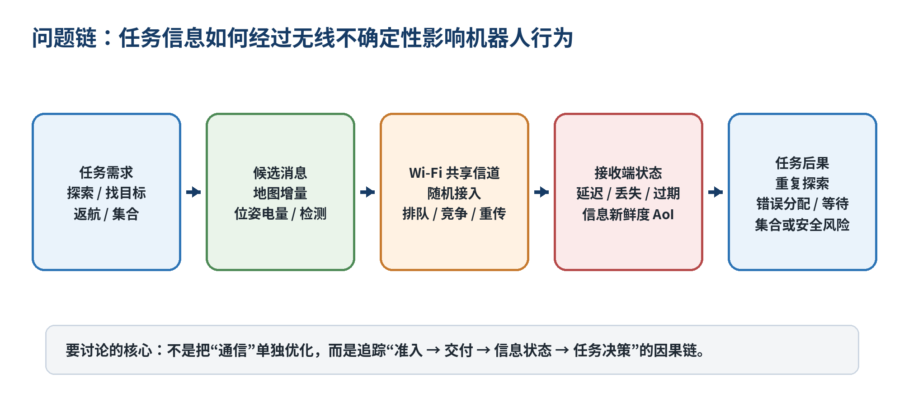
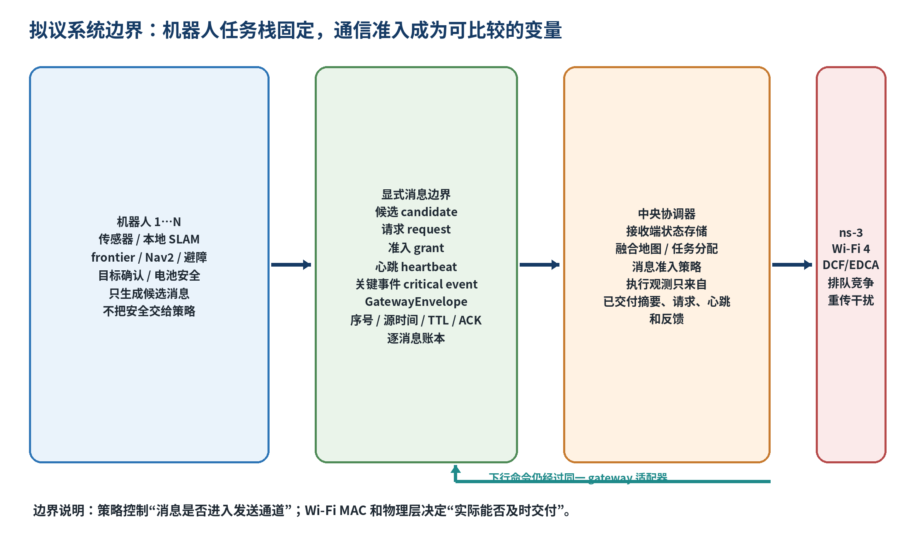
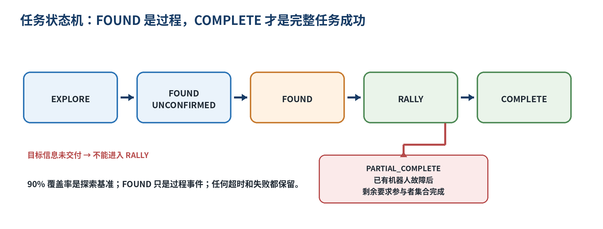
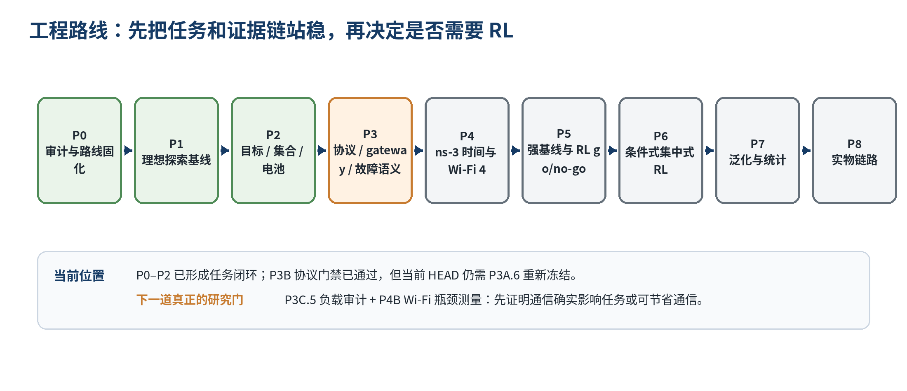
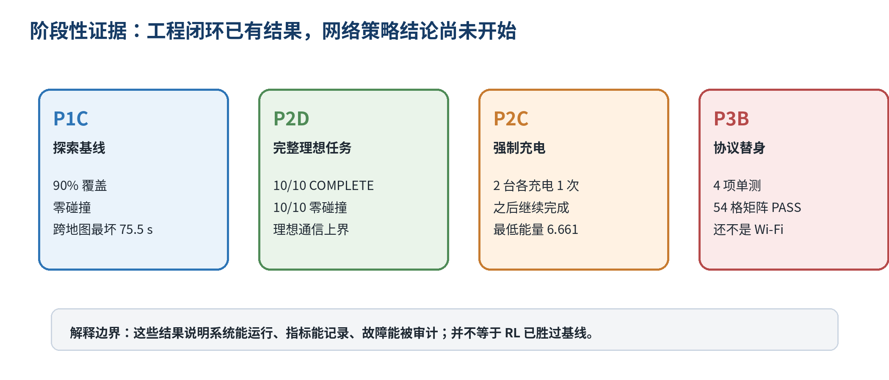

# 多机器人无线通信调度近期进展分享文档

## 分享定位

这份文档是一次组内进展分享的底稿，不是成果答辩，也不把当前工作包装成已经完成的无线强化学习系统。希望和老师、师兄弟姐妹一起讨论三件事：问题是否值得做，已有工作把问题推进到了哪里，我现在搭的路线是否能把“通信变化”真正传递到“机器人任务结果”。

文档按“问题提出 → 文献调研 → 方法想法 → 工程路线 → 当前证据 → 现场演示 → 反思和问题”组织。建议汇报 25–35 分钟，预留 5–10 分钟讨论。文中把历史冻结批次、当前 HEAD 的探索性诊断、还没有通过的门禁分开标记。

## 目录

1. 我想分享的问题
2. 为什么无线通信会变成任务问题
3. 11 篇论文带来的问题地图
4. 我现在想尝试的方法
5. 从仿真到实物的工程路线
6. 已经完成的工作和目前证据
7. Gazebo 现场演示安排
8. 现在的反思和希望一起讨论的问题
9. 附录：听众可能会追问的口径和资料入口

## 1 我想分享的问题

### 1.1 先从一个应用场景开始

设想一个陌生的室内环境，例如实验室、房间组合或长走廊。2–3 台移动机器人从共同充电区域附近出发，不预先知道地图；它们一边用激光雷达和本地 SLAM 建图，一边用 frontier 方法分配探索区域，之后寻找指定目标。找到目标后，发现信息要送到中央协调器，再给仍参与任务的机器人分配互相分离的安全集合位姿。电量不足时，机器人必须先本地返航、充电，再继续任务。

这个场景中，通信不是“把一个已经决定好的动作发出去”这么简单。机器人产生的是一组不同语义、不同大小、不同紧急程度的消息：地图增量、位姿和电量、frontier 摘要、目标检测、返航请求、集合命令。它们对任务的敏感度并不一样：一条过期地图可能只是减少探索效率，一条没有及时送达的目标确认则可能让整个团队继续搜索；一条返航或急停命令不能和普通状态消息使用完全相同的等待规则。

### 1.2 需要一起看的问题链



图 1 问题链。汇报时可以把“通信是否可靠”改成更具体的问题：一条消息是否被准入、实际是否进入队列、是否获得发送机会、是否及时交付、接收端是否消费，以及它是否改变了后续任务决策。

### 1.3 为什么 Wi-Fi 会带来不确定性

在共享 Wi-Fi 中，机器人不是各自拥有一条独立的“管道”。随机接入和竞争会带来发送时刻的不确定性；队列排队会把本来有意义的信息变成旧信息；碰撞、ACK 失败和重传会拉长尾部时延；移动、墙体和同信道干扰会让链路状态随位置变化。多机器人同时发送地图或状态时，通信负担可能出现 burst，而不是均匀流量。

有线通信能把一部分无线不确定性移走，但对移动机器人、临时部署或需要穿越不同区域的系统并不方便。更关键的是，单纯追求吞吐率也不一定对应任务更好：地图消息可能很多但重复，目标检测很小却更紧急；“最新”也不自动等于“有用”，因为 AoI 只描述时间新鲜度，不知道内容是否改变了任务。

### 1.4 我希望把问题说成什么

> 在中央端只能看到带时延、可能过期的候选摘要、请求、心跳和已交付状态，底层 Wi-Fi 仍然负责排队、竞争和重传的条件下，怎样控制应用消息准入，使多机器人任务获得真正有用的新信息，同时在任务完成、信息时效和通信代价之间取得可解释的权衡？

这里的“调度”首先指应用层消息是否进入发送通道，不等同于取代 802.11 DCF/EDCA、MAC 重传、MCS、功率或信道控制。

## 2 为什么无线通信会变成任务问题

### 2.1 不同消息的时效和价值不同

| 消息类别 | 例子 | 典型风险 | 第一版处理想法 |
|---|---|---|---|
| 心跳和状态 | 位姿、电量、任务阶段 | 丢一条可以接受，长期没有会误判掉线 | 小包、周期发送、允许旧包丢失 |
| 地图和 frontier | 地图快照、局部地图、frontier 摘要 | 过期后可能引起重复探索或错误分工 | 版本替代、TTL、按需准入 |
| 目标事件 | 目标确认、目标位置 | 没送达会延迟进入集合阶段 | 关键事件、序号、ACK、有限重传 |
| 安全和控制 | 返航、集合、急停 | 延迟可能直接改变安全行为 | 最大等待、本地安全降级、有限重试 |

### 2.2 任务闭环要求因果证据

项目里需要保留下面这条链，而不是只在旁边跑一个 ns-3 仿真并同时记录几个网络指标：

```text
消息候选 / 请求
  → 准入决策
  → 进入队列、竞争、重传
  → 交付或过期
  → 接收端地图 / 状态版本变化
  → frontier 分配或目标集合改变
  → 机器人路径和运动改变
  → 覆盖率、完成时间、能量和安全结果改变
```

所以日志中要区分 `source_time`、`enqueue_time`、`admit_time`、`tx_time`、`delivery_time`、`consume_time`、`drop_time`、消息 ID、版本和尝试次数。否则只能知道“发生了丢包”，不知道丢包是否真的影响了任务。

## 3 11 篇论文带来的问题地图

这批文献没有给出一个可以直接复制的方案，但把问题分成了几个相互连接的领域。下面的归纳来自 `260929_report` 目录下的 11 篇论文、`综述论文调研.docx` 和 2026-09-29 教师研究路线评审。

### 3.1 逐篇放置

| 方向 | 文献 | 它主要关心什么 | 对当前项目的启发和边界 |
|---|---|---|---|
| 通信 DRL | Luong 等，2019，*Applications of Deep Reinforcement Learning in Communications and Networking* | 将频谱接入、速率控制、缓存、卸载、路由、资源共享等通信问题建模为状态—动作—奖励序列决策 | 提供把动态网络优化写成 MDP/POMDP 的语言；原综述主要面向网络指标，项目还要验证任务闭环 |
| 无线资源分配 | Alwarafy 等，2021/2022，*Deep Reinforcement Learning for Radio Resource Allocation and Management in Next Generation Heterogeneous Wireless Networks* | 总结 DQN、DDPG 等在异构网络资源分配中的使用，强调连续动作和大规模网络复杂度 | 说明 RL 适合动态、非凸、模型不完备问题；不能据此直接声称 RL 比强规则方法好 |
| 多 UAV 无线网络 | Bai 等，2023，*Toward Autonomous Multi-UAV Wireless Network* | 将轨迹、通信资源、多目标优化和 MARL/CTDE 联系起来，讨论 MADDPG、COMA、MAPPO、AoI 和 sim-to-real | 提醒奖励量纲、局部观测、规模和部署安全都很难；当前先采用中央单智能体，暂不自动改成 MARL |
| 动态资源分配 | Clinton 等，2026，*Adaptive resource allocation in dynamic wireless environments* | 比较优化、DRL、MARL 和混合方法，强调训练稳定性、泛化、可扩展和真实验证 | 支持“先测真实负载、再决定学习”的顺序；实物验证本身不是方法创新 |
| 多机器人通信协同 | Gielis 等，2022，*A Critical Review of Communications in Multi-robot Systems* | 批评机器人算法和网络长期割裂，主张通信与运动、控制、网络共同设计，关注 sim-to-real | 强化了本项目的系统视角；也提醒“多机器人 + 真实 Wi-Fi”不能单独作为创新主张 |
| 多机器人协作通信 | *A Survey on Multi-Robot Collaboration and Communication*，2026 预印本 | 用图论、Swarm-SLAM 和协议比较描述协作，讨论 Wi-Fi、蓝牙、Zigbee、LoRa、异构和规模问题 | 提供更完整的网络—任务问题地图；大规模拓扑和异构机器人先作为风险，不作为第一版变量 |
| 目标导向通信 | Charalambous 等，2024/2026，*Toward Goal-Oriented Communication in Multi-Agent Systems* | 把通信价值从比特保真转向共同目标贡献，整理 VoI、CoIL、AoI、VAoI 和学习式通信 | 给出“消息是否推进任务”的术语；本项目还要把价值放入真实 Wi-Fi 排队和交付过程 |
| 推理增强 TOC | Xie 等，2026，*Towards reasoning-empowered task-oriented communication for agent networks* | 讨论 agent 何时、为什么、传什么，把感知、推理、规划和通信闭环 | 与“任务反过来驱动通信”理念接近；它是上层范式，当前项目先做可审计的候选/准入协议，不直接做生成式语义通信 |
| 多机器人 DRL | Sensors 2023，*Multi-Agent Deep Reinforcement Learning for Multi-Robot Applications* | 按覆盖、探索、导航、信息收集、任务分配、搬运等分类，梳理 MADDPG、CTDE、MAPPO | 帮助固定任务层和理解多机器人建模；通信不是该综述的中心，因此不能直接解决当前网络因果问题 |
| 多机器人探索 | Wang 等，2025，*Multi-Robot System for Cooperative Exploration in Unknown Environments* | 将多机探索拆成定位建图、协作规划和通信，讨论地图融合、frontier、分配和规划 | 任务栈采用模块化 frontier + SLAM + Nav2 是有依据的；通信在该方向常被当作约束，项目试着把它变成可测决策变量 |
| 信息年龄 | Yates 等，2021，*Age of Information: An Introduction and Survey* | 研究状态更新的新鲜度、排队、能量受限更新和无线网络，说明“越快越多发”不一定最优 | AoI 是重要指标，但不能代替内容价值；动作里要允许等待，过期地图还要结合任务阶段判断 |

### 3.2 文献共同关心的四个问题

1. **资源怎么分**：频谱、时隙、速率、功率、计算和存储如何在动态环境中分配。
2. **谁在做决策**：规则、优化、集中式 RL、MARL、CTDE，各自面临信息量和规模代价。
3. **传什么才有用**：从完整数据、压缩特征到任务导向消息，关注内容价值和通信开销。
4. **怎样落到真实系统**：仿真和实物差距、真实信道、动态拓扑、安全约束和可复现性。

### 3.3 我暂时不把它说成“文献空白”

教师评审特别提醒：事件触发通信、发送者选择、任务收益、异构机器人、真实 Wi-Fi 和实物演示分别都能找到直接或高度相关先例。因而当前更稳妥的说法是：我想验证一种具体的因果闭环——在固定多机器人任务和固定消息语义下，真实 Wi-Fi 的竞争、排队、重传、时延和过期信息，是否会改变后续任务分配与完成结果；如果强非学习方法已经足够，也应该把“不需要复杂 RL”作为诚实结论。

## 4 我现在想尝试的方法

### 4.1 先固定什么

为了让结果能归因到通信决策，第一版固定：机器人任务栈、SLAM、frontier 生成、Nav2、本地避障、目标确认规则、消息语义和序列化格式。策略不直接学习地图、导航、任务分配或 Wi-Fi MAC 参数。机器人本地保留感知、避障、低电量返航和断网降级，通信策略不能覆盖安全约束。

### 4.2 方法的核心想法

采用一个**集中式、部分可观测的单智能体通信调度器**。多机器人是环境中的多个 endpoint，中央策略在每个决策窗选择“哪个 endpoint 的哪一类候选消息获得短期准入”，也允许不准入普通消息。



图 2 系统边界。中央端不能免费读取机器人隐藏队列或 Gazebo 真值，只能使用已经交付的候选摘要、请求、心跳、地图/位姿/电量状态和消息反馈。训练时若使用完整状态的 critic，必须明确标注为训练特权，执行时仍使用可部署观测。

### 4.3 为什么先不把它叫 MARL

当前只有一个中央策略在做准入决策，多台机器人只是它面对的多个消息端点；这更接近一个集中式、部分可观测的单智能体问题。只有当每台机器人独立运行需要学习的通信或行动策略，并通过团队交互共同学习时，才有必要把方法组织为 MARL。网络里有多个输出头、训练集中式或系统里有多台机器人，都不能单独决定它是 MARL。

### 4.4 建议的协议机制

机器人先生成低开销 `candidate` 或 `request`，描述消息类型、版本、大小、生成时间、任务阶段和紧急等级；中央根据已收到的信息发放短期 `grant`；心跳和关键事件保留独立的最低限度通告路径；交付反馈进入中央接收状态存储。控制开销本身也要计入账本。

```text
robot local state
  → candidate/request
  → central admission grant
  → message enters Wi-Fi queue
  → ns-3 DCF/EDCA decides actual access
  → delivery / retry / expire
  → receiver updates state store
  → task coordinator changes next decision
```

### 4.5 任务状态机和完成口径



图 3 任务状态机。`FOUND` 和 90% 覆盖率是过程指标；无故障时只有所有要求参与的机器人在各自集合位姿满足位置、速度和连续保持条件后才是 `COMPLETE`。机器人故障后剩余机器人集合完成记录为 `PARTIAL_COMPLETE`，不能通过静默丢弃机器人把它写成完整成功。

### 4.6 预留的比较基线

进入 RL 前先运行以下规则：无普通通信、全部发送、固定周期、事件触发、freshness/deadline、task-priority、task-value greedy、link-aware greedy，以及在相同观测和消息接口上适配的 SchedNet-inspired 学习式评分。它们要使用相同任务栈、候选消息、网络条件、种子和安全约束。

## 5 从仿真到实物的工程路线

### 5.1 P0 到 P8 的简化路线



图 4 工程路线。这里把计划里的细检查点合并成汇报时容易理解的九步；每一步都有退出条件，不直接从 toy MDP 跳到 RL 或实物。

| 阶段 | 主要问题 | 主要产物和退出条件 |
|---|---|---|
| P0 | 项目边界是否说清 | 研究计划、实施计划、当前状态和评测口径一致 |
| P1 | 机器人能否稳定探索并可评估 | 1–4 台 Gazebo TurtleBot3、SLAM、frontier、Nav2、真值评估器、跨 world 探索基线 |
| P2 | 探索、发现、集合、返航充电能否连起来 | 目标确认、权威状态机、不同集合位姿、电池安全和完整理想任务基线 |
| P3 | 以后网络故障是否真的能改变信息 | GatewayEnvelope、候选/交付/消费账本、TTL/序号/ACK/重传、固定 delay/loss、freshness 降级和可视化 |
| P4 | ns-3 是否和应用时间、字节、位置对上 | trace 对账、时间同步、Gazebo mobility、802.11n AP/STA、墙损耗、背景干扰、排队/重传/交付指标 |
| P5 | 问题是否真的需要 RL | 先做真实负载审计，再用强非学习基线和 SchedNet-inspired 建立困难；记录 RL go/no-go |
| P6 | 若有长期决策空间，如何学习 | 集中式 POMDP 调度，硬安全覆盖、可部署观测、checkpoint 和验证集选模 |
| P7 | 是否能泛化、是否只是调参 | held-out world/目标/干扰/seed、配对统计、置信区间、消融和失败原因 |
| P8 | 能否走出仿真 | 单机真实感知与 UDP/Wi-Fi、双机端到端任务、sim-to-real 差异和安全证据 |

### 5.2 当前真正的下一道门

当前任务栈在 2026-09-29 的代码改动后还没有通过 P3A.6 重新冻结，因此不能把它直接叫作网络/RL 公平基线。下一步顺序是：

1. 在当前 HEAD 重新跑 P2D 完整理想通信矩阵、P3A 旁路和 gateway 审计，生成新的 commit/config/environment manifest。
2. 完成 P3B.5 的 Gazebo fault-mode 任务矩阵，检查未交付信息是否阻止错误的 RALLY、stale-state 是否触发安全等待、单机故障后健康机器人是否继续。
3. 完成 P3C/P3C.5，测量真实候选负载、控制开销、队列、AoI、过期和通信能耗相对移动能耗的量级。
4. 只有测量证明存在通信决策空间，才进入 ns-3 Wi-Fi 4 和 RL；如果 Wi-Fi 不是瓶颈，就研究节省通信而不降低任务表现。

## 6 已经完成的工作和目前证据

### 6.1 当前代码框架

| 组件 | 当前作用 | 现在的边界 |
|---|---|---|
| `wireless-rl` | ns-3/ns3-gym 的 5 用户抽象队列调度 MDP，已有 baseline、DQN、checkpoint、多 seed 工具 | 还没有真实 Wi-Fi 节点、传播、干扰和机器人任务，历史结果只能说明工具链可用 |
| `multi_robot` | Gazebo world、TurtleBot3 模型、SLAM/Nav2、启动参数和任务场景 | 当前仍是应用任务层，摄像头真实检测尚未恢复 |
| `merge_map` | 融合多台机器人地图 | P3A 后只消费 gateway 交付的地图 |
| `multi_robot_exploration/control.py` | 总部协同探索、frontier、目标后集合、失败隔离 | 中央决策只消费 gateway 状态，Nav2 命令也经 gateway 适配 |
| `ideal_gateway.py` | 零损 finite-rate gateway，也可切换确定性 fault transport | fault 模式是应用层替身，不是 ns-3 MAC/PHY |
| `battery_manager.py` | 本地扣能量、安全返航、充电和恢复任务 | 第一版 `c_tx=0`，共享充电器和通信能耗未实现 |
| `task_evaluator.py` | 只读评估器，记录覆盖率、地图质量、路径、碰撞、阶段、电池和失败原因 | 评估器可以读 Gazebo 真值，但不能向控制链发布真值 |

### 6.2 已经形成的任务层证据



图 5 当前证据概览。它们说明工程闭环和日志证据在逐步形成，不构成“RL 已经有效”的结论。

**P1C 理想通信协同探索。** 在 `my_world.world` 上，2 台机器人 seeds 101/202/303 达到 90% 正确自由空间覆盖的时间为 98.9/79.6/104.4 秒，3 台为 78.3/69.8/69.5 秒，均零碰撞。跨 `p1c_open`、`p1c_rooms`、`p1c_corridors` 的 9 项三机器人 episode 也达到 90%，最坏 `time_to_90=75.5 s`，最低观测准确率 97.47%，最大搜索重叠 1.91%。这些是探索能力基线，不是无线网络结果。

**P2A/P2B 目标和集合。** 目标确认采用距离、视场、遮挡和连续 3 帧规则；在固定目标 `(-4,4)` 的三机器人 seeds 101/202/303 中，确认时间为 60.7/72.9/61.5 秒，零碰撞、零搜索重叠。集合要求各机器人独立位姿、位置误差不超过 0.35 m、速度门槛满足并连续保持 5 秒。

**P2C 强制充电。** 两机器人 seed 303、初始能量 18 的 episode 中，两台机器人各返航和充电 1 次，之后继续完成任务；最终 `COMPLETE`，总完成时间 190.1 秒，最低能量 6.661，碰撞和搜索重叠均为 0。这里的能量模型仍是可校准的简化模型，通信能耗暂设为 `c_tx=0`。

**P2D 完整理想通信基线。** lab、rooms、corridors 三种场景共 10 项固定矩阵全部 `COMPLETE`、零碰撞、零基础设施失败；lab seed 202 和 corridors 双机器人交叉格发生过安全充电。场景初始能量分别为 40、40、45。它是“理想通信上界”，不是 Wi-Fi 结果。

### 6.3 P3 的当前边界

P3A 历史批次已经证明中央地图、位姿、TF、电量、目标检测和 Nav2 命令可以通过同一个显式 gateway；旁路审计能检查中央是否绕过 gateway 直接订阅机器人 topic 或调用 action。但教师评审后，当前 task-stack 又发生了协调器、电池和路径净空修改，所以必须先做 P3A.6 重新冻结。

P3B 已完成的范围是固定 seed 的应用层 delay/loss transport、TTL、序号、重复/乱序、有限重传和逐消息账本。2026-09-28 的协议门禁为 4 项单测通过、54 格固定矩阵 `PASS`。100% 上行丢包的 Gazebo smoke 保留为失败样本，并且它符合“目标信息未交付时不能进入 RALLY”的安全预期；它还不是 fault-mode 任务成功率，也不是 Wi-Fi 性能。

### 6.4 2026-09-29 当前探索性诊断

当前工作树最近完成了两个有价值但还不能替换正式门禁的诊断：

- 单机器人初始能量 18 的 180 秒探索 smoke 中，实际发生 1 次返航和充电，之后恢复为 `ACTIVE`；最低能量 10.66，零碰撞，覆盖率 0.789。说明本地返航—充电—恢复闭环可以被日志看到。
- 双机器人 120 秒联合探索中，`nav_goal_count=24`、成功 22、无 abort、正确自由覆盖率 0.9101、搜索重叠 0、碰撞 0。说明新的任务分配没有等待所有机器人或让一台机器人独占全部 frontier。

三机器人 RALLY 的动态占位死锁修复刚完成组件测试和构建，现场进程需要在干净 ROS domain 中重新启动验证。它属于当前 task-stack 的探索性工作，不应被写成已经通过的 P3A.6。

### 6.5 需要保留的失败和限制

- P3A.5 的历史当前 HEAD 批次曾出现 9/10 正式 episode 完成，lab seed 202 在启动后 RALLY 阶段失败；失败 episode 必须保留，不能用成功重跑覆盖。
- P3B 的应用层 fault transport 没有 Wi-Fi 的竞争、退避、物理传播和干扰；P3B.5 的完整 fault-mode 任务矩阵仍待完成。
- Gazebo 目标检测使用真值 provider，是协议和任务事件的 MVP；P8A 才替换为真实相机检测和坐标转换。
- 电池返航目前使用保守的路径启发式，不能宣称一般安全保证；真实通信能耗、共享充电器排队和机械对接尚未做。
- 机器人地图 origin 已要求预先对齐，当前不处理任意未知初始位姿下的地图配准。
- 旧 ROS 进程、Fast DDS domain、CPU/Gazebo 负载会造成基础设施失败，必须和 episode 开始后的任务失败分开记录。

## 7 Gazebo 现场演示安排

### 7.1 推荐演示目标

现场演示不追求“跑出一个漂亮数字”，而是让大家看到任务、通信边界和日志之间的关系。建议主演示使用 2 台机器人，时间紧张时先关闭全局 RViz；资源充足再切换到 3 台机器人。

### 7.2 启动命令

先在新终端执行：

```bash
source /opt/ros/humble/setup.bash
cd /home/zhuyulab/ns3-workspace/ros2_ws/ros2-multi-robot-automap
source install/setup.bash
source /usr/share/gazebo/setup.sh
export TURTLEBOT3_MODEL=waffle
```

推荐的现场命令：

```bash
ros2 launch multi_robot gazebo_multirobot_mapping_with_nav2.launch.py \\
  world:=my_world.world \\
  robot_count:=2 \\
  enable_gzclient:=true \\
  enable_task_regions:=true \\
  enable_status_panel:=true \\
  enable_rviz:=false \\
  enable_merge_rviz:=false \\
  auto_save_map:=false \\
  gazebo_seed:=303 \\
  nav2_ready_timeout_sec:=360.0 \\
  enable_target_detection:=true \\
  enable_rally:=true \\
  enable_battery:=true \\
  battery_initial_energy:=40.0 \\
  target_x:=-4.0 \\
  target_y:=4.0
```

Gazebo 中可以介绍：蓝色环是共同起始/充电区，红色环表示目标检测范围，橙色圆盘是目标确认后分配的集合位姿；右侧状态栏显示任务阶段、Nav2、电池模式和位姿。演示时可以打开一个终端观察：

```bash
ros2 topic echo /task_state --once
ros2 topic echo /rally_assignments --once
ros2 topic echo /tb1/battery_state --once --full-length --field data
```

### 7.3 现场讲解顺序

1. **先看场景**：两台机器人共同出发，各自探索，不预先知道地图和目标位置。
2. **再看协同**：合并地图和 frontier 分配让两台机器人走向不同区域，强调“任务层目前先固定”。
3. **等目标确认**：状态从 `EXPLORE` 经过 `FOUND_UNCONFIRMED`、`FOUND` 进入 `RALLY`；解释目标检测是 Gazebo MVP，不把它讲成真实视觉识别。
4. **看集合**：两台机器人被分到不同橙色集合位姿，连续稳定后才进入 `COMPLETE`。
5. **可选电池演示**：时间允许时改用两机器人强制充电命令，展示返回、充电和恢复；如果现场资源不足，不要临时切换三机器人低电量参数。
6. **最后打开日志**：展示任务评估 JSON/CSV 和 gateway message events，说明“成功/失败、消息交付、任务阶段”是如何对上的。

### 7.4 演示中的诚实口径

可以说：“现在演示的是任务层和消息边界已经能运行；真正的 Wi-Fi 4 排队、竞争、重传和干扰耦合还在后面。今天希望大家帮我判断这个问题定义和路线是否值得继续。”

不要说：“Gazebo 跑通了，所以无线调度策略已经证明有效。”

## 8 现在的反思和希望一起讨论的问题

### 8.1 项目实施阶段遇到的问题

**任务闭环比想象中更脆弱。** Nav2 lifecycle、地图坐标、全局/局部 costmap、动态障碍和电池返航会互相影响。之前出现过目标区动态占位死锁、返航 action 被迟到结果拉走、充电恢复后起点落在 lethal space 等问题。它们提醒我：如果不先把任务栈和失败分类冻结，后面网络实验很难解释。

**通信边界不能只画在架构图上。** 如果中央仍能直接读最新地图或机器人队列，那么旁边接入 ns-3 也不会形成真实网络因果。candidate/request/grant/heartbeat/critical-event 的字节和时间都要进入账本，否则“准入”很容易被误写成“已发送”。

**网络未必一定是瓶颈。** 如果真实候选负载很小、消息很少过期，那么人为注入拥塞再训练 RL 只会制造一个不自然的问题。相反，可能更有价值的结果是：在合理负载下节省通信，而任务不变差。

**仿真到实物不是最后一步的简单复制。** Gazebo 里的真值检测、同机 ROS 2/DDS 和理想 gateway 不能替代真实相机、UDP/Wi-Fi、时钟、遮挡和安全策略。实物链路需要单独校准和保留失败样本。

### 8.2 方向上比较难的问题

1. **消息价值怎么定义**：AoI、deadline、RSSI、队列长度和任务阶段都能提供线索，但怎样估计“这条消息送达会让最终任务更好多少”？
2. **中央端能看到什么**：为了可部署，中央不能免费知道机器人隐藏队列；但如果只看到很少的摘要，又如何避免“没有请求就永远不知道关键事件”？
3. **任务收益和网络指标如何公平结合**：成功率、完成时间、payload、airtime、PDR、AoI、能耗的量纲不同；主终点需要预注册，不能看完结果后挑指标。
4. **强基线会不会已经足够**：task-value greedy 可能比复杂 RL 更稳定。如果它已经达到同等效果，项目应该怎样把结论改成“复杂 RL 没有必要”？
5. **规模和异构怎么进入**：2–3 台同构 TurtleBot3 适合先把因果链做清楚，但大规模机器人或异构传感器会带来状态和消息类型爆炸，何时加入才不把第一版问题做散？
6. **Wi-Fi 4 的真实性到什么程度**：ns-3 的传播和墙损耗需要校准；没有测量数据时，哪些结果只能叫 synthetic sensitivity，不能叫 sim-to-real？
7. **实物部署的安全边界**：网络短时中断时，机器人继续执行多少本地任务是安全的？什么时候应该等待、返航或报告 PARTIAL_COMPLETE？

### 8.3 希望现场讨论的三个选择题

- 我应该把第一版论文问题进一步收窄到“消息准入 + 真实 Wi-Fi 交付”，还是保留更宽的通信资源联合优化视角？
- 在 P3C.5/P4B 之前，是否需要补做一轮真实消息负载和通信能耗测量，来决定 RL 是否值得进入主线？
- 现场 demo 更适合展示 2 台稳定的完整任务，还是展示 3 台更能体现协同但可能暴露更多 Nav2/资源问题？

## 9 附录：听众可能会追问的口径和资料入口

### 9.1 三个容易混淆的词

- **理想通信**：当前 P2D/P3A 中的 zero-loss finite-rate gateway，仍然有消息生成、限频、序列化和交付，不是无限带宽 oracle。
- **应用层故障替身**：P3B 的固定 delay/loss/TTL/ACK/重传队列，用来先测协议和 stale-state 安全语义，不包含 Wi-Fi MAC/PHY。
- **真实 Wi-Fi 结果**：必须等 P4 的 ns-3 包级/时间级闭环和 Wi-Fi 4 场景完成后才能这样称呼。

### 9.2 当前状态总表

| 检查点 | 现在的状态 | 汇报时建议怎么说 |
|---|---|---|
| P0 项目审计 | 已验收 | 边界、口径和路线已经固化 |
| P1 探索基线 | 已验收 | 任务层能重复探索，评估器能记录失败 |
| P2 完整理想任务 | 已验收 | 目标、集合、返航充电可在同一 episode 闭环 |
| P3A gateway | 历史证据，当前 HEAD 待 P3A.6 重新冻结 | 所有跨端信息已有统一边界，但公平基线还要重冻 |
| P3B 协议门禁 | 已验收范围 | 故障语义和账本可复现，仍不是 Wi-Fi |
| P3B.5/P3C/P3C.5 | 待完成 | 完整故障任务、通信指标和真实负载还没有闭环 |
| P4 ns-3 Wi-Fi | 待完成 | 这是下一阶段的核心工程门 |
| P5 强基线/RL go-no-go | 待完成 | 先判断是否真的需要 RL |
| P6–P8 | 待完成 | 有条件进入学习、泛化和实物 |

### 9.3 建议引用的项目资料

- 研究边界和指标：`ns-allinone-3.40/ns-3.40/contrib/opengym/examples/wireless-rl/RESEARCH_PLAN.md`
- 工程检查点：`ns-allinone-3.40/ns-3.40/contrib/opengym/examples/wireless-rl/IMPLEMENTATION_PLAN.md`
- 当前证据和失败记录：`ns-allinone-3.40/ns-3.40/contrib/opengym/examples/wireless-rl/log.md` 与 `report/` 下按日期的报告
- 教师研究路线评审：`report/20260929_teacher_research_route_review.md`
- ROS 2 运行说明：`ros2_ws/ros2-multi-robot-automap/user_guide.md`、`launch_commands.md`
- 文献原文和调研笔记：`260929_report/` 目录下的 11 篇 PDF、`综述论文调研.docx`

### 9.4 一句话收束

我现在更想把这项工作做成一个可以被大家一起挑问题的系统：先让任务、消息、网络和日志真正连起来，再看学习方法是否带来不可替代的价值；如果答案是否定的，也能得到一个清楚、可复现的结论。
