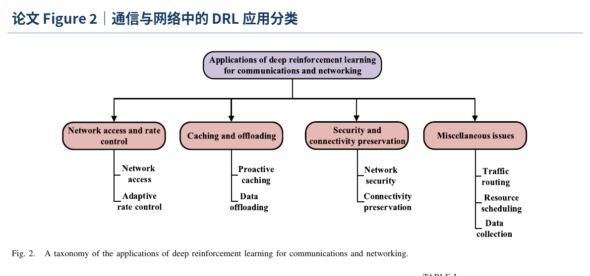
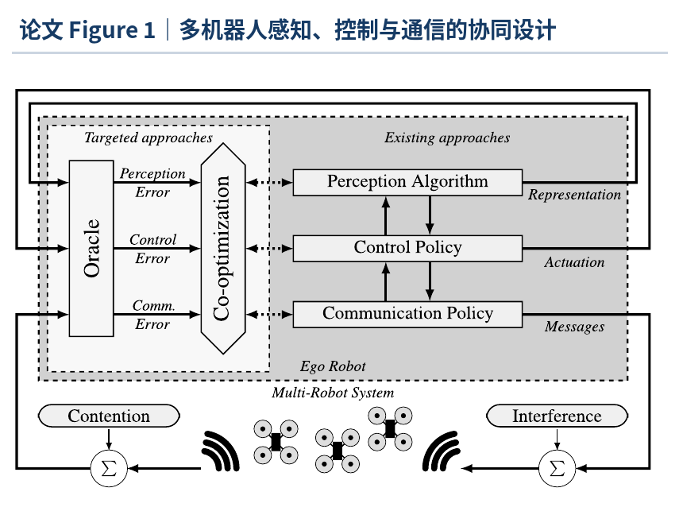
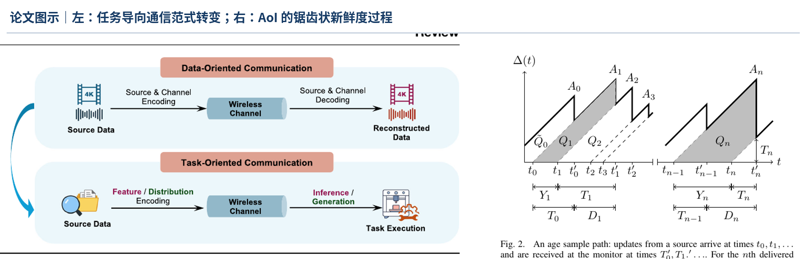
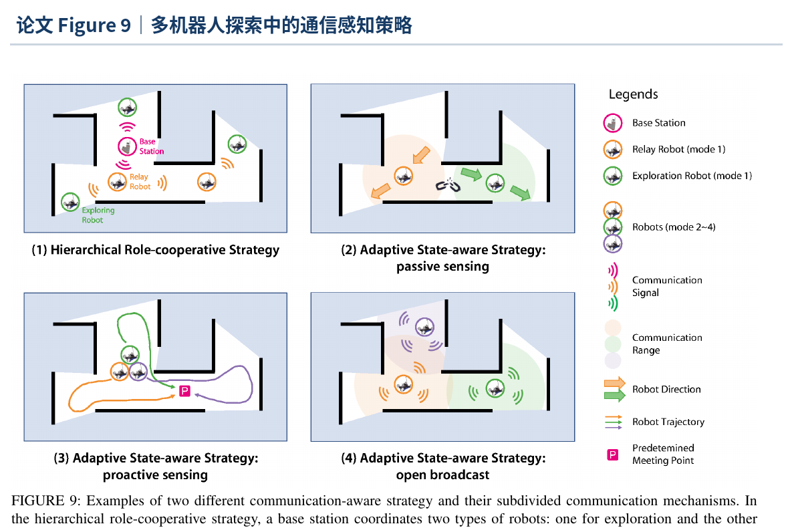
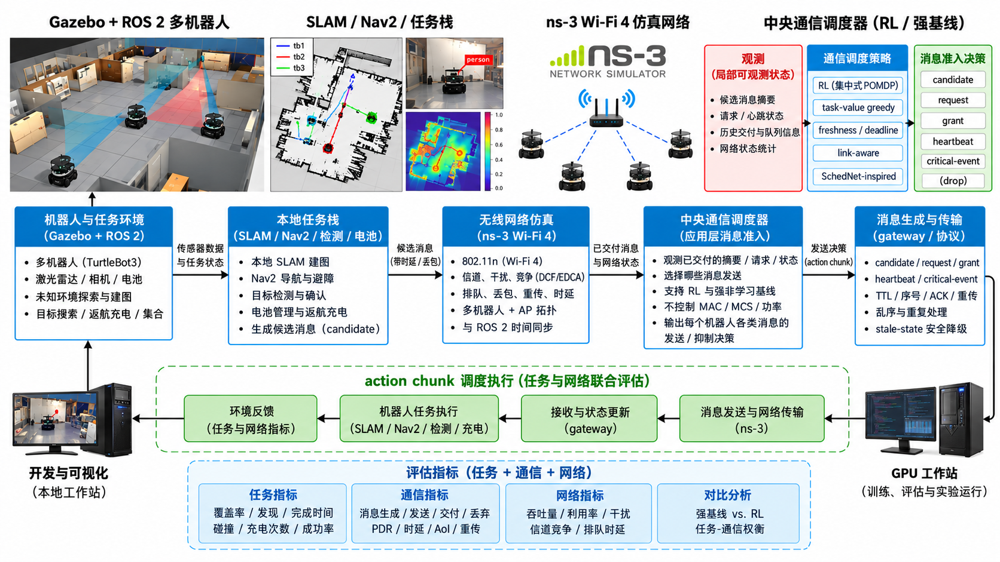

# 复杂环境下多机器人无线通信问题：近期工作进展与研究路线

## 开场

今天想从一个更大的应用问题开始：当多台机器人需要在陌生、拥挤或受干扰的环境中协同工作时，无线通信的不确定性会怎样改变任务本身？我最近围绕这个问题阅读了一批通信、任务导向通信、多机器人协作和强化学习文献，也在 Gazebo、ROS 2、ns-3/ns3-gym 之间搭起了一条逐步验证的路线。下面把目前形成的认识、正在尝试的方法、已经完成的任务层工作，以及还没有解决的问题放在同一条线上。

这不是一个先给出结论的汇报。更希望先把问题边界和证据链讲清楚，再讨论当前的集中式通信调度思路是否值得继续，以及后面哪些实验最能说明问题。

## 目录

1. 从一个大问题开始：多机器人无线通信为什么会影响任务
2. 文献调研：从网络资源分配走向任务导向通信
3. 把文献落到一个可验证的问题
4. 当前想尝试的方法
5. 从仿真到实物的 P0–P8 路线
6. 已经完成的工作、证据和边界
7. Gazebo 现场演示安排
8. 反思与待讨论的问题
9. 附录：口径和资料入口

## 1 从一个大问题开始：多机器人无线通信为什么会影响任务

### 1.1 应用中的共同场景

灾害搜索、仓储盘点、工业巡检、地下空间勘测和未知室内探索都在使用多台移动机器人。它们需要共享地图、位姿、目标线索和任务状态，同时保持各自的局部感知和避障能力。机器人数量增加以后，问题不只是“每台机器人能不能走”，而是团队能不能在有限通信条件下及时形成共同的状态判断。

无线链路通常比有线链路更适合移动和临时部署，但它把不确定性带进了任务闭环：机器人移动后链路会变化，墙体和遮挡会改变接收质量，多台机器人同时上报会形成突发负载，共享信道的随机接入会产生排队和竞争，碰撞、ACK 失败和重传会拉长时延尾部。某个消息即使最终到达，也可能已经过期，接收端据此做出的分工或集合决策未必仍然合适。

### 1.2 不同任务、不同消息的敏感度并不一样

在同一个任务里，通信内容也不是同质的。地图增量可以用版本替代，普通位姿和电量可以周期更新，frontier 摘要可能在几秒后就失去价值；目标确认、集合命令、返航和急停却有更强的时限和安全约束。只优化吞吐率，可能让大量重复地图占满队列；只追求低时延，也可能把本来不重要的更新送得过于频繁。

因此需要同时问四个问题：

- 哪类信息值得进入发送队列？
- 什么时候发送比继续等待更有价值？
- 在多个机器人同时有消息时，先满足谁？
- 消息的交付是否真的改变了任务状态、路径或最终完成结果？


图 1　从任务需求到消息准入、无线不确定性和任务后果的因果链。这里关注的是“准入—交付—消费—任务变化”是否能被逐条追踪。

### 1.3 为什么 Wi-Fi 的随机接入会变成应用问题

在共享 Wi-Fi 中，机器人没有各自独立的管道。随机接入和竞争决定发送时刻，队列排队改变信息年龄，重传和退避增加尾延迟，移动和干扰让链路条件随时间变化。多机器人同时发布地图、状态或检测结果时，通信负载还会出现 burst；负载是否形成拥塞，要由实际消息大小、生成频率和接收端消费速度共同决定。

有线传输可以绕开一部分无线不确定性，但不适合很多移动、临时部署或跨区域场景。更重要的是，“最新”不一定等于“有用”：一条很新的普通状态可能没有改变任务，而一条稍晚但包含目标确认的消息却可能决定团队何时停止搜索。因此，通信指标需要和任务结果放在同一条因果链上。

### 1.4 当前想回答的大问题

> 在中央端只能看到带时延、可能过期的候选摘要、请求、心跳和已交付状态，底层 Wi-Fi 仍然负责排队、竞争和重传的条件下，怎样控制应用消息准入，使多机器人任务获得真正有用的新信息，同时在任务完成、信息时效和通信代价之间取得可解释的权衡？

这里的“调度”首先指应用层消息是否进入发送通道，不把它直接等同于取代 802.11 DCF/EDCA、MAC 重传、MCS、功率或信道控制。

## 2 文献调研：从网络资源分配走向任务导向通信

目录中的 11 篇论文覆盖了通信 DRL、无线资源分配、多 UAV 网络、多机器人通信、多机器人任务、目标导向通信和 AoI 等方向。把它们并排看时，最有帮助的不是逐篇罗列，而是它们共同把问题推向了四个判断：网络侧为什么需要学习，机器人和网络为什么要共同设计，信息价值为什么不能只用比特数或新鲜度表示，以及任务层应该如何固定以便做出公平比较。

### 2.1 判断一：DRL 适合处理动态和复杂决策，但“用了 DRL”不是结论

通信领域的 DRL 综述把频谱接入、速率控制、缓存、卸载、路由和资源共享都写成状态—动作—奖励的连续决策问题。它给出的帮助是：当网络状态动态变化、模型不完备、动作空间很大时，学习策略有机会替代难以在线求解的全局优化；但同一批工作也反复出现状态爆炸、训练样本、稳定性、泛化和部署安全等困难。



图 2　论文 Figure 2 截图（Luong 等，2019）：通信与网络中的 DRL 被归纳到网络接入/速率控制、缓存/卸载、安全/连接保持和资源调度等类别。它支持“网络侧存在动态决策空间”的判断，但不能直接证明任务导向的 RL 会胜过规则方法。

这对当前路线的直接影响是：先建立“问题是否真的需要学习”的门槛。需要先测量真实候选负载、队列、过期和任务影响，再和强规则基线比较；如果固定周期、deadline 或 task-value greedy 已经足够稳定，得到“不需要复杂 RL”的结果也有价值。

### 2.2 判断二：多机器人通信不能长期和机器人算法割开

多机器人通信综述从机器人应用和网络技术两侧回顾了这个领域，指出很多系统把通信当成一个已经存在的约束，而不是和运动、感知、控制共同设计的变量。它还把数据驱动方法和 sim-to-real gap 放在一起讨论：网络模型再精细，如果消息怎样改变机器人行为没有进入评估，仍然无法判断通信改进是否有任务价值。



图 3　论文 Figure 1 截图（Gielis 等，2022）：把感知、控制、通信策略和信道竞争放在同一套机器人网络闭环中，强调共同设计。当前路线因此把消息生成、网络交付、接收端状态和任务结果放进同一条日志。

这并不意味着第一版要同时学习运动、任务分配和 PHY/MAC。相反，需要先固定任务栈，把通信准入作为一个可控变量，才能知道变化来自哪里。

### 2.3 判断三：任务导向通信把“传多少”改写成“这条信息能否推进共同目标”

Goal-oriented communication 的综述把通信价值从比特保真转向共同目标贡献，讨论了 VoI、CoIL、AoI、VAoI 等概念；推理增强的任务导向通信进一步强调 agent 应该判断传什么、什么时候传、为什么传。这些工作给当前问题一个更贴近应用的语言：地图、位姿、目标和集合消息的价值，取决于它们能否改变下一步任务决策，而不是只取决于字节数。

AoI 文献又提供了一个必要但不充分的提醒：状态更新越新通常越好，但“尽可能快、尽可能多地发送”不等于系统更优；排队、能源和接收端消费速度都会影响最合适的更新策略。AoI 可以进入指标，但不能独自代表内容价值。



图 4　论文 Figure 2 截图：左图来自 Charalambous 等的任务导向通信综述，右图来自 Yates 等的 AoI 综述。左图把通信目标从“重构数据”转向“支持任务执行”，右图用锯齿状过程定义信息新鲜度；两者结合后更接近“消息是否值得占用信道”的问题。

### 2.4 判断四：任务研究提供了稳定的应用基线，通信通常仍被当作约束

多机器人探索和多智能体 DRL 文献通常把任务拆成定位建图、frontier 生成、分配、规划、避障、导航和信息收集。这个模块化结构很适合构建可重复的应用基线，也说明了为什么第一版应该固定 SLAM、frontier 和 Nav2，而不是同时让通信策略改变任务栈。

另一方面，很多任务工作把通信简单处理成“可用/不可用”、范围约束或带宽限制，较少保留消息生成、排队、重传、过期、消费和任务变化的逐条因果记录。当前路线要补的不是再造一个探索算法，而是把这些消息过程显式化，并验证它们是否会改变探索、目标确认、集合和充电恢复。



图 5　论文 Figure 9 截图（多机器人协同探索综述）：不同策略通过中继机器人、被动/主动感知或开放广播来处理通信范围和信息交换。它说明通信感知已经是探索系统中的一类设计变量，当前需要进一步把这种变量和 Wi-Fi 队列、交付以及任务结果接起来。

### 2.5 11 篇论文合起来后的问题地图

| 文献群 | 目录中的代表论文 | 共同关注 | 对当前路线的帮助 |
|---|---|---|---|
| 通信资源与 DRL | 2019 DRL 通信综述；2021/2022 无线资源分配综述；2023 多 UAV 无线网络；2026 动态资源分配综述 | 动态网络中的资源、轨迹、接入、AoI、MARL/CTDE，以及稳定性、泛化和部署 | 提供网络决策的建模语言；把 RL 放在“负载审计和强基线之后” |
| 机器人—网络协同 | 2022 多机器人通信 critical review；2026 多机器人协作通信综述 | 通信与机器人共同设计，拓扑、异构、规模、协议和 sim-to-real | 要求记录通信如何改变任务，而不是只报告网络指标 |
| 任务导向与信息新鲜度 | Goal-oriented communication 综述；reasoning-empowered TOC；AoI 综述 | what/when/why to communicate、VoI、AoI、内容价值和资源约束 | 形成“消息价值 = 任务贡献 + 时效 + 代价”的工作假设 |
| 多机器人任务与探索 | Sensors 多机器人 DRL；多机器人协同探索综述；Swarm/协作通信综述中的任务部分 | 覆盖、建图、frontier、分配、导航和团队协作 | 固定任务栈、设计可重复场景，把通信影响留给可测变量 |

### 2.6 从文献得到的工作解释

把这些方向拼在一起后，我暂时采用三层解释：

1. **内容生成层**：机器人根据本地任务状态产生地图、frontier、位姿、电量、目标和安全事件候选。
2. **应用准入层**：中央策略决定哪些候选进入发送通道，考虑任务阶段、内容价值、时效和代价。
3. **网络交付层**：Wi-Fi 的排队、竞争、退避、重传、干扰和传播决定消息何时、是否到达；接收端再把已交付信息消费为状态和任务决策。

要验证的不是“学习策略是否让某个网络指标变大”，而是这三层是否能在日志中接上：候选生成 → 准入 → 入队和尝试 → 交付或过期 → 接收端消费 → 任务变化 → 最终完成结果。

这也决定了当前不把贡献说成一个笼统的“多机器人 + 真实 Wi-Fi + 强化学习”组合，而是先验证一条可以被审计的系统因果链。

## 3 把文献落到一个可验证的问题

### 3.1 具体场景：陌生室内环境中的协同探索与目标集合

在实验室、房间组合或长走廊里，2–3 台 TurtleBot3 从共同起始/充电区域出发，不预先知道地图。它们使用激光雷达和本地 SLAM 建图，通过 frontier 分配探索区域，之后寻找指定目标。目标被确认后，信息需要到达中央协调器，再为仍参与任务的机器人分配互相分离的集合位姿；电量不足的机器人先返航、充电，再恢复任务。

这个场景只作为研究载体，不预先假设某一种算法一定有效。它能同时提供探索、目标事件、集合、安全返航和消息负载变化，让通信结果有机会传递到真实任务状态。

### 3.2 要固定的任务层和安全边界

第一版固定机器人任务栈、SLAM、frontier 生成、Nav2、本地避障、目标确认规则、消息语义和序列化格式。通信策略不直接学习地图、导航、任务分配或 Wi-Fi MAC 参数；机器人本地保留感知、避障、低电量返航和断网降级，通信策略不能覆盖安全约束。

## 4 当前想尝试的方法

先把整个验证闭环画出来：左侧是 Gazebo/ROS 2 中的机器人和任务，中央是应用层通信调度器，右侧是 ns-3 Wi-Fi 4 交付，底部记录 action chunk、任务指标、网络指标和对比结果。



图 6　总体验证框架：任务层、消息准入层、Wi-Fi 仿真层和评估日志在同一条 action chunk 闭环中交替运行。

### 4.1 集中式、部分可观测的单智能体通信调度

采用一个中央策略，在每个决策窗选择“哪个 endpoint 的哪一类候选消息获得短期准入”，也允许普通消息暂不准入。多机器人是环境中的多个消息端点；中央只能看到已经交付的摘要、请求、心跳、状态版本和反馈，不免费读取机器人隐藏队列或 Gazebo 真值。


图 7　系统边界：机器人任务栈固定，策略首先只控制应用层消息准入；Wi-Fi MAC/PHY 仍决定实际交付。

当前先用集中式、部分可观测的单智能体表述，而不自动把多机器人称为 MARL。只有当每台机器人独立运行需要学习的通信或行动策略，并通过团队交互共同学习时，才有必要使用 MARL 的组织方式。

### 4.2 消息协议和可审计边界

机器人先生成低开销的 `candidate` 或 `request`，描述消息类型、版本、大小、生成时间、任务阶段和紧急等级；中央根据已经收到的信息发放短期 `grant`；心跳和关键事件保留最低限度的通告路径；交付反馈进入中央接收状态存储。控制开销本身也计入账本。

```text
robot local state
  → candidate/request
  → central admission grant
  → message enters Wi-Fi queue
  → ns-3 DCF/EDCA decides actual access
  → delivery / retry / expire
  → receiver updates state store
  → task coordinator changes next decision
```

日志需要区分 `source_time`、`enqueue_time`、`admit_time`、`tx_time`、`delivery_time`、`consume_time`、`drop_time`、消息 ID、版本和尝试次数。只有这样才能回答“消息没有送达”和“任务因此变差”是否是同一件事。

### 4.3 任务状态机和完成口径


图 8　任务状态机：`FOUND` 和 90% 覆盖率是过程指标；无故障时只有满足所有集合条件才是 `COMPLETE`，健康机器人在已有机器人故障后完成则记录为 `PARTIAL_COMPLETE`。

### 4.4 比较基线和 RL 的位置

进入 RL 前先运行：无普通通信、全部发送、固定周期、事件触发、freshness/deadline、task-priority、task-value greedy、link-aware greedy，以及在相同观测和消息接口上适配的 SchedNet-inspired 评分。所有方法使用相同任务栈、候选消息、网络条件、种子和安全约束。

如果强规则方法已经达到同样的任务表现，结论可以是“复杂 RL 没有带来足够收益”；如果通信负载、过期和任务后果之间存在长期权衡，再把集中式 POMDP 的 RL 作为候选方法。

## 5 从仿真到实物的 P0–P8 路线

### 5.1 路线总览


图 9　工程路线：先把任务和证据链站稳，再决定是否需要 RL。

| 阶段 | 要回答的问题 | 主要产物和退出条件 |
|---|---|---|
| P0 | 项目边界和指标是否一致 | 研究计划、实施计划、状态和评测口径一致 |
| P1 | 机器人能否稳定探索并可评估 | Gazebo TurtleBot3、SLAM、frontier、Nav2、评估器、跨 world 基线 |
| P2 | 探索、发现、集合、返航充电能否连成一个任务 | 目标确认、权威状态机、不同集合位姿、电池安全和完整理想任务基线 |
| P3 | 网络故障能否改变信息和任务状态 | GatewayEnvelope、候选/交付/消费账本、TTL/序号/ACK/重传、可视化和 fault-mode |
| P4 | ns-3 是否和应用时间、字节、位置对上 | trace 对账、Gazebo mobility、802.11n AP/STA、墙损耗、干扰、队列/重传/交付指标 |
| P5 | 问题是否真的需要 RL | 真实负载审计、强非学习基线、SchedNet-inspired 基线和 RL go/no-go |
| P6 | 若有长期决策空间，如何学习 | 集中式 POMDP、硬安全覆盖、可部署观测、checkpoint 和验证集选模 |
| P7 | 是否能泛化，而不是只调好一个场景 | held-out world/目标/干扰/seed、配对统计、置信区间、消融和失败原因 |
| P8 | 能否走出仿真 | 真实感知、UDP/Wi-Fi、双机端到端任务、sim-to-real 差异和安全证据 |

### 5.2 当前最近的工程门

1. 在当前 HEAD 重新冻结 P2D 完整理想通信矩阵、P3A 旁路和 gateway 审计，生成新的 commit/config/environment manifest。
2. 完成 P3B.5 的 Gazebo fault-mode 任务矩阵：未交付目标不能错误进入 `RALLY`，stale-state 应触发安全等待，单机故障后健康机器人仍能按口径继续。
3. 完成 P3C/P3C.5，测量真实候选负载、控制开销、队列、AoI、过期和通信能耗相对移动能耗的量级。
4. 只有测量证明存在通信决策空间，才进入 ns-3 Wi-Fi 4 和 RL；如果 Wi-Fi 不是瓶颈，就研究节省通信而不降低任务表现。

## 6 已经完成的工作、证据和边界

### 6.1 当前代码框架

| 组件 | 当前作用 | 边界 |
|---|---|---|
| `wireless-rl` | ns-3/ns3-gym 的 5 用户抽象队列调度 MDP，已有 baseline、DQN、checkpoint 和多 seed 工具 | 还没有真实 Wi-Fi 节点、传播、干扰和机器人任务；历史结果只能说明工具链可用 |
| `multi_robot` | Gazebo world、TurtleBot3、SLAM/Nav2、启动参数和任务场景 | 当前仍是应用任务层，摄像头真实检测尚未恢复 |
| `merge_map` | 融合多台机器人地图 | P3A 后只消费 gateway 交付的地图 |
| `multi_robot_exploration/control.py` | 协同探索、frontier、目标后集合、失败隔离 | 中央决策只消费 gateway 状态，Nav2 命令也经 gateway 适配 |
| `ideal_gateway.py` | 零损 finite-rate gateway，也可切换确定性 fault transport | fault 模式是应用层替身，不是 ns-3 MAC/PHY |
| `battery_manager.py` | 本地扣能量、安全返航、充电和恢复任务 | 第一版 `c_tx=0`，共享充电器和通信能耗未实现 |
| `task_evaluator.py` | 记录覆盖率、地图质量、路径、碰撞、阶段、电池和失败原因 | 可读 Gazebo 真值，但不能向控制链发布真值 |

### 6.2 任务层已经形成的证据


图 10　阶段性证据：任务闭环和日志证据逐步形成，网络策略结论尚未开始。

**P1C 理想通信协同探索。** 在 `my_world.world` 上，2 台机器人 seeds 101/202/303 达到 90% 正确自由空间覆盖的时间为 98.9/79.6/104.4 秒，3 台为 78.3/69.8/69.5 秒，均零碰撞。跨 `p1c_open`、`p1c_rooms`、`p1c_corridors` 的 9 项三机器人 episode 也达到 90%，最坏 `time_to_90=75.5 s`，最低观测准确率 97.47%，最大搜索重叠 1.91%。这些是探索能力基线，不是无线网络结果。

**P2A/P2B 目标和集合。** 目标确认采用距离、视场、遮挡和连续 3 帧规则；在固定目标 `(-4,4)` 的三机器人 seeds 101/202/303 中，确认时间为 60.7/72.9/61.5 秒，零碰撞、零搜索重叠。集合要求各机器人独立位姿、位置误差不超过 0.35 m、速度门槛满足并连续保持 5 秒。

**P2C 强制充电。** 两机器人 seed 303、初始能量 18 的 episode 中，两台机器人各返航和充电 1 次，之后继续完成任务；最终 `COMPLETE`，总完成时间 190.1 秒，最低能量 6.661，碰撞和搜索重叠均为 0。能量模型仍是可校准的简化模型，通信能耗暂设为 `c_tx=0`。

**P2D 完整理想通信基线。** lab、rooms、corridors 三种场景共 10 项固定矩阵全部 `COMPLETE`、零碰撞、零基础设施失败；lab seed 202 和 corridors 双机器人交叉格发生过安全充电。场景初始能量分别为 40、40、45。它是理想通信上界，不是 Wi-Fi 结果。

### 6.3 P3 当前进展和保留边界

P3A 的历史批次证明中央地图、位姿、TF、电量、目标检测和 Nav2 命令可以通过同一个显式 gateway；旁路审计能检查是否绕过 gateway 直接订阅机器人 topic 或调用 action。由于当前 task-stack 又发生了协调器、电池和路径净空修改，P3A.6 需要在当前 HEAD 重新冻结。

P3B 已完成的范围是固定 seed 的应用层 delay/loss transport、TTL、序号、重复/乱序、有限重传和逐消息账本。2026-09-28 的协议门禁为 4 项单测通过、54 格固定矩阵 `PASS`。100% 上行丢包的 Gazebo smoke 保留为失败样本，它符合“目标信息未交付时不能进入 RALLY”的安全预期；它还不是 fault-mode 任务成功率，也不是 Wi-Fi 性能。

### 6.4 最近的探索性诊断

- 单机器人初始能量 18 的 180 秒探索 smoke 中，实际发生 1 次返航和充电，之后恢复为 `ACTIVE`；最低能量 10.66，零碰撞，覆盖率 0.789。说明本地返航—充电—恢复闭环可以被日志观察到。
- 双机器人 120 秒联合探索中，`nav_goal_count=24`、成功 22、无 abort、正确自由覆盖率 0.9101、搜索重叠 0、碰撞 0。说明新的任务分配没有等待所有机器人或让一台机器人独占全部 frontier。
- 三机器人 RALLY 的动态占位死锁修复刚完成组件测试和构建，干净 ROS domain 下的进程重启验证仍待完成。这属于当前 task-stack 的探索性工作，不写成已经通过 P3A.6。

### 6.5 失败和限制也要保留

- P3A.5 历史当前 HEAD 批次曾出现 9/10 正式 episode 完成，lab seed 202 在启动后 `RALLY` 阶段失败；失败 episode 必须保留，不能用成功重跑覆盖。
- P3B 的应用层 fault transport 没有 Wi-Fi 的竞争、退避、物理传播和干扰；P3B.5 的完整 fault-mode 任务矩阵仍待完成。
- Gazebo 目标检测使用真值 provider，是协议和任务事件的 MVP；P8A 才替换为真实相机检测和坐标转换。
- 电池返航目前使用保守的路径启发式，真实通信能耗、共享充电器排队和机械对接尚未做。
- 机器人地图 origin 需要预先对齐，当前不处理任意未知初始位姿下的地图配准。
- 旧 ROS 进程、Fast DDS domain、CPU/Gazebo 负载会造成基础设施失败，必须和 episode 开始后的任务失败分开记录。

## 7 Gazebo 现场演示安排

### 7.1 推荐演示目标

主演示使用 2 台机器人：先看陌生环境中的协同探索，再看目标确认、集合、状态记录和可选的返航充电。时间和计算资源充足时再切换到 3 台机器人。演示的重点是让任务状态、通信边界和日志之间能互相对上，而不是临时追求一个更大的数字。

### 7.2 启动命令

```bash
source /opt/ros/humble/setup.bash
cd /home/zhuyulab/ns3-workspace/ros2_ws/ros2-multi-robot-automap
source install/setup.bash
source /usr/share/gazebo/setup.sh
export TURTLEBOT3_MODEL=waffle
```

```bash
ros2 launch multi_robot gazebo_multirobot_mapping_with_nav2.launch.py \
  world:=my_world.world \
  robot_count:=2 \
  enable_gzclient:=true \
  enable_task_regions:=true \
  enable_status_panel:=true \
  enable_rviz:=false \
  enable_merge_rviz:=false \
  auto_save_map:=false \
  gazebo_seed:=303 \
  nav2_ready_timeout_sec:=360.0 \
  enable_target_detection:=true \
  enable_rally:=true \
  enable_battery:=true \
  battery_initial_energy:=40.0 \
  target_x:=-4.0 \
  target_y:=4.0
```

Gazebo 中蓝色环是共同起始/充电区，红色环表示目标检测范围，橙色圆盘是目标确认后分配的集合位姿；右侧状态栏显示任务阶段、Nav2、电池模式和位姿。需要时可在另一个终端观察：

```bash
ros2 topic echo /task_state --once
ros2 topic echo /rally_assignments --once
ros2 topic echo /tb1/battery_state --once --full-length --field data
```

### 7.3 现场讲解顺序

1. 两台机器人共同出发，各自探索，不预先知道地图和目标位置。
2. 合并地图和 frontier 分配让两台机器人走向不同区域，说明任务层目前先固定。
3. 目标确认后，状态从 `EXPLORE` 经过 `FOUND_UNCONFIRMED`、`FOUND` 进入 `RALLY`；目标检测是 Gazebo MVP，不把它讲成真实视觉识别。
4. 两台机器人被分到不同橙色集合位姿，连续稳定后进入 `COMPLETE`。
5. 时间允许时再展示低电量返航、充电和恢复；如果资源不足，不临时切换三机器人低电量参数。
6. 最后打开任务评估 JSON/CSV 和 gateway message events，对照成功/失败、消息交付和任务阶段。

### 7.4 演示口径

可以说：“现在演示的是任务层和消息边界已经能运行；真正的 Wi-Fi 4 排队、竞争、重传和干扰耦合还在后面。”

不把 Gazebo 跑通直接等同于无线调度策略已经有效。

## 8 反思与待讨论的问题

### 8.1 实施阶段的几个认识

**任务闭环比想象中更脆弱。** Nav2 lifecycle、地图坐标、全局/局部 costmap、动态障碍和电池返航会互相影响。之前出现过目标区动态占位死锁、返航 action 被迟到结果拉走、充电恢复后起点落在 lethal space 等问题。如果不先冻结任务栈和失败分类，后面的网络实验很难解释。

**通信边界不能只画在架构图上。** 如果中央仍能直接读最新地图或机器人队列，那么旁边接入 ns-3 也不会形成真实网络因果。candidate/request/grant/heartbeat/critical-event 的字节和时间都要进入账本，否则“准入”很容易被误写成“已发送”。

**网络可能不是瓶颈。** 如果真实候选负载很小、消息很少过期，人为注入拥塞再训练 RL 只会制造一个不自然的问题。更有价值的结果可能是：在合理负载下节省通信，而任务不变差。

**仿真到实物不是最后一步的复制。** Gazebo 真值检测、同机 ROS 2/DDS 和理想 gateway 不能替代真实相机、UDP/Wi-Fi、时钟、遮挡和安全策略。实物链路需要单独校准并保留失败样本。

### 8.2 方向上最难的几个问题

1. **消息价值怎么定义**：AoI、deadline、RSSI、队列长度和任务阶段都能提供线索，但怎样估计“这条消息送达会让最终任务好多少”？
2. **中央端能看到什么**：中央不能免费知道机器人隐藏队列；如果只看到摘要，又如何避免关键事件因为没有请求而永远不可见？
3. **任务收益和网络指标如何结合**：成功率、完成时间、payload、airtime、PDR、AoI、能耗量纲不同，主终点需要提前固定。
4. **强基线会不会已经足够**：task-value greedy 可能比复杂 RL 更稳定；如果结果相同，如何把“复杂 RL 没有必要”写成清楚的结论？
5. **规模和异构何时加入**：2–3 台同构 TurtleBot3 适合先把因果链做清楚，大规模和异构会带来状态、消息类型和训练规模爆炸。
6. **Wi-Fi 4 的真实性到什么程度**：ns-3 传播和墙损耗需要校准；没有实测数据时，哪些结果只能叫 synthetic sensitivity？
7. **实物部署的安全边界**：短时断网时机器人继续执行多少本地任务是安全的？什么时候等待、返航或报告 `PARTIAL_COMPLETE`？

### 8.3 当前最需要确定的三个选择

| 选择 | 现在确定它的意义 |
|---|---|
| 第一版是否收窄到“消息准入 + 真实 Wi-Fi 交付” | 能固定任务栈和消息语义，把因果链做完整；更宽的 PHY/MAC 联合优化会扩大变量 |
| 是否在 P3C.5/P4B 前先补一轮真实消息负载和通信能耗测量 | 没有可测瓶颈时，RL 可能只是人为制造优势；有排队/过期时，测量能给训练问题定边界 |
| 现场主 demo 采用 2 台稳定完整任务还是 3 台协同任务 | 2 台更适合展示端到端闭环；3 台更接近后续研究，但更依赖资源和启动清理 |

## 9 附录：口径和资料入口

### 9.1 三个容易混淆的词

- **理想通信**：P2D/P3A 的 zero-loss finite-rate gateway，仍有消息生成、限频、序列化和交付，不是无限带宽 oracle。
- **应用层故障替身**：P3B 的固定 delay/loss/TTL/ACK/重传队列，用来测协议和 stale-state 安全语义，不包含 Wi-Fi MAC/PHY。
- **真实 Wi-Fi 结果**：必须等 P4 的 ns-3 包级/时间级闭环和 Wi-Fi 4 场景完成后才能这样称呼。

### 9.2 当前状态总表

| 检查点 | 状态 | 汇报时的准确说法 |
|---|---|---|
| P0 项目审计 | 已验收 | 边界、口径和路线已经固化 |
| P1 探索基线 | 已验收 | 任务层能重复探索，评估器能记录失败 |
| P2 完整理想任务 | 已验收 | 目标、集合、返航充电可在同一 episode 闭环 |
| P3A gateway | 历史证据，当前 HEAD 待 P3A.6 重新冻结 | 跨端信息已有统一边界，但公平基线还要重冻 |
| P3B 协议门禁 | 已验收范围 | 故障语义和账本可复现，仍不是 Wi-Fi |
| P3B.5/P3C/P3C.5 | 待完成 | 完整故障任务、通信指标和真实负载还没有闭环 |
| P4 ns-3 Wi-Fi | 待完成 | 下一阶段的核心工程门 |
| P5 强基线/RL go-no-go | 待完成 | 先判断是否真的需要 RL |
| P6–P8 | 待完成 | 有条件进入学习、泛化和实物 |

### 9.3 资料入口

- 研究边界和指标：`ns-allinone-3.40/ns-3.40/contrib/opengym/examples/wireless-rl/RESEARCH_PLAN.md`
- 工程检查点：`ns-allinone-3.40/ns-3.40/contrib/opengym/examples/wireless-rl/IMPLEMENTATION_PLAN.md`
- 当前证据和失败记录：`ns-allinone-3.40/ns-3.40/contrib/opengym/examples/wireless-rl/log.md` 与 `report/` 下按日期的报告
- ROS 2 运行说明：`ros2_ws/ros2-multi-robot-automap/user_guide.md`、`launch_commands.md`
- 文献原文和调研笔记：`260929_report/` 目录下的 11 篇 PDF、`综述论文调研.docx`

### 9.4 收束

我现在想验证的不是某个算法名字是否足够新，而是：任务、消息、网络和日志能不能真正连成一条可以复现、可以质疑、也可以在否定后继续推进的系统证据链。先把这条链做好，再判断学习方法是否带来不可替代的价值。
