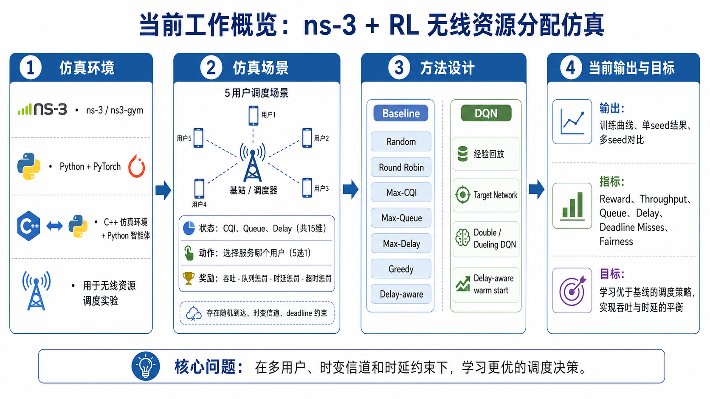
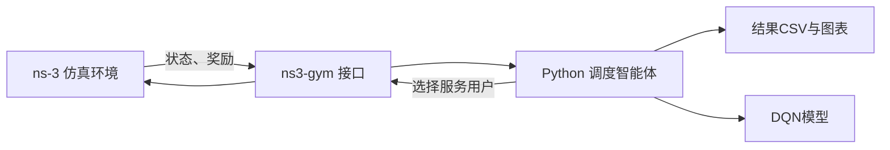
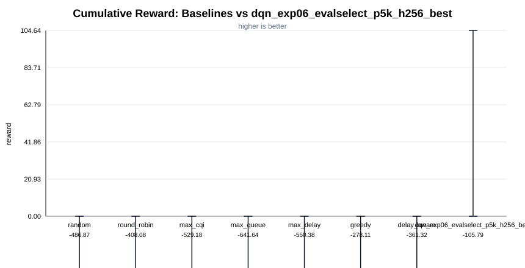
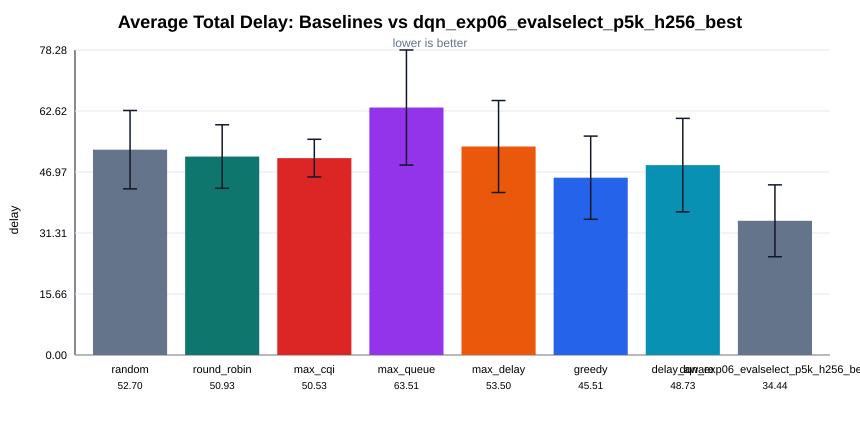
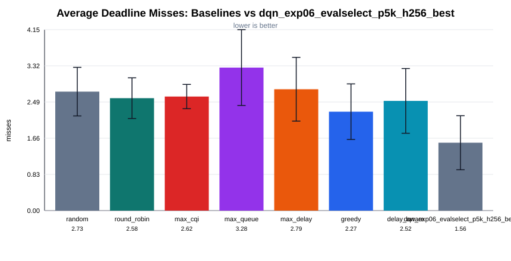
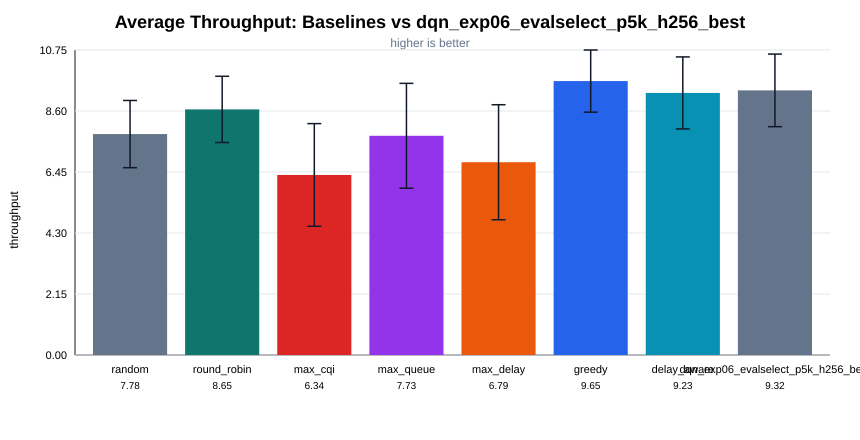
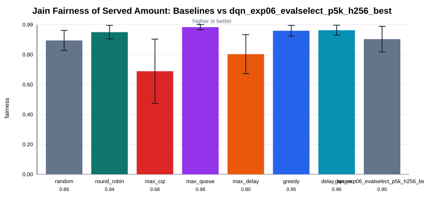

# ns3-gym + DQN 无线资源分配进展报告

汇报日期：2026-04-29  
项目目录：`ns-3.40/contrib/opengym/examples/wireless-rl`

## 1. 项目目标

本项目希望基于 **ns-3 + ns3-gym + PyTorch** 搭建一个无线资源分配仿真环境，用于验证强化学习在无线调度问题中的效果。

- 后续是否可以扩展到多机器人通信、任务导向通信和低时延调度等方向。



## 2. 仿真平台与整体流程

当前系统分为三部分：

- **ns-3**：负责仿真无线环境，包括用户队列、信道质量、服务动作和 reward；
- **ns3-gym**：把 ns-3 环境封装成类似 Gym 的接口；
- **Python / PyTorch**：实现 baseline 和 DQN 智能体。

整体交互流程是：



这套结构的好处是：环境逻辑保留在 ns-3 中，后续可以接入更真实的通信机制；学习算法放在 Python 中，便于使用 PyTorch 训练和调参。

## 3. 当前仿真场景

当前环境是一个 **5 用户无线调度场景**。每个 step 只能选择一个用户进行服务。

每个用户有三个状态：

| 状态 | 含义 |
|---|---|
| `CQI` | 当前信道质量，越高表示服务速率越高 |
| `Queue` | 用户当前积压的数据量 |
| `Delay` | 用户级 backlog age，表示队列持续非空的时间 |

因此总状态维度为：

```text
[cqi0, queue0, delay0, ..., cqi4, queue4, delay4]
```

动作是：

```text
action = i  表示当前 step 服务用户 i
```

reward 设计为：

```text
reward = 吞吐收益 - 队列惩罚 - 时延惩罚 - 超 deadline 惩罚
```

也就是希望智能体不仅追求吞吐，还要控制队列积压和用户等待时间。

## 4. 已实现方法

当前已经实现了多种手工 baseline 和 DQN 方法。

### Baseline

| 方法 | 思路 |
|---|---|
| `random` | 随机选择用户 |
| `round_robin` | 轮询选择用户 |
| `max_cqi` | 优先服务信道最好的用户 |
| `max_queue` | 优先服务队列最大的用户 |
| `max_delay` | 优先服务等待最久的用户 |
| `greedy` | 选择 `CQI × Queue` 最大的用户 |
| `delay_aware` | 同时考虑 `CQI × Queue` 和 `Delay` |

### DQN

当前 DQN 采用：

- Dueling DQN 网络结构；
- Double DQN 更新方式；
- replay buffer；
- target network；
- delay-aware warm start；
- validation seeds 选择最佳 checkpoint。

实验中发现，最后一个 checkpoint 不一定最好，因此现在保存的是 validation 表现最好的模型。

## 5. 当前实验结果

当前主要结果基于 10 个 evaluation seeds：

```text
1,2,3,4,5,6,7,8,9,10
```

### 5.1 多 seed 平均结果

| Agent | Reward ↑ | Throughput ↑ | Queue ↓ | Delay ↓ | Deadline Misses ↓ | Fairness ↑ |
|---|---:|---:|---:|---:|---:|---:|
| `random` | -486.868 | 7.7850 | 103.6950 | 52.6975 | 2.7300 | 0.8888 |
| `round_robin` | -408.080 | 8.6550 | 86.4250 | 50.9275 | 2.5800 | 0.9438 |
| `max_cqi` | -529.182 | 6.3450 | 143.4300 | 50.5275 | 2.6175 | 0.6843 |
| `max_queue` | -641.642 | 7.7250 | 100.2550 | 63.5100 | 3.2825 | 0.9771 |
| `max_delay` | -550.375 | 6.7925 | 127.6375 | 53.5050 | 2.7850 | 0.7978 |
| `greedy` | -278.111 | **9.6525** | **70.4775** | 45.5050 | 2.2700 | 0.9531 |
| `delay_aware` | -361.319 | 9.2350 | 80.7225 | 48.7325 | 2.5175 | **0.9567** |
| `DQN best` | **-105.792** | 9.3250 | 73.8050 | **34.4425** | **1.5575** | 0.8974 |

### 5.2 关键结果图

**Cumulative reward**



DQN 的 cumulative reward 明显高于所有 baseline。当前最强 baseline 是 `greedy`，平均 reward 为 `-278.111`，DQN best 提升到 `-105.792`。

**Average total delay**



DQN 将 average total delay 从 greedy 的 `45.5050` 降到 `34.4425`，说明它确实学到了更低时延的调度策略。

**Average deadline misses**



DQN 将 average deadline misses 从 greedy 的 `2.2700` 降到 `1.5575`，低时延指标改善明显。

**Average throughput**



DQN 的 throughput 为 `9.3250`，略低于 greedy 的 `9.6525`。这说明 DQN 牺牲了少量吞吐，换取了更低的 delay 和 deadline miss。

**Fairness**



DQN 的 fairness 低于 greedy 和 delay-aware，说明当前 reward 设计下，DQN 更倾向于优先服务高价值或紧急用户。后续如果公平性也作为核心目标，需要在 reward 或约束中显式加入 fairness。

## 6. 阶段性结论

当前阶段可以得到几个结论：

1. **原始环境太简单时，DQN 很难体现优势。**  
   只包含 CQI 和 queue 时，`greedy = CQI × Queue` 已经很强，DQN 主要是在模仿 greedy。

2. **加入 delay / deadline 和时变 CQI 后，问题更适合 RL。**  
   当前动作会影响后续 backlog age 和 deadline miss，因此不再是简单单步贪心问题。

3. **DQN best 在综合 reward、delay 和 deadline miss 上明显优于 baseline。**  
   相比 greedy，DQN 的主要提升来自降低时延和 deadline miss，同时吞吐没有大幅下降。

## 7. 当前不足

目前环境仍然是 toy model，主要限制包括：

- delay 是用户级 backlog age，不是逐包真实 delay；
- deadline miss 不是逐包 deadline violation；
- arrival、channel、service model 仍然比较简化；
- action 只是选择单个用户，没有建模 RB、功率、MCS 等真实无线资源；
- reward 权重还需要系统 ablation；
- 当前只在 10 个 seeds 上评估，后续需要更多随机场景验证泛化性。

## 8. 下一步计划

下一阶段准备从三个方向推进：

1. **改进仿真环境**  
   引入 packet-level queue，记录每个 packet 的 arrival time 和 deadline，从而统计真实 packet delay 和 deadline violation。

2. **丰富业务模型**  
   给不同用户设置不同 arrival rate、deadline 和任务重要性，使场景更接近多机器人通信或任务导向通信。

3. **完善 RL 实验**  
   做 reward 权重 ablation，引入 fairness / starvation 约束，并尝试 PPO、Rainbow DQN、优先级经验回放等方法。