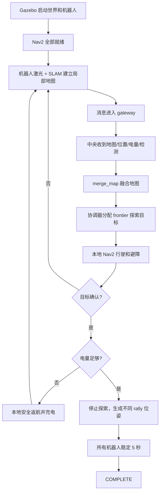

# 多机器人任务导向 Wi-Fi RL 项目总览：从 P0 到 P3B

日期：2026-09-28

本文面向第一次接触本项目、对 ROS 2、Gazebo、Nav2、SLAM、通信协议和强化学习基础不深的读者。
它把项目为什么存在、现在的系统怎样工作、P0 到 P3B 每一步做了什么、哪些结果已经被证明、哪些
事情还没有证明，以及后续 P4 到 P8 的计划放在一处。本文是项目总览，不替代每个阶段的原始实验
报告；具体实验数字仍以日期报告、源码和 `log.md` 为准。

## 先看结论

这个项目要解决的问题是：**让 2–3 台移动机器人在陌生室内环境里协同建图、寻找目标、在需要时
返航充电，最后安全地在目标附近集合；然后研究通信网络的延迟、丢包和带宽限制如何影响这个任务，
以及通信策略能否通过强化学习得到改善。**

截至本报告：

- P0 到 P2D 已完成对应工程门禁，其中 P1C、P2A、P2B、P2C、P2D 已得到用户验收；
- P3A 的显式消息 gateway 和 P3A.5 的当前 task-stack 重验证已经实现，固定 10 格任务矩阵为
  `10/10 COMPLETE`、零碰撞，强制充电回归也通过，但 P3A/P3A.5 仍处于“待用户验收”；
- P3B 的确定性应用层 delay/loss 故障替身和协议 matrix 已通过：4 个传输单测通过，54 格协议
  matrix 为 `PASS`；但 P3B 的 Gazebo 故障任务矩阵还没有完成，也还没有接入 ns-3 Wi-Fi；
- ns-3 目录里的旧 `wireless-rl` 是一个 5 用户抽象队列调度 MDP。它验证了 ns3-gym、DQN、
  checkpoint 和 GPU 工具链，但它目前不是这个多机器人 Wi-Fi 任务的完整网络模拟器；不能把旧
  toy MDP 的结果写成“机器人 Wi-Fi RL 已经有效”；
- 当前最重要的未完成闭环是：把 P3B 的应用层消息继续接到真实 ns-3 Wi-Fi，让“通信策略→网络
  交付→机器人获得的信息→任务行为→任务指标”真正连起来。

一句话概括工程状态：**任务层已经形成可靠的理想通信闭环，协议层已经开始处理可解释的故障，
无线层和强化学习层还没有完成。**

## 1. 项目背景：为什么需要这个系统

单个机器人可以使用激光雷达扫描周围环境，用 SLAM（同时定位与建图）建立地图，再使用 Nav2
规划路径和避障。多个机器人一起工作时，任务会变成一个因果链：

1. 每台机器人只看到自己附近的环境，并产生自己的局部地图、位置和电量状态；
2. 机器人需要把有用信息告诉中央协调器或其他机器人；
3. 中央协调器根据收到的信息决定下一步探索目标、地图融合和集合任务；
4. 如果通信延迟或丢包，中央看到的可能是旧地图、旧位置或根本没有收到目标检测；
5. 信息差异会改变机器人路线、目标分配、碰撞风险、返航时机和最终完成时间。

所以，真正要研究的不是“机器人能不能跑”，也不是“单独的 Wi-Fi 吞吐有多高”，而是下面这个
闭环：

```text
通信策略
    ↓ 选择哪些消息发送、何时发送
消息进入网络队列
    ↓ 排队、竞争、延迟、丢包、重传
接收端得到新信息、旧信息或没有信息
    ↓
地图融合、探索分配、目标通知、集合和充电行为改变
    ↓
任务成功率、完成时间、碰撞、路径和通信开销改变
```

如果机器人节点仍然可以绕过网络直接读取最新地图、位置或目标真值，那么通信就没有真正影响
任务，实验结论也不成立。因此项目把工作拆成层层递进的检查点，先证明机器人任务本身正确，
再证明消息边界正确，最后才进入真实 Wi-Fi 和 RL。

## 2. 项目由哪些部分组成

代码在同一个 monorepo 中，但可以先把它理解为两个相互配合的部分。

### 2.1 ROS 2/Gazebo 多机器人任务栈

路径：

```text
/home/zhuyulab/ns3-workspace/ros2_ws/ros2-multi-robot-automap
```

它负责“机器人任务世界”：

| 组件 | 初学者理解 | 当前作用 |
|---|---|---|
| Gazebo | 机器人运行的虚拟世界 | 墙、障碍物、机器人、目标和仿真时钟 |
| TurtleBot3 Waffle | 虚拟机器人本体 | 激光雷达、里程计、速度控制和机器人模型 |
| SLAM Toolbox | 边走边画地图 | 每台机器人从激光和位姿估计局部地图 |
| `merge_map` | 把多张局部地图拼起来 | 生成中央的 `/merge_map` 融合地图 |
| Nav2 | 机器人导航系统 | 全局路径、局部避障和 `NavigateToPose` action |
| `multi_robot_exploration/control.py` | 总部协调器 | 选择 frontier、分配探索目标、处理目标发现和 rally |
| `target_detector.py` | 仿真目标检测器 | 使用 Gazebo 真值模拟本地传感器的目标确认事件 |
| `battery_manager.py` | 每台机器人的本地电池管理器 | 扣能量、触发安全返航、充电和恢复任务 |
| `task_evaluator.py` | 只读裁判 | 记录覆盖率、路径、碰撞、阶段、充电和成功/失败原因 |
| `ideal_gateway.py` | 跨端消息入口 | P3A 的零损消息边界和 P3B 的故障替身 |
| `navigation_gateway.py` | 机器人本地导航适配器 | 把中央送达的导航命令交给本机 Nav2 |

主启动入口是：

```text
multi_robot/launch/gazebo_multirobot_mapping_with_nav2.launch.py
```

它可以启动 1–4 台机器人。当前人工启动命令、全部 63 个 launch 参数和场景说明在：

```text
ros2_ws/ros2-multi-robot-automap/launch_commands.md
```

### 2.2 ns-3/ns3-gym 无线强化学习工具链

路径：

```text
ns-allinone-3.40/ns-3.40/contrib/opengym/examples/wireless-rl
```

这里保留了早期的 ns3-gym 调度 MDP、DQN、baseline、checkpoint、GPU 和多 seed 评估工具。它对
“如何训练和评估 RL”有用，但当前环境是抽象队列，不包含真实的 802.11 AP、机器人节点、传播、
墙体损耗、背景干扰、Gazebo mobility 或消息包对账。

因此要区分三件事：

1. 旧 toy MDP 证明 ns3-gym 和 DQN 工具链可以运行；
2. ROS 2/Gazebo 证明机器人任务可以正确完成；
3. P4 以后才会证明真实 ns-3 Wi-Fi 的网络变化会传导到机器人任务。

## 3. 一次完整任务怎样运行

一轮 episode 可以用下面的流程理解：



从 P2B 开始，几个状态必须分开理解：

| 状态/指标 | 含义 | 是否等于最终成功 |
|---|---|---|
| `EXPLORE` | 仍在建图和寻找 frontier | 否 |
| `FOUND_UNCONFIRMED` | 有短暂观察，但尚未满足确认规则 | 否 |
| `FOUND` | 目标已被本地检测规则确认 | 否 |
| `RALLY` | 中央收到有效目标信息并开始集合 | 否 |
| `COMPLETE` | 所有 required robots 到达各自位姿并稳定 | 是 |
| 90% coverage | P1C 探索能力指标 | P1C 的基准成功条件，P2B 以后不是任务成功替代品 |
| collision=0 | 安全指标 | P2 以后是硬门禁，但单独不代表完成 |

最终任务成功只能由 `COMPLETE/task_complete` 产生。找到目标但目标信息没有交付，不能进入
`RALLY`；一台机器人悄悄退出 required set，也不能把剩下机器人完成当成成功。

## 4. 项目为什么要分 P0、P1、P2、P3

每个阶段都回答一个不同的问题：

```text
P0：我们到底要解决什么，怎样才算成功？
P1：机器人系统能稳定启动，能探索，并且能被独立测量吗？
P2：目标检测、集合、充电和完整理想任务能在同一轮闭环吗？
P3：所有跨机器人信息真的经过统一消息边界，延迟/丢包会产生可解释后果吗？
P4：这些应用消息能和 ns-3 的真实数据包、时间和 Wi-Fi 行为对账吗？
```

这样做的好处是：如果 P4 的网络结果异常，可以知道问题发生在无线层；不会把 SLAM、Nav2、
电池或消息旁路问题误认为“RL 没学好”。

## 5. P0：项目审计、研究问题和验收规则

### 5.1 P0 要解决的问题

最初仓库中同时存在一个 ns3-gym 抽象调度例子和一个 ROS 2 多机器人项目。如果直接在旧 MDP
上继续训练，容易产生一个危险误解：仿真中的队列奖励并不等于真实机器人任务中的 Wi-Fi 影响。

P0 因此先做项目审计和路线固化：

- 复用已有 ROS 2/Gazebo/Nav2/SLAM 任务栈，不从零重写机器人；
- 先建立无网络、无 RL 的正确任务闭环；
- 把任务工程、消息协议、无线仿真和实物验证分层；
- 固定 `COMPLETE` 为最终任务成功，不能用 `FOUND` 或覆盖率代替；
- 明确区分 episode 开始前基础设施失败和开始后的任务失败；
- 规定失败、超时和中断必须保留，不能只保留成功重跑；
- 在完成消息旁路审计和理想任务基线前，不开始 ns-3 或 RL。

### 5.2 P0 的主要产物和结果

主要文档是：

- `RESEARCH_PLAN.md`：长期研究问题、系统边界、指标、风险和 P4–P8 路线；
- `IMPLEMENTATION_PLAN.md`：逐阶段工程检查点、最短退出条件和用户验收状态；
- `report/20260917_roadmap_audit.md`：发现原计划缺少完整任务集成门、严格成功语义、P4 时间/包
  对账门和正式统计规则，并把这些补进路线；
- `AGENTS.md`：当前仓库的事实边界、环境、验证和提交规则。

P0 的结论不是“已经完成机器人功能”，而是把项目从一个混合代码库变成一条可审计的研究流水线。
P0 已完成。

## 6. P1：先把机器人任务做成可重复、可测量的基线

P1 仍然不研究网络和 RL。它回答的是：在理想同机 ROS 2/DDS 条件下，机器人能不能可靠启动、
探索，并且我们能不能客观判断一轮运行到底成功还是失败。

### 6.1 P1A：可重复启动和 headless smoke

#### 目标

冷启动多机器人系统经常有 spawn 服务尚未出现、Nav2 lifecycle 尚未 active、Gazebo 进程退出不干净
等问题。若不先处理这些问题，后续“任务失败”可能只是环境没有启动完成。

#### 实现

- 主 launch 接收显式 `world`、`robot_count`、`gazebo_seed` 和 `spawn_timeout`；
- 机器人按 `tb1` 到 `tb4` 顺序生成，数量限制为 1–4；
- smoke 关闭 GUI、RViz、自动地图保存，降低资源和退出干扰；
- readiness gate 同时要求 Nav2 action 可发现，并要求每台 `bt_navigator=active`；
- smoke 检查 `/scan`、`/odom`、`/map`、`/cmd_vel` 和 `/merge_map` 至少有数据；
- 只终止本次启动的进程组，并检查是否在 shutdown timeout 内退出；
- 启动前失败单独标成 infrastructure failure，不能和 episode 任务失败混在一起。

#### 结果

1、2、3 台机器人启动和消息流检查已通过。P1A 只证明“系统能启动并产生数据”，不证明探索、
检测或网络性能；这是刻意的边界。

### 6.2 P1B：独立真值评估器

#### 为什么需要评估器

如果只看终端输出，很容易把“某个 topic 出现了”“机器人动过”“目标被发现”误当成任务完成。
因此新增只读评估器，评估器不参与控制，只负责记录和判定。

#### 评估器记录什么

- world、Gazebo seed、机器人数量、episode 起止仿真时间；
- 每台机器人真实轨迹和阶段路径长度；
- 探索阶段访问过的真值自由栅格、覆盖率和搜索重叠；
- SLAM 地图相对真值地图的正确自由覆盖、占据栅格准确率和 IoU 类指标；
- Nav2 goal 的成功、取消和 abort；
- base contact 碰撞事件和持续时间；
- 任务阶段、终止原因和结构化失败原因；
- 后续追加目标检测、rally、稳定保持和电池/充电字段。

输出为单 episode JSON/CSV，既保留完整字段，也保留失败 episode。P1B 已完成并通过短 episode
和构造数据检查。

### 6.3 P1C：理想通信下的协同探索

#### 固定验收口径

- 任务：在陌生室内环境中协同探索；
- 主要成功指标：`correct_free_coverage_ratio >= 0.90`；
- episode 硬上限：180 仿真秒；
- 2 台机器人最慢不超过 120 秒，3 台最慢不超过 90 秒；
- seeds：101、202、303；
- 过程指标：覆盖率、路径、地图准确率、Nav2 结果、搜索重叠、碰撞；
- 这个阶段没有目标检测、充电或真实网络影响。

#### 关键根因修复

早期系统长时间只能达到约 75%–80%，原因不是“多机器人探索做不到”，而是基础闭环有多处不
一致：

1. 自定义 SLAM 回调没有正确启用 `map→odom`；
2. 建图期间 AMCL 与 SLAM 竞争；
3. 协调器把 odom 坐标错误地当成 map 坐标；
4. frontier 选择中的最近点扫描过慢；
5. 中央用融合地图评分，但 Nav2 全局规划仍使用不一致的私有地图；
6. 长距离目标容易超出滚动全局代价图；
7. 多机器人会选择穿过队友当前位置的目标；
8. 只检查 action server 名称，没有确认 `bt_navigator` 真正 active。

修复方向是建立一致的数据和导航闭环：使用融合地图、SmacPlanner2D、完整非滚动全局图、
超过 5 m 的路径分段、已知自由且有净空的观察点、队友位置排除和轻量 lifecycle gate。

#### 结果

在 `my_world.world` 上：

| 机器人 | seed 101 | seed 202 | seed 303 | 均值 |
|---:|---:|---:|---:|---:|
| 2 | 98.9 s | 79.6 s | 104.4 s | 94.3 s |
| 3 | 78.3 s | 69.8 s | 69.5 s | 72.5 s |

所有 6 项均达到 90% 且零碰撞；3 机器人最大搜索重叠为 0.44%。

之后做了跨地图泛化：`p1c_open.world`、`p1c_rooms.world`、`p1c_corridors.world` 共 9 项
三机器人 episode 全部达到 90%，最坏 `time_to_90=75.5 s`，零碰撞，最低观测准确率 97.47%，
最大搜索重叠 1.91%；最难地图的双机器人交叉检查为 85.5 s、零碰撞。

P1C 已验收。这里的 90% 覆盖是探索基准，不是后续目标搜索任务的最终成功定义。

## 7. P2：从“会探索”到“会完成任务”

P2 把目标、集合、电池和完整任务串起来。P2 仍使用理想同机通信，目标检测使用 Gazebo 真值
模拟器，尚未引入网络延迟和丢包。

### 7.1 P2A：目标检测与确认 MVP

#### 设计边界

真正的 RGB/深度视觉还不是这一阶段的研究变量。P2A 先建立一个可重复的“本地传感器模拟器”：

- Gazebo 中生成无碰撞的红色 `search_target` 可视模型；
- `target_detector` 根据机器人与目标的仿真位置产生候选观测；
- 用静态真值栅格检查墙体遮挡；
- 目标必须在 3.0 m 距离内、90° 水平视场内，并连续 3 帧可见；
- 一次不可见会清零当前机器人的确认计数；
- 检测器发布观测和检测事件，不直接控制探索，也不直接发布最终任务状态。

#### 结果

在 `my_world.world`、3 台机器人、目标 `(-4,4)`、seeds 101/202/303 下，目标确认时间为
60.7/72.9/61.5 秒，三轮零碰撞、零搜索重叠。目标放到 `(100,100)` 的负例保持 `EXPLORE`
并按超时结束，没有误触发。

P2A 已验收。它证明的是“确认规则和事件契约”，不是“真实摄像头识别已经完成”。真实视觉要在
P8A 通过替换 `DetectionProvider` 完成。

### 7.2 P2B：权威任务状态机和安全集合

#### 为什么需要状态机

“发现目标”不等于“任务完成”。发现后必须停止继续探索，为每台要求参与的机器人安排不同的
安全集合位姿，并确认所有机器人稳定停下。

状态机为：

```text
EXPLORE
  -> FOUND_UNCONFIRMED
  -> FOUND
  -> RALLY
  -> COMPLETE
```

其中 `/task_state` 只有协调器能发布；检测器只发布观察和检测事件。

#### 实现要点

- 首次有效目标确认后取消探索目标；
- 如果目标附近地图还不完整，发现机器人执行有界 survey；
- 从已知自由地图生成朝向目标、净空足够的不同 staging pose；
- 集合位姿至少保持 0.8 m 硬间距，并优先达到 1.2 m；
- 每段 rally 路径约 1.5 m，避免长距离 action 在狭窄通道中失败；
- 按路径、动态占位和目标背侧优先级选择进场顺序；
- action 拒绝、取消、重试耗尽、集合空间不足和 timeout 都有明确失败原因；
- `COMPLETE` 要求每台位置误差 ≤0.35 m、线速度 ≤0.05 m/s、角速度 ≤0.10 rad/s，且全体
  连续保持 5 仿真秒；任何机器人重新运动都会重置保持计时。

#### 结果

| 机器人 | seed | `COMPLETE` 时间 | 最大位置误差 | 最小集合间距 | 碰撞 |
|---:|---:|---:|---:|---:|---:|
| 3 | 101 | 134.5 s | 0.237 m | 1.210 m | 0 |
| 3 | 202 | 171.9 s | 0.237 m | 1.221 m | 0 |
| 3 | 303 | 177.3 s | 0.221 m | 1.414 m | 0 |
| 2 | 303 | 96.5 s | — | 2.025 m | 0 |

早期存在候选位姿不足、长走廊直达失败、survey 状态竞态和集合路径碰撞。每一次 post-start
失败都保留，修复通过更严格的路径净空、分段导航、顺序进场和状态清理完成。

P2B 已验收。

### 7.3 P2C：本地电池、返航和充电

#### 能量模型

当前简化模型为：

```text
E_next = E
         - c_move * traveled_distance
         - c_idle * elapsed_time
         - c_tx * transmitted_bytes
```

P3 之前还没有真实消息字节账本，因此 `c_tx=0`，没有假装通信能耗已经校准。

#### 安全原则

- 每台机器人有独立的本地 battery manager；
- 当剩余电量接近“预计返航成本 + 安全余量”时，本地硬安全逻辑抢占普通任务；
- 返航使用机器人自己的出生/充电位，充电位彼此不重叠；
- 机器人必须进入充电半径、保持速度低于阈值并稳定足够时间；
- 充电不清空 SLAM 地图，不重置任务阶段，完成后恢复原任务；
- `battery_exhausted`、`battery_return_unreachable` 和 `battery_charge_timeout` 是明确失败；
- 中央可以暂停任务，但不能覆盖本地安全返航。

#### 强制充电证据

两机器人、seed 303、初始能量 18 的强制充电 episode：

| 指标 | 结果 |
|---|---:|
| 最终状态 | `COMPLETE` |
| 完成时间 | 190.1 s |
| 返航/充电次数 | 2/2 |
| 最低能量 | 6.661 |
| 碰撞 | 0 |
| 搜索重叠 | 0 |

两台机器人各完成一次返航和充电，地图和任务状态保留，之后继续发现目标并集合。

P2C 已验收。共享单充电器排队、真实机械对接和通信能耗仍未实现。

### 7.4 P2D：完整理想通信任务基线

#### 为什么必须增加 P2D

P2A、P2B、P2C 分别通过，并不代表探索、目标发现、返航充电和集合能在同一 episode 中连起来。
P2D 是进入消息故障前的完整 ideal upper bound。

新增统一串行 runner：

- 每个 episode 使用独立 ROS domain 和输出目录；
- 运行前检查 world、目标位置、自由空间、集合位可达性和间距；
- 记录 schema v7 的阶段时间、路径、覆盖、重叠、Nav2、碰撞、电池和失败字段；
- 只对 episode 开始前且没有评估结果的基础设施失败重试；
- 已经启动并写出结果的任务失败不可被成功重跑替换；
- 10 项固定矩阵：三个场景各 3 个三机器人 seed，加走廊双机器人交叉检查。

冻结场景为：

| 场景 | world | 目标 | 初始能量 |
|---|---|---:|---:|
| lab | `my_world.world` | `(-4,4)` | 40 |
| rooms | `p1c_rooms.world` | `(5,3)` | 40 |
| corridors | `p1c_corridors.world` | `(-4.5,-0.5)` | 45 |

走廊场景在能量 40 的双机器人校准中后段返航并在 300 秒超时，因此在正式批次前统一把该场景
能量冻结为 45，没有按 seed 调参。

#### 结果

10/10 episode 均为 `COMPLETE`，10/10 零碰撞、零基础设施失败；lab seed 202 完成一次安全
充电，corridors 双机器人交叉格也完成一次充电。完成时间范围为 87.5–274.1 仿真秒。

P2D 已验收。它是理想通信上界，不是 Wi-Fi 结果。

## 8. P3A：把所有跨端信息放进同一个 gateway

### 8.1 P3A 解决的核心问题

P2 的系统虽然能完成任务，但中央协调器当时可以直接读取机器人地图、odom、TF、检测和中央
融合地图，Nav2 也可能直接调用机器人 action。这样即使未来旁边运行 ns-3，机器人仍可以免费
拿到最新信息，网络就不会真正改变任务。

P3A 的目标不是制造网络损失，而是先保证**理想零损条件也走同一条消息路径**。这里的 ideal
含义是 zero-loss finite-rate：消息仍然真实生成、限频、序列化和交付，只是不注入额外丢包和
延迟；它不是无限带宽、无限频率的 oracle。

### 8.2 `GatewayEnvelope` 和数据流

每个跨端消息至少包含：

- `message_type`；
- `sender`、`recipient`；
- `sequence`、`correlation_id`；
- `generation_time` 和 `task_phase`；
- payload 长度、编码、TTL、ACK 序号和 payload。

主要上行消息包括机器人地图、位姿、TF、电量、目标观测、目标检测和电池失败；主要下行消息
包括融合地图、任务状态、探索/返航/集合导航命令。

数据流变为：

```text
机器人原始 topic
    → ideal_gateway 候选 envelope
    → /gateway/uplink/candidates
    → gateway 接收/校验/存储
    → /gateway/uplink/delivered
    → /gateway/received/... 或中央消费 topic

中央导航 action
    → /gateway/<robot>/navigate_to_pose
    → navigation_gateway
    → downlink envelope
    → 机器人本地 Nav2 action
```

中央控制链只能订阅 `/gateway/received/...`；机器人 Nav2 全局代价图只能订阅
`/<robot>/gateway/merge_map`；中央不能直建 `/<robot>/navigate_to_pose` action client。

### 8.3 forbidden-bypass 审计

新增机器可检查的 `p3a_forbidden_bypasses.json` 清单，结合：

- 源码搜索；
- ROS graph publisher/subscriber 方向；
- launch remap；
- 动态 topic；
- evaluator/truth 的明确只读例外。

评估器仍然可以读取 Gazebo 真值，因为它是裁判，不是控制链；但真值不能发布给中央协调器或
机器人策略。

### 8.4 P3A.5：为什么还要重新验证当前 HEAD

P3A gateway 提交之后，电池、协调器、净空和 rally 路由继续修改过。历史 P3A formal 矩阵不能
自动代表当前代码，因此 P3A.5 要求在当前 task-stack 上重新跑 P2D/P3A 固定矩阵并冻结：

- commit；
- 配置和协议哈希；
- 环境版本；
- worktree 是否干净；
- 每个 episode 的 graph snapshot；
- 源码/运行时旁路审计结果。

中间候选 `41f63fb` 为 9/10，lab seed 202 在启动后 `RALLY` 超时；`c369c7d` 为 8/10，
lab seed 202 和 rooms seed 303 在 `EXPLORE` 超时。这些失败都保留。

随后加入已知自由起点的有界逃逸、动态阻挡下的 rally 顺序、parked blocker 让路、stale action
清理、gateway battery return action 和最长路径 minimax 分配。冻结候选 `2933c24` 的两个连续
干净 runner 批次合计：

- lab/rooms 六格：6/6 `COMPLETE`，零碰撞；
- corridors 四格（含双机器人交叉格）：4/4 `COMPLETE`，零碰撞；
- 两个 manifest 均 `worktree_dirty=false`；
- 源码和 ROS graph bypass audit 通过；
- 强制充电回归完成 2 次充电并 `COMPLETE`。

这使 P3A/P3A.5 达到“待用户验收”边界，但按照项目规则，仍不能把“待用户验收”写成“已验收”。

## 9. P3B：确定性 delay/loss 故障替身

### 9.1 P3B 的目的

P3B 先不接真实 Wi-Fi，而是在同一个 gateway 上注入可重复、可解释的应用层故障。这样可以先回答：

- 目标检测丢了，是否真的不会进入 `RALLY`？
- 位置、TF 或地图过期，中央是否暂停新的分配？
- 导航命令丢失或延迟，是否会在 deadline 内重试或明确失败？
- 旧序号、重复消息、TTL 过期消息是否不会覆盖新状态？
- 每一次 attempt 是否能追踪到生成、入队、发送、交付或丢弃？

### 9.2 实现

`fault_model.py` 提供 `DeterministicFaultTransport`：

- 上行和下行各自拥有 transport 和 seed；
- 丢包按消息 identity、attempt 和故障 seed 的哈希计算，避免依赖 wall clock；
- 支持 `0/10/100%` 丢包和 `0/0.5/2s` 延迟；
- 支持重复、窗口乱序和队列溢出；
- 支持 TTL 过期、ACK timeout 和最大重试次数；
- 过期或失败不会悄悄被当成成功交付。

`ideal_gateway.py` 在 `gateway_mode:=ideal` 时保留 P3A 零损行为，在 `gateway_mode:=fault` 时
启用故障队列。`/gateway/message_events` 和可选 JSONL 账本记录：

```text
source_time
enqueue_time
admit_time
tx_time
delivery_time 或 drop_time
message_id、sequence、version、correlation_id
attempt、duplicate、reason
```

`navigation_gateway.py` 为导航命令提供 command id、deadline、有限重试和本地取消；电池处于
非 ACTIVE 时可以直接取消本地 Nav2 action。

### 9.3 协议验证结果

当前协议单测：`4 passed`。

当前 fault matrix：

- seeds：101、202、303；
- direction：uplink、downlink；
- loss：0.0、0.1、1.0；
- delay：0.0、0.5、2.0；
- 总格数：54；
- TTL 延迟消息：`expired_in_flight`；
- 乱序结果：`[2,1]`；
- 100% 丢包可靠消息：初始发送加两次重试后明确耗尽；
- 总体：`status=PASS`。

### 9.4 ROS fault-mode 保留样本

2026-09-25 运行过两机器人 `my_world.world`、seed 101、rally 模式、100% 上行丢包的 smoke：

- Nav2 readiness 通过；
- P3A bypass audit 通过；
- 所有上行地图、位姿和 TF 被故障队列丢弃；
- 中央没有收到 `/merge_map`；
- 没有导航目标，没有进入 `RALLY`；
- 结果为 `failure_reason=no_data`、`map_message_count=0`、`nav_goal_count=0`。

这是一个有价值的安全降级样本：未收到检测和状态，系统没有伪造成功。但它发生在随后 ACK、
源时间和本地 deadline 语义收紧之前，因此不能替代硬化后的完整任务矩阵，也不能被当成故障
网络成功率。

### 9.5 P3B 当前没有完成什么

P3B 整体仍为“待用户验收”，原因是：

1. 还没有在硬化后的当前代码上跑完 `coverage/target/rally`、多 world、多 seed、多延迟/丢包
   组合的 Gazebo 任务矩阵；
2. 还没有故障条件下的 `COMPLETE` 成功率、完成时间、碰撞和充电统计；
3. 还没有 ns-3 bridge、逐包生成/发送/交付/丢弃字节对账、时间同步和资源记录；
4. 当前文档已明确记录 gateway 默认队列容量的实现语义，后续仍需在正式验收中把容量/overflow、
   TTL/deadline/retry 组合纳入固定 seed 的完整矩阵。

因此，“P3B 已完成”只能理解为“P3B 应用层故障替身和协议门禁实现完成”，不能理解为“无线网络
实验已经完成”。

## 10. 当前阶段总表

| 阶段 | 核心问题 | 当前状态 | 证据摘要 |
|---|---|---|---|
| P0 | 目标、边界、指标和顺序是否清楚 | 已验收 | 研究计划、实施计划、路线审计 |
| P1A | ROS/Gazebo 能否可重复启动 | 已验收 | 1/2/3 机器人 smoke 和 Nav2 readiness |
| P1B | 能否独立、客观评估 episode | 已验收 | truth grid、路径、覆盖、碰撞、CSV/JSON |
| P1C | 理想通信下能否协同探索 | 已验收 | 2/3 机器人固定 seeds 达到 90%，零碰撞 |
| P2A | 能否可靠确认目标 | 已验收 | 3m、90°、3 连续帧和负例 |
| P2B | 发现后能否安全集合并定义完成 | 已验收 | `COMPLETE`、不同位姿、5s 稳定、零碰撞 |
| P2C | 电量不足能否安全返航、充电、恢复 | 已验收 | 强制充电 2 次后 `COMPLETE` |
| P2D | 探索→发现→充电→集合能否完整闭环 | 已验收 | 10/10 ideal episodes `COMPLETE`、零碰撞 |
| P3A | 所有跨端信息是否走同一 gateway | 待用户验收 | envelope、接收状态、导航适配器、bypass audit |
| P3A.5 | 当前 task-stack 是否可冻结为网络基线 | 待用户验收 | 2933c24 上 10/10、零碰撞、强制充电通过 |
| P3B | delay/loss/TTL/重传是否产生可解释后果 | 待用户验收 | 4 tests、54 格 protocol PASS；Gazebo matrix 未完成 |
| P4A | 应用消息能否和 ns-3 数据包/时间对账 | 待开始 | 需要 trace ledger 和 lock-step/bridge |
| P4B | Wi-Fi 4 参数是否有来源且会改变任务 | 待开始 | 需要 AP/STA、墙损耗、干扰和校准 |
| P5 | 非学习 baseline 和实验协议是否冻结 | 待开始 | 需要 paired seeds 和统一 gateway |
| P6 | 中央通信策略 DQN 是否可部署 | 待开始 | 需要真实候选队列观测和安全动作覆盖 |
| P7 | 泛化、消融和统计是否足够 | 待开始 | 至少 20 个配对 held-out episodes |
| P8A | 单机器人真实感知和真实通信能否复用协议 | 待开始 | camera provider、UDP、时钟和安全返航 |
| P8B | 双机器人实物任务和 sim-to-real | 待开始 | 搜索、通知、充电、集合和差异报告 |

## 11. 已经证明的内容与尚未证明的内容

### 11.1 已经有证据支持的结论

- 当前 ROS 任务栈可以在固定世界和 seed 下启动并完成可测量任务；
- 协同 frontier 探索在已验证的室内几何上可以达到 90% 正确自由空间覆盖；
- 目标检测确认规则可以产生可重复的 `FOUND`，并且目标不可见时不误报；
- 发现目标后，机器人可以停止探索、分配不同安全集合位姿并完成 `COMPLETE`；
- 电池不足时机器人可以本地返航、充电、保留地图和任务，再继续完成任务；
- 三个 world、三个 seed 和一次双机器人交叉检查组成的 ideal 完整任务矩阵已经通过；
- 当前跨端控制链经过显式 gateway，源码和 ROS graph forbidden-bypass 审计有自动证据；
- 应用层 delay/loss/TTL/重试语义可以固定 seed 重复，并能记录逐次 attempt。

### 11.2 目前不能声称的内容

- 不能说已经完成真实 Wi-Fi 4 仿真；
- 不能说 P3B 已有完整故障网络任务成功率；
- 不能说旧 toy MDP 的 DQN 已经学会多机器人通信；
- 不能说 Gazebo truth detector 等于真实摄像头识别；
- 不能说当前电池模型是一般性的安全保证；它是可校准的仿真可行性模型；
- 不能从独立充电位结果推断共享充电器排队已经解决；
- 不能把理想 gateway 的完成时间直接当成 Wi-Fi 下界或 sim-to-real 预测；
- 不能把 P3A/P3A.5 的“待用户验收”写成“已验收”。

## 12. 下一步路线：P3B 之后怎样进入真正的 Wi-Fi 和 RL

### 12.1 先完成 P3B 的剩余门禁

下一步不是立刻训练 DQN，而是完成硬化后 fault-mode ROS 任务矩阵：

1. 固定当前 task-stack commit、配置、场景和环境 manifest；
2. 在 lab、rooms、corridors 以及 holdout 场景中运行固定 seeds；
3. 覆盖 `coverage`、`target`、`rally` 三种 `mission_mode`；
4. 至少覆盖 0/10/100% 丢包和 0/0.5/2s 延迟；
5. 另外固定测试重复、乱序、TTL、deadline、重传耗尽、队列 overflow；
6. 对每一轮记录 `COMPLETE`、`no_data`、`stale_state`、`navigation_deadline`、碰撞、充电和
   ledger 时间；
7. 把理想模式作为同一 gateway 的配对对照，不更换任务实现。

这一阶段的成功不是“所有高丢包都要完成”，而是：系统在故障下有可解释的降级行为，关键消息
不会无限等待，未交付检测不会伪造 `RALLY`，旧状态不会覆盖新状态。

### 12.2 P4A-0：先做离线 trace ledger

在真正接入 ns-3 前，先把应用层事件写成 canonical JSONL：

```text
应用生成
  → gateway 入队/准入
  → ns-3 发送
  → ns-3 交付/丢弃
  → ROS 接收
  → 应用消费
```

每条消息要能按 `message_id` 和 attempt 对齐，至少闭合 payload bytes、时间戳、方向、发送者、
接收者和原因。相同 seed 重跑必须产生可复核的事件顺序。

### 12.3 P4A-1：固定时间窗或 lock-step 桥接

ROS 2/rclpy 使用 system Python，ns3gym 使用 `ns3gym` conda Python，不能强行导入同一个进程。
两边通过明确的 UDP、ZMQ、文件或 clock-handshake 桥连接。

需要解决：

- Gazebo 仿真时间和 ns-3 时间怎样推进；
- 消息生成、网络发送、交付和消费何时确认；
- wall clock 慢但 simulation time 正常时如何记录；
- 网络退出或进程异常时怎样有界停止；
- 背压和消息队列满时怎样不死锁。

P4A 的退出证据必须包含 wall time、sim time、RTF、CPU/RAM 峰值和重复运行一致性。

### 12.4 P4B：Wi-Fi 4 场景和校准

初始无线模型计划为 1 个 802.11n AP、2 台 STA，稳定后增加第 3 台，20 MHz 固定 MCS 起步，
加入墙体损耗、传播、背景干扰和真实消息大小。

至少建立三档可解释条件：

1. ideal/no-network-bottleneck；
2. 有 Wi-Fi 但没有强干扰；
3. 有可解释的受干扰/受限网络。

如果实测校准表明 Wi-Fi 对任务几乎没有影响，应该报告 network-not-bottleneck，而不是人为
制造拥塞来让 RL 看起来有优势。

### 12.5 P5：先冻结非学习 baseline

在训练前冻结：

- 场景、目标、能量、任务 horizon 和 seed 划分；
- `coverage/target/rally` 任务口径；
- 每种消息大小和产生规则；
- 主指标、失败分类和统计方法；
- 所有策略使用同一 gateway 和同一配对 episode。

至少保留 no-communication、ideal、always-send、periodic、random、event-triggered、
task-aware 和 network-aware 等 baseline。先确认真实消息负载下确实存在通信决策空间，再训练 RL。

### 12.6 P6：中央 DQN 工程链

DQN 的输入必须来自执行时可获得的信息，例如：

- 最近一次收到的地图/位姿/电量版本及 age；
- 目标检测是否本地确认、是否已交付、是否已消费；
- 任务阶段和剩余 horizon；
- 队列长度、重试次数、deadline 和网络状态；
- 机器人数量和必要的安全状态。

动作不直接控制 Nav2 或安全返航，而是决定某类候选消息是否准入、何时发送或是否抑制。目标
检测、急停、低电量返航等关键消息必须有硬安全覆盖，RL 不能永久阻塞。

validation 只能用于选 checkpoint；held-out 测试不能反复调参。旧 toy MDP checkpoint 不直接
迁移到新的机器人通信环境。

### 12.7 P7：泛化、消融和统计

主要比较使用至少 20 个配对 held-out episode，每个主要 world 至少 6 个，推荐 24 个。先报告：

- `success rate` 和 95% Wilson 区间；
- 固定 horizon 的 RMST 或完成时间分布；
- collision、battery failure、stale/deadline failure；
- payload bytes、airtime、delivery rate、AoI、retry 和 drop；
- 任务阶段的 detection-to-rally 和 rally-to-complete 时间。

主终点预注册为安全不劣条件下的 payload/airtime 或任务完成代价。若 RL 没有优势，也要报告
负结果和失败原因，而不是只保留最好的 seed。

### 12.8 P8A/P8B：真实机器人

P8A 先做单机器人：

- 用真实 camera provider 替换 Gazebo truth provider；
- 复用同一检测消息契约；
- 接入真实 UDP/Wi-Fi 和时钟同步；
- 验证检测消息、返航、充电和失联安全行为；
- 校准仿真中的关键消息大小、延迟和感知误差。

P8B 再做双机器人完整任务，并单独测试共享充电器或充电排队。当前各机器人独立充电位只用于
隔离通信变量，不能直接泛化到一个共享充电器。

## 13. 如何复现当前项目

### 13.1 ROS 2 手动启动

```bash
source /opt/ros/humble/setup.bash
cd /home/zhuyulab/ns3-workspace/ros2_ws/ros2-multi-robot-automap
source install/setup.bash
source /usr/share/gazebo/setup.sh
export TURTLEBOT3_MODEL=waffle

ros2 launch multi_robot gazebo_multirobot_mapping_with_nav2.launch.py \
  world:=my_world.world \
  robot_count:=3 \
  enable_gzclient:=true \
  enable_task_regions:=true \
  enable_status_panel:=true \
  enable_rviz:=false \
  enable_merge_rviz:=false \
  auto_save_map:=false \
  gazebo_seed:=101 \
  nav2_ready_timeout_sec:=360.0 \
  enable_target_detection:=true \
  enable_rally:=true \
  enable_battery:=true \
  battery_initial_energy:=24.0 \
  target_x:=-4.0 \
  target_y:=4.0
```

启动后应看到：

```text
All 3 Nav2 stacks are active.
Nav2 ready; starting cooperative exploration.
```

如果只想看合并地图，关闭 Gazebo GUI、打开 `enable_merge_rviz:=true`；如果是 headless，关闭
`enable_gzclient`、`enable_status_panel`、`enable_task_regions` 和两个 RViz。

### 13.2 查看完整参数

```bash
ros2 launch multi_robot gazebo_multirobot_mapping_with_nav2.launch.py --show-args
```

当前参数参考以 `ros2_ws/ros2-multi-robot-automap/launch_commands.md` 为准。

### 13.3 P3B 协议门禁

ROS 脚本用 system Python；ns-3/wireless-rl 脚本才使用 `ns3gym` conda：

```bash
export PYTHONPATH=/home/zhuyulab/ns3-workspace/ros2_ws/ros2-multi-robot-automap/src/multi_robot_exploration
/usr/bin/python3 -m pytest -q \
  ros2_ws/ros2-multi-robot-automap/src/multi_robot_exploration/test/test_fault_model.py
/usr/bin/python3 ros2_ws/ros2-multi-robot-automap/scripts/run_p3b_fault_matrix.py \
  --output /tmp/p3b_fault_matrix_current.json
```

### 13.4 证据位置

- P1/P2 日期报告：`report/20260914_*` 到 `report/20260918_p2d.md`；
- P3A/P3A.5：`report/20260922_p3a.md`、`report/20260923_p3a5.md`、`report/20260924_p3a5.md`；
- P3B：`report/20260928_p3b.md`；
- 全部运行时间线和失败：`log.md`；
- ROS 运行 JSON、CSV、launch log、graph snapshot：`ros2_ws/ros2-multi-robot-automap/log/`，
  其中大部分是 Git 忽略的运行产物；
- 当前参数和启动入口：`ros2_ws/ros2-multi-robot-automap/launch_commands.md`；
- 当前 ROS 使用说明：`ros2_ws/ros2-multi-robot-automap/user_guide.md`。

## 14. 初学者词汇表

| 词 | 简单解释 |
|---|---|
| ROS 2 | 机器人软件之间通过 topic、service 和 action 通信的框架 |
| topic | 持续发布消息的频道，例如地图、位置或电池状态 |
| action | 可以持续执行、反馈进度、最终返回结果的任务接口，例如导航到某个位置 |
| Gazebo | 运行机器人和环境的物理仿真器 |
| SLAM | 同时估计机器人位置并建立地图 |
| Nav2 | ROS 2 的导航、路径规划和局部避障系统 |
| frontier | 已知自由区域和未知区域的边界，常被用作探索目标 |
| gateway | 所有跨端消息必须经过的应用层边界 |
| envelope | 包住原始 payload 的协议消息，带类型、序号、时间、TTL 和目标信息 |
| TTL | 消息最多允许存在的时间；过期消息不能继续更新状态 |
| ACK | 接收端确认“这条可靠消息已被接受”的应答 |
| retry | 没有收到 ACK 时按上限重新发送 |
| stale state | 时间太旧、已经不能安全支撑新决策的地图/位置/TF |
| seed | 随机过程的固定起点；相同 seed 用来复现相同实验条件 |
| episode | 一次从启动到 COMPLETE、FAILED 或 timeout 的完整任务 |
| ideal gateway | 零损、零附加延迟但仍有限速和真实消息路径的通信条件 |
| fault gateway | 在 ideal gateway 同一协议上注入固定 delay/loss/TTL/重试的故障条件 |
| `FOUND` | 目标已经确认，是过程状态，不是最终成功 |
| `COMPLETE` | 所有 required robots 满足集合和稳定条件，才是最终任务成功 |
| held-out | 调参时没有使用，最后只用于检验泛化能力的场景或 seed |
| AoI | 信息年龄（Age of Information），衡量接收端看到的状态有多旧 |

## 15. 最终阶段性判断

项目已经越过“能不能把机器人跑起来”的阶段，也越过了“各个功能单独能不能工作”的阶段：
探索、目标确认、集合、返航、充电和完整 ideal 任务都有独立证据，跨端控制路径也已经开始
统一经过 gateway。

当前还没有越过的门是“通信网络是否真实改变了任务，以及 RL 是否能在安全前提下减少通信代价”。
P3B 解决的是这扇门之前的协议可解释性问题；P4 才会把消息交给 ns-3，P5 冻结比较协议，P6
训练 DQN，P7 做配对统计，P8 才进入真实机器人。

因此最稳妥的研究叙述是：

> 本项目已经完成多机器人任务工程和显式应用消息协议的阶段性基础，建立了可重复的理想任务
> 上界和确定性故障安全门；真实 Wi-Fi 因果闭环、通信策略强化学习和实物 sim-to-real 仍属于
> 后续阶段，不能用当前 P0–P3B 证据提前宣称。
