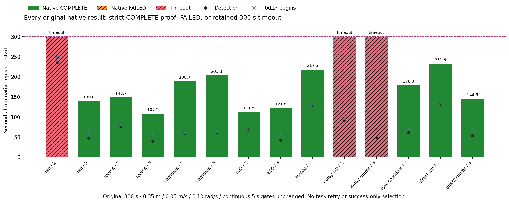
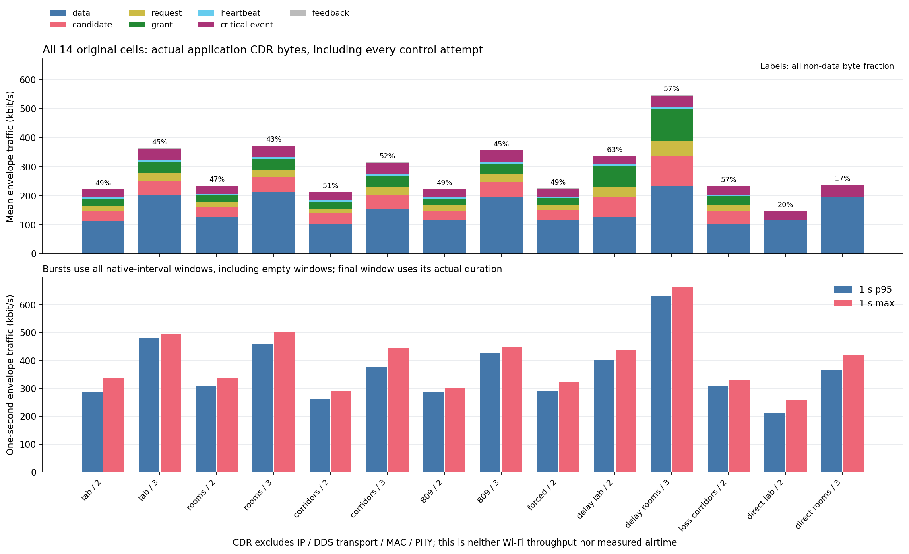
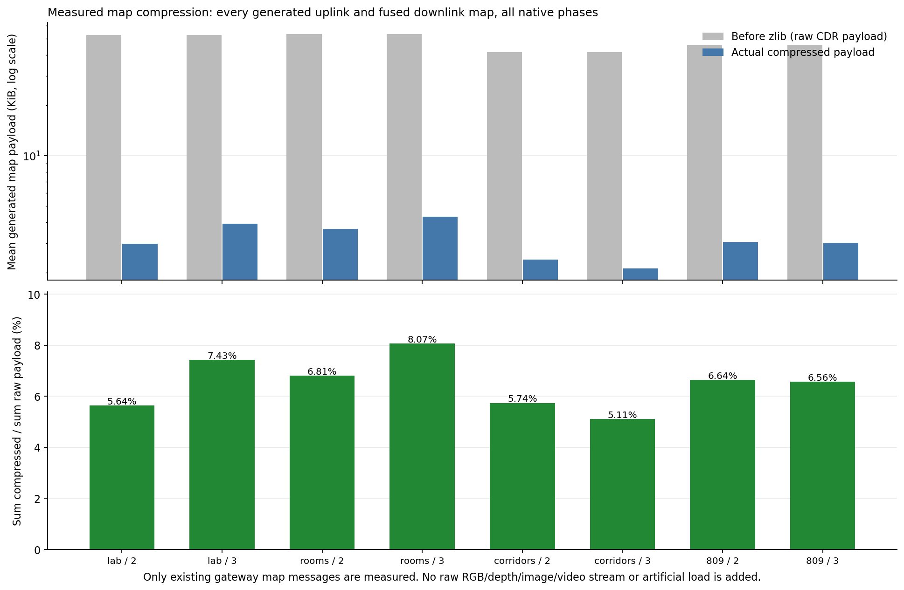
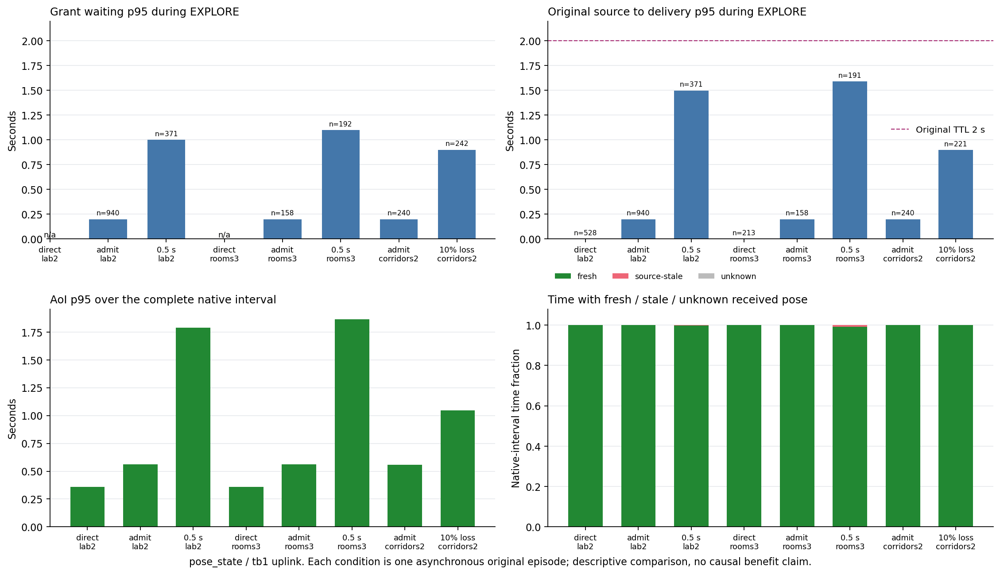

# P3C.5 应用负载、控制协议与可观测性门禁（2026-10-07）

**技术门禁 PASS，待用户验收。** 用户已验收 P3C，本轮完成 P3C.5。14个同冻结原始任务全部自然结束；11个原生 COMPLETE、3个 RALLY 超时，原超时保持失败。全部任务零碰撞、零耗尽、零失效机器人、零基础设施失败、零整轮重试。强制充电原生完成217.5秒，两台各完成一次充电。PASS表示应用协议、可观测性与负载审计完成，不表示14次任务全部成功。

任务/协议执行冻结：`bea7f8bfb41b19dc55c1ecdd351a5a797261d18a`，run-id `p3c5_v3`，2026-10-07 06:37:03–07:12:54 UTC。任务栈基线为已验收 `d8d361b`，P3C为已验收 `e4a2621`。任务算法、世界、候选生成、原生300秒/.35米/.05mps/.1radps/连续5秒、本地储备及源TTL保持。执行后只读比较校验/显示和报告修订有独立源码摘要；当前HEAD不能代替原任务执行提交。

[机器门禁](20261007_p3c5_gate.json) · [完整来源与输入SHA](20261007_p3c5_provenance.json) · [逐格数值](20261007_p3c5_artifacts/final_findings.json) · [前瞻声明与勘误](20261007_p3c5_protocol.md)

## 1. 实际协议与信息边界

普通上行 map_snapshot/pose_state/frame_state 的完整payload进入对应机器人 EndpointQueue。candidate只报告身份、类别、sender/recipient、版本、源时刻、原截止、payload大小和任务阶段；request引用身份。两者作为实际控制envelope经同一故障传输交付AP。固定always-grant的grant绑定原身份/版本/大小/截止，租约≤1秒且≤原源截止；只有实际收到且仍有效的grant释放原payload。授权不更新源时间、TTL或版本，迟到/重复grant不能重放payload。

每个新候选立即发送一组candidate/request；未获授权时相隔至少.75秒重发，每候选总计最多三组（首次＋最多两次重发）。这不是全局4Hz限速。源码从首次冻结起就是该语义；前瞻文档的易混淆措辞已明确勘误，原schema/manifest/生成器和运行均未因此改变。

本地容量4096，过期/关闭记local_discard，不伪装成发送attempt丢包。总部已拥有的下行数据执行本地准入，不产生发给自身的虚构candidate/request/grant；发往机器人的grant和上下行各1Hz heartbeat实际经过故障传输。检测、任务/电池/返充和导航关键消息独立于grant，沿用原TTL、有限可靠重传与ACK；critical-event和ACK同样计费。

AP只使用实际交付candidate/request/heartbeat和交付历史；`remote_current_queue`始终null。heartbeat.pending_count是带source_time/age_sec/stale的历史快照，不能当成即时远端队列。完整payload、隐藏队列与未来生成结果不属于AP输入；`local_queue_audit`只供离线诊断。隐藏队列改变时AP观测不变的反例检查通过。参与者逻辑隔离但共处当前网关进程；这是接口和应用交付验证，不是多主机/进程隔离证明。

`gateway_admission_protocol`默认false，保持已验收直接路径；本轮12格开启、2格直接参照关闭。`frame_state`实际是 `/tb*/gateway/source_tf` 的TFMessage，不是相机帧。测量原有压缩地图、Odometry/TF、事件和导航流；没有引入RGB/depth/image/video或人为负载。

## 2. 原始任务与结果

每个冻结候选每格仅一次；最大并行3格、CPU0–79、domain180–193/master19920–19933。系统Python/ROS2 Humble/NoUser/FastDDS UDPv4，无未声明XML/discovery server；domain222/master11345未动。每格保存完整命令、环境、源摘要、原生结果、ledger、graph与实时输入。普通lab/rooms能量40，corridors/809为45；forced2为18，原充电10秒/安全余量5/返航120秒。故障seed17011，delay两方向各.5秒，loss两方向各10%；目标按原清单。

101/202/303为集成seed；809已在P3B.5暴露，不作新未见泛化声明。所有失败纳入结果，没有回填、替换或重试。原生COMPLETE均通过原严格物理保持证明，不以中央声明、FOUND或覆盖率代替。

| 格 | 机器人/seed | 原生结果 | 原始终点s / 负载窗s | 总充电 | 最低任务能量 |
|---|---|---|---:|---:|---:|
| lab2 | 2/303 | RALLY timeout | 300.4 / 300.0 | 2 | 16.2553 |
| lab3 | 3/101 | COMPLETE | 139.0 / 139.0 | 0 | 25.3124 |
| rooms2 | 2/101 | COMPLETE | 148.7 / 148.7 | 0 | 20.2811 |
| rooms3 | 3/101 | COMPLETE | 107.5 / 107.5 | 0 | 28.0596 |
| corridors2 | 2/202 | COMPLETE | 188.7 / 188.7 | 0 | 23.6964 |
| corridors3 | 3/202 | COMPLETE | 203.3 / 203.3 | 0 | 21.0401 |
| holdout2 | 2/809 | COMPLETE | 111.5 / 111.5 | 0 | 28.8831 |
| holdout3 | 3/809 | COMPLETE | 121.8 / 121.8 | 0 | 33.0772 |
| forced2 | 2/303 | COMPLETE | 217.5 / 217.5 | 2 | 15.4457 |
| delay_lab2 | 2/303 | RALLY timeout | 300.2 / 300.0 | 0 | 22.5420 |
| delay_rooms3 | 3/101 | RALLY timeout | 300.0 / 300.0 | 0 | 24.2404 |
| loss_corridors2 | 2/202 | COMPLETE | 178.3 / 178.3 | 0 | 24.4903 |
| direct_lab2 | 2/303 | COMPLETE | 231.6 / 231.6 | 1 | 20.9932 |
| direct_rooms3 | 3/101 | COMPLETE | 144.5 / 144.5 | 0 | 22.6369 |

三超时仍success=false、completion_time_sec=null；300秒后的原始轮询尾段保留，负载窗裁到300秒。失败RMST300仍300秒。读者用旧v2的274.9秒真实FAILED反例验证提前失败负载/AoI不虚构补齐到300秒，这不改其失败RMST。安全逐机器人核查原生消息数、最小/最终正能量、非FAILED电池模式及零contact。



## 3. 负载、压缩与控制成本

原生任务时段共有2,087个阶段×类型×方向×机器人分层、220,552行发送attempt成本和29,894个类型突发记录。每分层保存生成Hz、payload/raw/compressed/CDR字节、授权等待、transport等待、源到交付时延、TTL、重试、过期与队列分布；阶段AoI与完整任务AoI独立保留。1秒CDR窗口包含空窗，最后不足1秒的窗按实际长度计算。

以下字节是实际序列化envelope CDR，排除IP、DDS传输、MAC/PHY；kbit/s=1000bit/s。“新增协议”仅candidate/request/grant/heartbeat；“全部非数据”还包含critical-event和feedback（ACK），二者不可混用。

| 格 | 平均CDR kbit/s | 1秒p95 / max kbit/s | 新增协议% | 全部非数据% | 压缩地图/原地图% |
|---|---:|---:|---:|---:|---:|
| lab2 | 221.90 | 285.21 / 335.72 | 36.77 | 49.15 | 5.64 |
| lab3 | 362.66 | 481.46 / 494.86 | 33.57 | 44.86 | 7.43 |
| rooms2 | 233.90 | 308.98 / 335.04 | 34.43 | 46.59 | 6.81 |
| rooms3 | 372.73 | 458.33 / 500.48 | 32.44 | 43.13 | 8.07 |
| corridors2 | 212.57 | 260.66 / 289.42 | 37.83 | 51.46 | 5.74 |
| corridors3 | 314.51 | 376.70 / 443.19 | 38.44 | 51.81 | 5.11 |
| holdout2 | 223.37 | 286.85 / 302.06 | 36.03 | 48.99 | 6.64 |
| holdout3 | 356.65 | 427.86 / 446.02 | 33.81 | 44.93 | 6.56 |
| forced2 | 225.07 | 291.18 / 324.68 | 36.01 | 48.62 | 5.91 |
| delay_lab2 | 337.33 | 399.96 / 438.24 | 53.69 | 62.59 | 6.88 |
| delay_rooms3 | 546.01 | 629.24 / 664.51 | 49.80 | 57.31 | 8.53 |
| loss_corridors2 | 233.01 | 306.25 / 330.42 | 44.06 | 56.57 | 5.42 |
| direct_lab2 | 146.82 | 210.90 / 255.94 | 0.00 | 19.63 | 6.25 |
| direct_rooms3 | 237.50 | 363.89 / 419.39 | 0.00 | 17.07 | 7.21 |

8个协议ideal格的新增协议占32.44–38.44% CDR，全部非数据43.13–51.81%；delay新增协议49.80–53.69%，loss为44.06%。这是运行内部逐attempt拆分，不是异步两次任务平均吞吐差的因果估计。地图压缩率为总压缩payload/总原payload，不平均各包比例；8个ideal格为5.11–8.07%。数百MB diagnostics来自重复元数据和事件存储，不是无线payload或CDR负载。





实际生成示例：rooms3/EXPLORE/tb1，阶段39.5秒。完整全部类别/阶段/方向/机器人分布见strata，不能用此例代替全体。

| 类别/方向 | 生成Hz | offered payload kbit/s | tx CDR kbit/s |
|---|---:|---:|---:|
| map_snapshot/uplink | 0.532 | 20.617 | 21.161 |
| pose_state/uplink | 4.000 | 23.168 | 27.008 |
| frame_state/uplink | 1.671 | 1.230 | 2.834 |
| candidate/uplink | 6.203 | 10.882 | 17.233 |
| request/uplink | 6.203 | 2.598 | 8.552 |
| grant/downlink | 6.203 | 6.053 | 12.007 |
| heartbeat/uplink | 1.013 | 0.154 | 1.191 |
| heartbeat/downlink | 1.013 | 0.154 | 1.191 |
| fused_map_snapshot/downlink | 0.633 | 22.703 | 23.391 |
| battery_state/uplink | 1.975 | 8.926 | 10.689 |
| ack/uplink | 0.076 | 0.021 | 0.089 |
| ack/downlink | 0.025 | 0.008 | 0.031 |

## 4. 等待、源龄、AoI、截止与重试

EXPLORE/tb1 uplink pose_state的ideal授权等待p95≈.2秒、源到交付p95≈.199秒。直接路径没有grant等待（null，不伪造为0），本模型零delay直接交付源龄p95为0。.5秒两方向delay下lab2/rooms3授权等待p95=1.0/1.1秒、源到交付p95=1.499/1.592秒；10%loss走廊为.9/.898秒。local等待起点是offer/enqueue，消息source时刻与它不同，两指标不必完全相等。

完整任务tb1 pose AoI p95：直接lab2/rooms3=.360/.359秒，协议ideal约.559–.565秒，delay=1.790/1.865秒，loss=1.048秒。原pose TTL仍2秒；delay鲜活比例99.774%/99.257%。图中fresh/source-stale/unknown互不重叠：原stale_sec包含unknown，绘图仅减no_data_sec，不改变指标数学。所有流的未知/过期和恢复时间见完整/阶段AoI，不能以单一pose流解释任务成败。



队列是真实timer采样分布，不是时间加权积分。delay_rooms3/EXPLORE上行在途p95=51/max=51，下行p95=28/max=54，每机器人本地pending p95=7/max=10（RALLY为p95=8/max8/8/9）。这是授权、指定delay、可靠未结算构成的队列，不是MAC带宽队列。全14格零queue_overflow。delay_rooms3有9个、loss_corridors2有14个本地source_expired候选，不冒充已发送丢包。

原生时段candidate/request控制重发消息：delay_lab2=7,422、delay_rooms3=11,244、loss_corridors2=1,422；原可靠transport retry=250/286/30。这两个口径不同；每候选控制组最多三次和原可靠attempt上限均逐包验证。ideal lab3仍有10条控制重发，其他ideal为0；真实异步回调与有限等待保留，不能宣称所有ideal等待为零。原生时段过期attempt与全账本关闭local_discard分开统计。

每条件一条异步原始轨迹，仅描述性比较，不作单因素收益、最坏时限或RL优势声明。lab2 ideal自身超时，不能把所有失败归因通信。direct参照协议关闭，不能与协议开启结果作为“同协议ideal/fault配对”计算TDI；显示/导出校验实际summary directions/live window/cumulative配置行，缺flag的历史direct兼容为false，冲突/非boolean拒绝。

## 5. 因果链与实时反馈核验

全账本（包含启动/收尾）53,319次offer=53,242次release+77次discard；79,514次AP决策都绑定此前实际收到的控制包。它不是79,514个独立候选：控制重发可产生重复grant，但原payload只释放一次。逐包核验offer→原候选→已交付摘要/请求→grant→已交付grant→对应payload enqueue及原source/version/deadline。每个AP观测引用均绑定已收到事件；偷读未交付资料、续期deadline、错grant/payload、缺闭合等篡改反例被拒绝。

14个ledger守恒/legacy时序租约、graph旁路、严格native和逐前缀verify_live全部PASS；1,272个实时快照与2,372,766条保存输入一致。CSV另逐值核对JSON，见provenance。监控只读，故障控台仍用独立服务；新类别自动进入P3C选择与曲线。实际Qt以原prefix渲染pose/heartbeat/消息表，图例换行完整显示；不兼容参考不显示配对曲线/TDI。最后实时快照可早于原生最终落盘，截图不填入未来任务结果。

[实际pose反馈](20261007_p3c5_artifacts/gui_prefix/loss_corridors2_pose_state.png) · [完整类别表](20261007_p3c5_artifacts/gui_final/rooms3_types.png) · [不兼容参考拒绝](20261007_p3c5_artifacts/gui_prefix/rooms3_types_task.png)

## 6. airtime/能耗账本和研究结论

每个native tx attempt保留message_id、attempt、ledger_index、source/version/TTL/deadline、enqueue/tx时间、candidate/control_attempt、phase/type/direction/robot/role、payload/CDR字节。actual_airtime_sec/actual_radio_energy_j均null，原全账本envelope字段也保留。220,552行库存覆盖本批任务时段每次发送，包括控制与可靠重传；不包含任务开始前/结束后的发送。

条件系数`k=8*envelope_cdr_bytes/1e6`：给定R Mbps，理想序列化秒=k/R；给定P瓦，条件发射焦耳=P*k/R。不是测量值，未计PHY/MAC/IP/DDS传输头部、争用/退避、接收或硬件电路功耗。rooms3任务总CDR系数40.068072，代入1/6/54Mbps为40.068/6.678/.742秒，1W与6Mbps条件值6.678J。任务能量是距离/时间单位，不能直接与射频焦耳相除。

**当前应用模型的负结果：“通信不是容量瓶颈”——未证明带宽服务竞争产生排队。** 网关没有序列化速率/PHY/MAC/传播或校准射频功率，ideal即时传输不是无线容量实验。指定delay/loss的等待、重发、过期及失败是应用协议敏感性，不能改称物理拥塞，也不能反向证明真实Wi-Fi没有瓶颈。保持当前实测负载和控制成本，交给后续包级/无线标定并检验节省通信是否损害任务；不得人为增流量创造RL空间。本轮没有实施P4/ns-3/Wi-Fi/RL。

## 7. 历史失败和验证

- v1 `adb370e`：三原始COMPLETE、11未运行；DDS停止后发布导致缺gateway_stop/本地闭合，指标强制收尾，技术FAIL。[原失败候选](20261007_p3c5_shutdown_failed_candidate.json)全部保留。
- v2 `4640926`：完整14原始任务11 COMPLETE/2timeout/1 FAILED；delay_rooms3指标30秒后升级SIGTERM，技术FAIL。exit0及可回放不能豁免无强制收尾门禁。[原失败候选](20261007_p3c5_export_grace_failed_candidate.json)全部保留，274.9秒真实FAILED保持。
- v3只把任务后metrics SIGINT grace改90秒、owner等待改120秒；native300秒/5秒/TTL/安全/生成器/控制规则不变。全部14新原格同新提交冻结，未复用旧结果。最大旧trace冷读取20.194秒＋带profiler导出42.175秒，数值与原文件一致；没有最坏导出时间保证。
- 初次广泛模板lint失败（既有6,056 style/26 docstring）、前两次打包校验错误、旧trace affinity80–111不可用前置失败及只读诊断错误均保留。功能scope沿用P3C，明确排除两个既有模板lint模块。
- 723项功能PASS/1 skip/17.59秒，四包build PASS5.61秒；68个任务/安全源码原字节、54格静态协议语义不变。29项相关读者PASS；最后仅图例换行后12项显示回归及68/54源码再次PASS。指标数学除配对校验外AST与原冻结相同，五个协议/记录/传输演员文件原字节相同。
- 实际ROS P3C.5停止上下文检查PASS：4offer=2释放+1原TTL过期+1关闭，11 AP快照。已验收P3C ROS/Qt配置控台回归PASS19快照/490输入，关GUI继续采集、收尾.4649秒。这些隔离domain组件探针不是新Gazebo任务。
- 最终14格strict gate PASS；四科学图逐图视觉核验。首次plot因已有matplotlib的`ncols`接口不兼容FAIL；改用`ncol`后同数据四图PASS，没有换依赖或重跑任务。一次报告生成的shell嵌套引号导致NameError，未写出报告，改用直接文件补丁；原trace也保留。实际Qt两参考检查、六前缀图及四最终图记录保留。

## 8. 复现、归档与提交边界

原完整目录：`ros2_ws/ros2-multi-robot-automap/log/p3c5/p3c5_v3/p3c5_v3_<case>/`。每格manifest/summary/graph/result的审阅副本见[originals](20261007_p3c5_artifacts/originals)。大原ledger与实时输入保留忽略目录，路径/字节/SHA绑定；成本、strata JSONL/CSV、bursts无损gzip入Git，保留原字节与压缩SHA。63个已验收P3B.5＋3个已验收P3C＋v1三格＋v2十四格共83个旧原始记录保持；27份用户资料保持，14个未跟踪用户文件未加入提交。新14原证据、CSV/JSON值与自有进程/端口关闭由provenance独立复核。

在ROS指南环境初始化后，只读重审到新输出目录：

```bash
export PYTHONNOUSERSITE=1
export PYTHONPATH="$PWD/src/multi_robot_exploration:$PYTHONPATH"
/usr/bin/python3 scripts/check_p3c_source.py --output log/p3c5/review_source_new.json
/usr/bin/python3 scripts/check_p3c5_gate.py \
  --run-root log/p3c5/p3c5_v3 --source log/p3c5/review_source_new.json \
  --runtime log/p3c5/runtime_v10 --output log/p3c5/review_gate_new --workers 3
```

实际gate使用v20_source.json、runtime_v10、gate_v21，stdout=v21_gate.txt；后续纯显示源码复核=v24_source.json。逐格原始命令、seed/配置、UTC间隔、输出和失败记录已在`log.md`同次会话追加。新任务实验须独立提交推送冻结并用新run-id，不能在v3目录补跑。本轮停止在P3C.5技术完成，不代用户接受或启动下一检查点。
