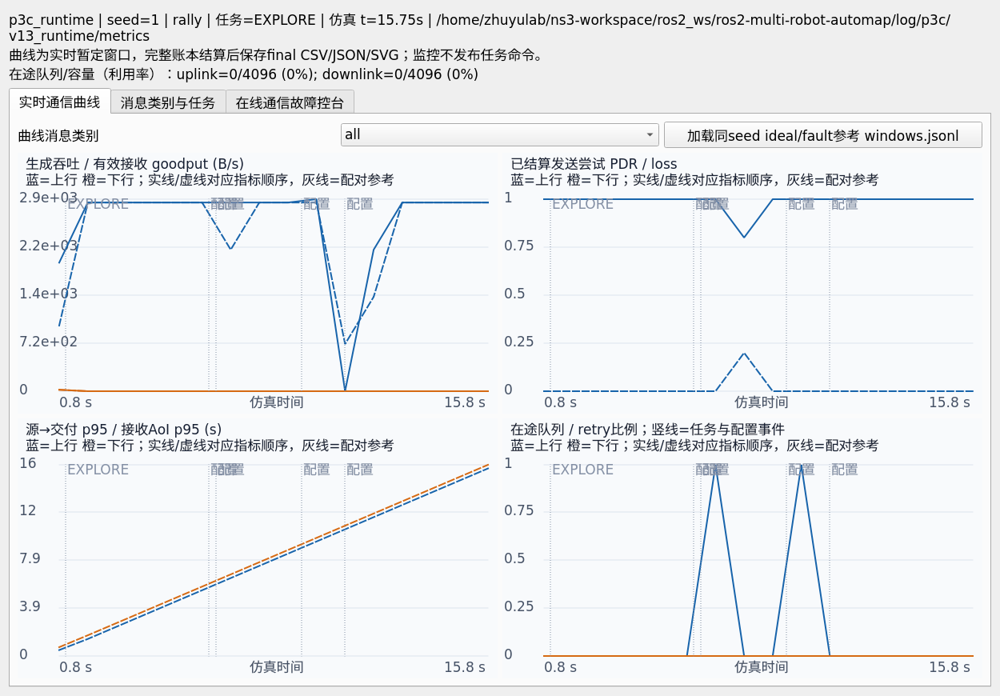
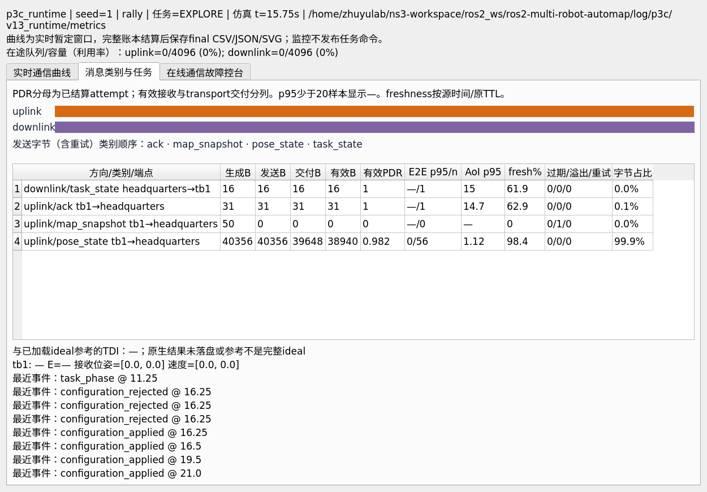
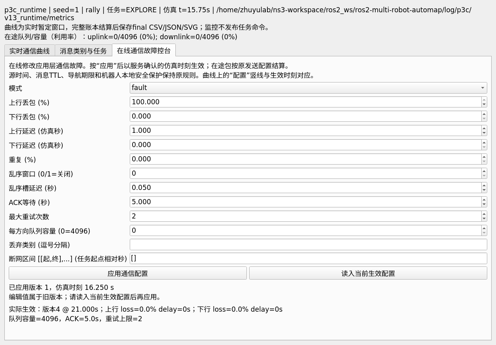
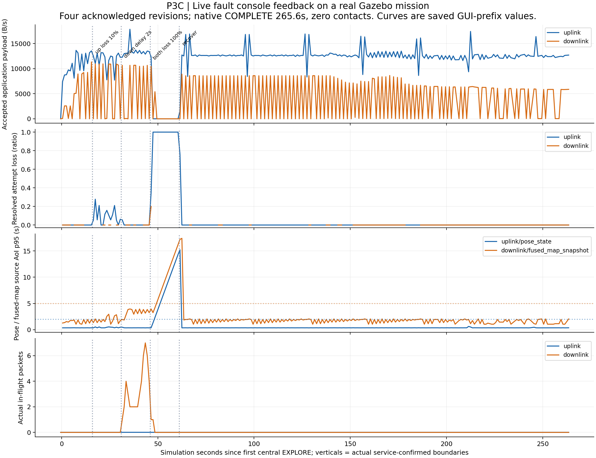
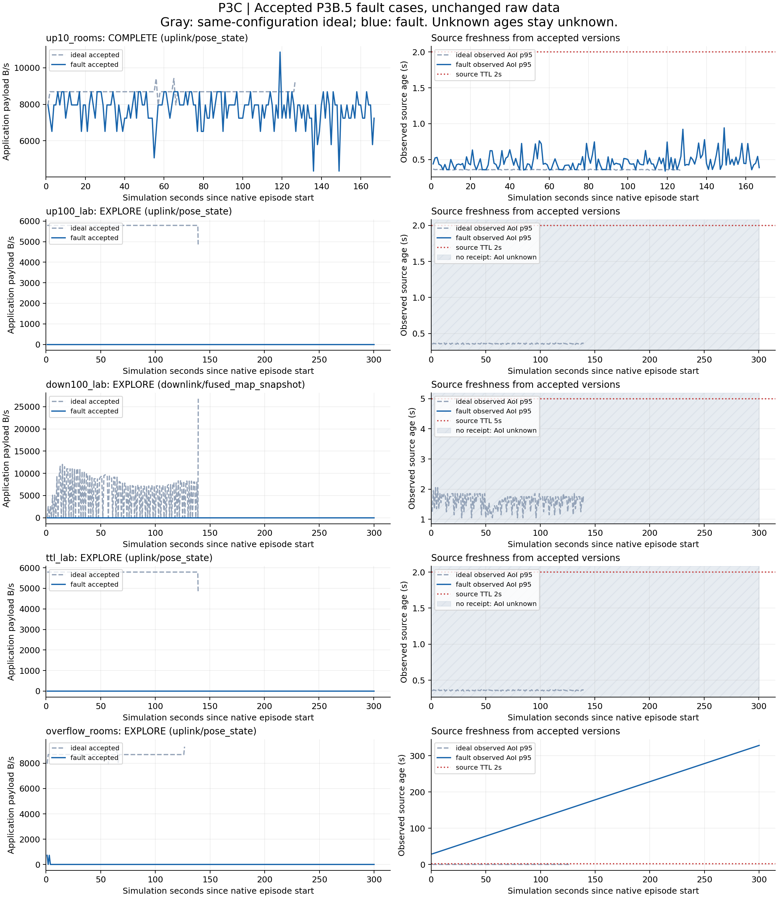
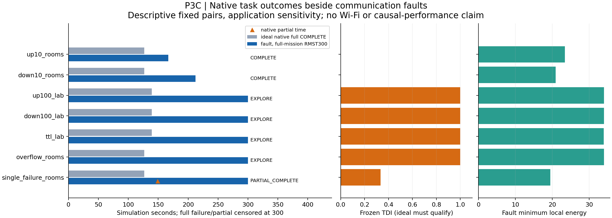

# P3C 实时通信指标与在线故障控台：实现及验证报告

日期：2026-10-07（Asia/Shanghai）；技术门禁 **PASS**。用户已验收P3B.5，本次完成P3C原计划及新增在线通信控台。新Gazebo原任务冻结在`6a0a8eb2e0523c2e3a9446908c9693ea30f70aaa`，三次均原生`COMPLETE`。后续显示、配对核验和只读导出修订在全部任务关闭之后完成，验证与冻结实验分列，不把最终HEAD冒充实验时源码。

完整机读门禁：[20261007_p3c_gate.json](20261007_p3c_gate.json)。文件摘要、精确命令、原失败记录和当前源码绑定：[20261007_p3c_provenance.json](20261007_p3c_provenance.json)。原始运行文件保留于canonical ROS workspace的`log/p3c/`，没有覆盖P3B.5原始结果或失败候选。

## 交付与验收对应

| 要求 | 实际交付和证据 |
| --- | --- |
| 默认实时面板、headless同源文件 | 主launch默认启动`gateway_metrics`及Qt监控；headless仅关闭窗口，继续采集。实际ROS/Qt订阅、窗口关闭后继续采集及正常关闭均PASS。 |
| 上下行、逐类型和逐端点指标 | 生成、准入、attempt、交付、有效接收消息/字节；throughput/goodput、PDR/loss/retry、重复/乱序/TTL/溢出/终止丢失、真实队列/利用率、字节堆叠表。 |
| 时延、AoI和freshness | 5种时间差、n/mean/p50/p95/p99/max，源年龄积分、fresh/stale/no_data、恢复时长；选类TTL参考线。缺失和低样本保留null。 |
| 检测、导航、任务和安全联动 | confirm→delivered→consumed链、navigation_outcome/deadline/cancel、任务阶段、返航/充电/故障/contact事件；机器人接收位姿/速度及电量摘要。 |
| 统计与参考对比 | 同配置ideal/fault曲线、原生任务指标、RMST300和冻结TDI；world/seed/mode/机器人、目标/检测/原生门槛和每机器人能量/充电位核验。GUI只有完整ideal参考且配置核验通过时显示TDI。 |
| 逐类守恒及时间对齐 | 63历史原任务、1,879方向/类型/端点流只读对账；三新任务及658实时前缀复算PASS；26,852 CSV行逐数值核验PASS。 |
| 在线受控通信指标 | 独立原子`/gateway/configure`服务和控台，4次真实配置生效与曲线反馈；非法/未知安全参数/过期版本拒绝，在途语义和关闭GUI持续采集PASS。 |
| 监控只读、任务基线保留 | ROS graph只读边界PASS；68任务/安全/物理/SLAM文件与已验收d8d361b字节相同；54固定协议格完整事件字典相同；navigation源去除新增结果诊断后AST相同。 |

## 在线控台的运行行为

面板有“实时通信曲线”“消息类别与任务”“在线通信故障控台”三页。上行和下行的loss/delay可独立调整，也可修改重复率、乱序窗口/步长、ACK等待、有限重试、每方向容量、类别丢弃与blackout。GUI显示编辑值、等待确认状态、当前实际生效值、版本和仿真时刻；其他入口改变版本后旧编辑值会拒绝覆盖，必须先读入当前配置。晚到的旧配置topic或服务回应不会回退已确认版本。

服务一次验证整个参数集合，使用`expected_revision`防止并发覆盖。`ideal`保留编辑参数，但有效损伤为零；切换`fault`后实际值明确列出。容量`0`选择4096。blackout为相对首次中央`EXPLORE`的仿真区间。运行时ROS启动参数被冻结；控台只改变通信故障，不提供任务、Nav2、电池、TTL、deadline或安全门槛写入口。

当前在途attempt按原配置结算，后续attempt和retry使用新配置。变更不清空队列、不重置随机种子、不刷新源时间、不延长消息lease。账本记录请求、拒绝、实际应用边界及完整配置，曲线按实际应用时刻标记。查询权威值使用`/gateway/fault_configuration`或配置服务，不能用启动ROS参数猜测在线值。

下列截图来自真实Qt/ROS组件探针的合成消息，明确不作为物理任务证据；三次物理集成任务另列。







## 三次新冻结Gazebo任务

统一lab world、2机器人、seed303、目标(-4,4)、fault seed17011、300秒上限。初始能量ideal/dynamic为40，forced为18；forced充电10秒、安全余量5、返航时限120秒。原生集合要求保持`.35m/.05mps/.1radps/5s`，TTL、能量和碰撞保护沿用P3B.5。精确smoke、观察器和配置argv、环境及源码摘要由首任务前的manifest保存。三次是预声明的不同cell，使用独立domain195/196/197和Gazebo master19820/19821/19822，同时运行；没有整轮重试或回填。

| case / 原始episode | 原生终态 | 完成秒 | 发现 / RALLY秒 | 总充电 | 最低电量 | contact / 耗尽 / failed / infra |
| --- | --- | ---: | ---: | ---: | ---: | --- |
| ideal / `p3c_v8_ideal_ideal` | COMPLETE | 197.1 | 89.0 / 90.5 | 1 | 23.85796 | 0 / 0 / 0 / 0 |
| forced / `p3c_v8_forced_forced` | COMPLETE | 235.0 | 129.2 / 130.5 | 2，各机1次 | 16.47589 | 0 / 0 / 0 / 0 |
| dynamic / `p3c_v8_dynamic_dynamic` | COMPLETE | 265.6 | 151.9 / 170.3 | 1 | 27.05247 | 0 / 0 / 0 / 0 |

原生稳定保持证明分别为5.0/5.4/5.0秒，全部使用原strict native checker。runner/observer/configuration进程均exit0，无强制退出；账本包含`gateway_stop`。任务结果、账本、graph和实时文件SHA已核验。中央task_phase事件与独立原生评估器终态分别保存，中央声明不会替代原生保持证明。

dynamic预声明在配置客户端观察到`EXPLORE`后15/30/45/60秒施加下列变化。表中只使用实际服务确认的边界，调度轮询不假定精确命中名义时刻。

| revision | 变化 | 实际绝对仿真时刻 | 距原生episode起点秒 | 请求→生效秒 |
| --- | --- | ---: | ---: | ---: |
| 1 | 上行loss10% | 2090.582 | 16.2 | 0.1 |
| 2 | 上行loss0%，下行delay2s | 2105.582 | 31.2 | 0.0 |
| 3 | 双向loss100%，下行delay0s | 2120.682 | 46.3 | 0.1 |
| 4 | 双向loss0%恢复 | 2135.682 | 61.3 | 0.0 |

实时曲线零点为首个中央`EXPLORE`（2074.582），原生评估器零点为2074.382；对应曲线边界为16.0/31.0/46.1/61.1秒。完整离线回放用原生episode零点。两个时间原点均保留并显式标注，所有点可由绝对sim_time对齐。



按同配置ideal完整回放比较，dynamic TDI=0、RMST300差+68.5秒、覆盖率差-0.06460、路径差-8.29409m、最低电量差+3.19451。两侧均完成，TDI不会体现这次耗时增加。这是单对异步轨迹的描述结果，不作单因素因果提速/退化、最坏时限或泛化保证。

## 已验收P3B.5原始数据的只读回放

保留[63原始/31pair逐条审计](20261007_p3b5_requirement_audit.md)的全部result/ledger摘要，前后hash相同。所有63个原任务逐类守恒PASS；9个不同episode导出完整1秒曲线，覆盖7个同配置pair。复用ideal只导出一次，不增加独立样本数。31个冻结TDI逐项等价。

| 展示pair | fault原生终态 | TDI | full-mission RMST300差秒 | 可观察通信与保障行为 |
| --- | --- | ---: | ---: | --- |
| up10_rooms | COMPLETE | 0 | +40.1 | 上行pose/TF/map等attempt注入丢弃，可靠消息有限重传；源版本与TTL继续核验，最终原生完成。 |
| down10_rooms | COMPLETE | 0 | +85.6 | 下行融合地图/任务/导航链受损，逐类有效接收和attempt分列，最终原生完成。 |
| up100_lab | EXPLORE，300秒超时 | 1 | +160.7 | 中央收不到新鲜上行状态；等待源数据，不消费陈旧状态发导航。AoI未观测时为未知。 |
| down100_lab | EXPLORE，300秒超时 | 1 | +160.7 | 融合地图/下行控制交付受阻，安全等待；没有把源消息生成当作机器人已接收。 |
| ttl_lab | EXPLORE，300秒超时 | 1 | +160.7 | 延迟超过源TTL，attempt过期而非有效接收；新鲜度缺失、中央等待，零碰撞。 |
| overflow_rooms | EXPLORE，300秒超时 | 1 | +173.3 | 小容量导致实际准入溢出，有限旧接收随后超龄；队列历史深度未知，不伪造深度曲线。 |
| single_failure_rooms | PARTIAL_COMPLETE | 1/3 | +173.3 | tb3明确失效被隔离，两个健康机器人原生部分完成；148.9秒partial时间另标，全任务RMST仍为300。 |

首个drop/TTL/coordinator-stale/wait及每流首个no_data、源超龄、恢复事件都在导出JSON中可定位。启动期no_data和source=0过期也保留，不能自动归因为故障；实际注入原因与配置revision需一起读取。检测链和导航deadline/outcome保留原消息ID、版本及时间，缺交付不补假事件。





原31pair中仅22个完整rally ideal合格，来自5个物理簇：fault完整成功8/22=36.36%，部分完成1/22=4.55%；平均full-mission RMST300为fault257.2773秒、ideal149.3682秒。冻结TDI均值0.606061、描述性95%簇bootstrap区间[0.384615,0.8]（10,000次、seed17011）。这些是原固定矩阵的条件统计，排除不合格ideal不能解读为无条件总体成功率；本次3任务不混入该历史统计。

## 指标口径和可复现输出

- logical message与发送attempt分别对账，重试不重复算logical生成，duplicate copies单列。没有显式generated的ACK/外部导航以首次enqueue推断生成并标记来源。唯一transport交付与receiver accepted分别统计；过期/旧序号接收不计有效goodput。
- 字节为序列化/压缩应用payload，含ACK payload，不含envelope/CDR外框、DDS及MAC/PHY开销。offered throughput为生成payload/仿真秒；goodput为唯一有效accepted payload/秒。attempt PDR/loss使用窗口内已结算primary attempt分母；logical PDR跟踪生成cohort到回放边界，另列未结算量。
- `queue_wait=本次tx_time−首个logical enqueue_time`，可能含重试ACK等待；`admit_to_tx`为本attempt准入到发送，当前drop-tail应用模型通常为0。另报tx→delivery、source→delivery、source→accepted。没有MAC服务/排队模型。p50/p95/p99最少2/20/100样本；不足保留null。
- AoI按最新有效accepted源版本连续积分，乱序旧版本不回退；无信息年龄未知，no_data时长单列。fresh/stale按原源时间和TTL，恢复时间在查询窗口中计量。事件/ACK源年龄不等于中央状态lease，混合全部类型曲线不画单一TTL。
- 新ledger的队列来自真实transport tick，分别显示in_flight、reliable_pending和capacity。旧P3B.5 ledger缺queue_depth和ACK accepted诊断时明确标记未知，不能据推断生成数伪造有效接收或物理队列。
- 实时采样保存当前前缀最近1秒窗口，CPU负载下可跳过tick；本次184/221/253个样本，共658，不称为连续固定1Hz采样。`live.jsonl`与`live_windows.csv`不改写；完整累计汇总对账全部输入。另用export重建连续固定1秒完整回放，9历史episode及新ideal/dynamic均已验证。实时曲线与事后完整结算口径分别标识。

每个metrics目录保存`inputs.jsonl`、`live.jsonl`、`live_windows.csv`、`windows.csv/jsonl`、`summary.json`、`events.jsonl`、`curves.svg`；配对export另保存`comparison.json/.svg`。每点有episode、绝对/相对sim_time、方向/类型/端点、world、Gazebo/fault seed、mission、完整通信配置和revision。SHA与命令由provenance指向原路径。

## 验证、失败保留和源码范围

| 验证 | 结果 |
| --- | --- |
| 全组件回归 | 676 PASS，17.05秒；最终GUI并发回应/显示修订另经26相关检查0.51秒和实际ROS/Qt验证。 |
| 四包symlink构建 | multi_robot_interfaces / multi_robot_exploration / merge_map / multi_robot，最终5.62秒PASS（此前5.47秒）。 |
| 静态/任务基线 | 68文件bytes相同、54协议格事件字典相同、导航仅结果诊断AST等价；3机器人source旁路0违规。 |
| 实际ROS/Qt组件 | v13探针PASS，490输入/19实时样本逐前缀等价；实际GUI点击和服务确认、原子拒绝、冻结参数拒绝、旧在途保留、重复/overflow、图边界、GUI关闭持续采集和shutdown<5秒。合成组件不代替任务。 |
| 新任务 | 三原始自然结束；原生保持、时间/TTL/版本因果账本、graph、守恒和raw SHA全部PASS。 |
| 历史回放 | 63原始、1,879流、9曲线episode、7展示pair、31原TDI全部PASS。 |
| 文件一致性 | 新任务658 live快照按原inputs条数复算，26,852 CSV行与JSON逐字段数值一致。 |
| 视觉QA | Qt三页逐页查看；3张科学图实际渲染并查看；版式修订独立留存生成脚本。 |

首次只读导出扫描瓶颈被SIGINT中断（exit130），exit130、中断说明和空输出保留；加入消息/事件索引后独立导出PASS。三次历史配对reader分别因未观测target_x、检测参数、集合门槛为null而FAIL；修正使用原manifest argv和冻结argparse默认声明核验，观测null原样保留。完整v7只读回放PASS，没有重跑原任务。

首source审计误列不存在模块而FAIL；一次build包名误写只构建三包，未作为四包PASS。首已push实现的三条v7 runner命令因ROS子目录相对Git路径误判用户资料为dirty，在preflight退出2，未创建任务/Gazebo；修复canonical Git根后commit/push，再以v8新目录首次执行三任务。首最终gate汇总读取补验pair不同schema而KeyError，原trace保留；改从原生结果读取success/partial，原数学门槛不变，独立重审PASS。绘图首次环境缺Matplotlib、一次派生导出误用不存在episode文件名均仅离线失败，保留trace，新输出独立生成。全部精确命令和文件摘要见provenance与`log.md`。

任务自然关闭后，仅修订实时snapshot首次事件快照拷贝、流式verify-live降低内存、统一CLI/GUI配对核验、拒绝旧配置topic/服务回应回退、队列利用率显示和混合TTL显示。未改control、battery、evaluator、detector、Nav2/SLAM/world、native/TTL/安全门槛；对同原输入继续验证。用户`260929_report/`27文件SHA保持，未暂存；实验只使用自有domains/master，未操作domain222/master11345。

## 启动与操作

先执行ROS指南的环境初始化，再使用原主launch；通信监控和控台默认开启。完整手动/headless/恢复窗口/查询/定时配置/导出命令见[launch_commands.md](../../../../../../../ros2_ws/ros2-multi-robot-automap/launch_commands.md)的P3C节，指标说明见[user_guide.md](../../../../../../../ros2_ws/ros2-multi-robot-automap/user_guide.md)。以下命令在canonical ROS目录、Humble/install环境中执行：

```bash
ros2 run multi_robot_exploration gateway_monitor
/usr/bin/python3 scripts/gateway_configure.py --set network_mode='"fault"' uplink_loss_rate=0.1 downlink_delay_sec=0.5
/usr/bin/python3 scripts/gateway_configure.py --set network_mode='"ideal"'
```

正式集成runner与验证工具为`scripts/run_p3c_integration.py`、`check_p3c_source.py`、`check_p3c_runtime.py`、`audit_p3c_evidence.py`、`export_gateway_metrics.py`和`check_p3c_gate.py`。精确执行记录在provenance和`log.md`；科学图生成源归档于[artifact_tools](20261007_p3c_artifact_tools/plot_p3c_results.py)。

P3C技术完成，供用户检查。后续为P3C.5应用负载/协议开销审计，再进入P4A ns-3 packet/clock耦合；本次没有ns-3/Wi-Fi/RL实验。seed303是集成种子，809已暴露；保留原lab303仅5.2秒余量的历史限制，本次监控回归不构成最坏任务时间保证。
