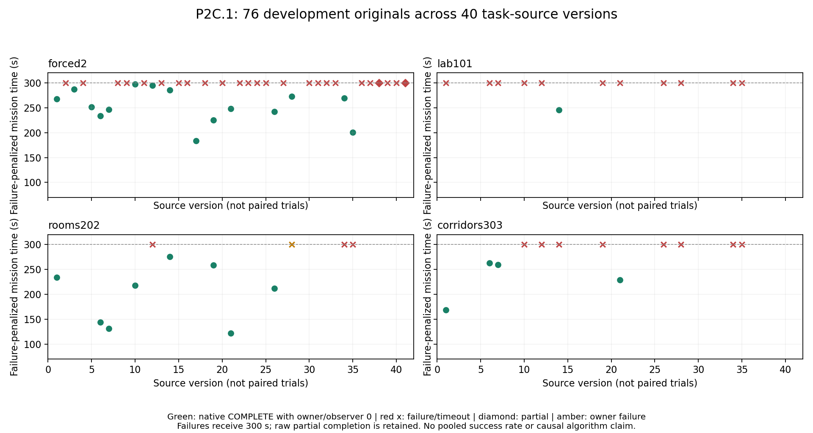

# P2C.1 补强与项目复查（2026-10-09）

用户已验收P3C.5。本轮实现并审核了完整已知路径能量预算、原生记账与来源约束，比较和部署多种规划/计算候选，完成1527功能检查、四包构建和独立实际ROS/DDS验证。**当前完整P2C.1集成仍为FAIL；最新独立受控返航对子为PASS，不能代替完整任务验收。** 原P3C.5及每轮失败全部保留，无P4/ns-3/Wi-Fi/RL，917仍未首次运行。

## 评审判定与证据

| 要求 | 当前实现/证据 | 判定与边界 |
|---|---|---|
| 用实际已知完整路径估计返航，禁止欧氏距离冒充可达 | Dijkstra/A*/反向接触区距离场192查询等价；旧欧氏46低估/28错误有限；本地/中央完整接触路径一致 | 组件PASS；最短路径与名义速度不构成动态最坏情况保证 |
| 预算包含去程/返航/时间/恢复/源龄/余量 | 完整接触路线、最大咨询地图源龄、位姿反应、原预算包络监督；超距/超时/失路停止并明确失败 | 组件及原任务审计PASS；地图执行中断连尚未关闭 |
| 原生能量方程可审计，充电不会抹掉实际消耗 | 距离/时长、charge credits、原始source stamps和每5秒snapshot；v41的112能量记录独立对账 | 模型记账PASS；不是物理电池J/对接校准 |
| 本地安全不依赖AP或无线交付 | 本地新鲜地图优先，合格融合/保守融合后备；local已知障碍veto；本地导航有优先权 | 当前受控对子PASS；不证明任意堵塞/配准/地图突变下安全 |
| 充电后接续任务，保证全体native任务完成 | 有界前沿接续、充电公平、集合完整预算与接触航段自然结束；原300秒和5秒保持 | FAIL；最新主forced为PARTIAL279.1，tb2正电量失路，不计COMPLETE |
| 新算法收益可核验 | 保存准确原输入、冻结旧函数、完整选择/预算/源戳等价与cold比较；全部失败/CPU退化保留 | 条件CPU改善有证据，未证明稳定任务改善/因果收益/全局最优 |
| 正式新冻结/留出/强基线 | 新冻结严格runner与source/command/protocol/native/graph/readiness审计；四开发→17正式+2物理门禁 | 完整门未通过，917未暴露，当前候选不能作为正式无线/RL比较基线 |

先前[项目评审](20261008_project_review.md)审核P3A.6/P3B.5/P3C/P3C.5共91份历史任务引用并修补协议/声明绑定。用户的P3C.5验收记录保持；历史通过不能替代当前改过任务栈的验收。

## 算法尝试与取舍

| 算法/优化方向 | 比较与采用 | 验证/限制 |
|---|---|---|
| 完整充电接触区路线 | 前向Dijkstra、A*、反向多源Dijkstra内容缓存；采用反向场共享路径/接触端点 | 192格查询成本/不可达一致。缓存查询中位0.258ms，前向7.89ms、此Python A*24.30ms；冷建图单列，不推广到其他实现。[证据](20261008_p2c_components.md) |
| 地图来源资格 | local/fused按完整预算择优，融合路线必须通过local已知障碍连续veto；失败才保守融合约束搜索，unknown不清除 | 源时间保留、最大咨询源龄定价；不能以unknown直接否决所有融合候选，不能用派生图续源TTL。[证据](20261009_p2c_constrained_components.md) |
| 几何计算 | 不可变bytes地图/cKDTree/精确向量veto/距离场与2048节点返航后缀memo | 可写数组及可写父数组的只读alias重新核验；只缓存几何，预算/TTL不缓存。[证据](20261008_p2c_geometry_components.md) |
| 探索调度 | 相对geodesic距离、有限2倍有用接续、充电公平、局部可见空间偏好、原已知空间相机朝向历史与目标邻域信息勘察 | 全部仍经body/route/完整去返预算；预测视觉不是目标不存在证明。实际探测模型仍3m/90度/3帧，2m仅原保守搜索偏好。[接续](20261009_p2c_bounded_commitment_components.md)/[搜索](20261009_p2c_camera_search_components.md) |
| 集合候选与时序 | 三圈先可行/原密集后备，外圈可见边界细化；目标确认新鲜时安静保持，失联时按原规则恢复朝向 | 不宣称全域软目标最优；原位置/位速/净空/间距/目标lease保持。[候选](20261009_p2c_outer_sampling_components.md)/[保持](20261009_p2c_healthy_confirmation_components.md) |
| 精确计算排序与剪枝 | 惰性稳定greedy gain/utility上界、必要有效前缀剪枝、资金下界/分阶段同伴预算界 | 边界仅决定计算顺序，实际选择执行精确完整预算；source到期撤销提案。批量射线与多种LRU/组合界无稳定收益者拒绝合入。[预算界](20261009_p2c_budget_bound_components.md)/[同伴界](20261009_p2c_staged_peer_bound_components.md) |
| 单次集合几何复用 | 比较原/只共享/只约束优先/组合；部署两个原采样层的不可变几何复用和更受限机器人优先核验 | 8准确输入各5cold，完整pose/yaw与冻结d70相同；两失败约1.21/1.23→.45/.46秒，走廊2.81→1.99；另5输入略慢0.06%..0.65%，rooms仍约2.3秒。无普遍/实时最坏保证。[证据](20261009_p2c_rally_computation_components.md) |
| 实际clock/状态/动作输入 | 真实时钟独立消费、latest-only交付快照、原native未来源有界等待、相关TF前置过滤、Future回调状态串行化；接触腿等Nav2结果再充电 | 原source timestamps/2秒位姿/5秒地图电池/60秒target、native定义不续期不放宽；实际DDS/graph和反例留存。[clock](20261009_p2c_live_clock_components.md)/[接触](20261009_p2c_contact_arrival_components.md) |
| 独立安全准备器 | 原prepare几何/短腿/50秒期限不变；真实Nav2地图就绪+两条不同source、跨0.5秒的新鲜交付ACTIVE | 修补实际启动竞争，原生隐藏状态不作AP控制输入，abort无重试；当前实际对子PASS。[组件](20261009_p2c_return_stable_components.md) |

选择依据是需求与可核验反例，未证明收益的方案不据此宣称任务改善。组件计时使用固定原输入与epoch，不能重放异步现场全部时钟/历史；同seed不同源码的Gazebo轨迹也不是单因素因果对照。

## 全部主任务开发轨迹

40个实际有主任务的源码版本、76份主原任务：29原生COMPLETE、20RALLY超时、7FOUND超时、5FAILED、13EXPLORE超时、2PARTIAL。原始phase/时间及owner状态分别保留；v28 rooms原生COMPLETE但owner1，仍不满足门禁，v23任务期control发布异常也保留，不由owner0抹掉。四份主任务出现正电量机器人失效（v2/v8/v38/v41）；76份原记录contact=0、minimum energy均正，这不是普遍安全证明。

这些不是固定算法的76个复本。没有跨版本汇总成功率/CI，没有挑选旧成功补齐新矩阵。图中失败或owner/observer失败按300秒惩罚；原partial completion279.1/262.8和保持证明不改写。初派生图将v28 owner1按native时间作图的错误已修正，初图/JSON与erratum保留。

| 版本 | 冻结 | 实际调用与原生结果 |
|---|---|---|
|1|899a69d|corridors303:COMPLETE(168.3s), forced2:COMPLETE(267.6s), lab101:RALLY(300.4s), rooms202:COMPLETE(233.4s)|
|2|862fe4a|forced2:EXPLORE(300.0s)|
|3|f637f64|forced2:COMPLETE(287.5s)|
|4|bc6b44c|forced2:RALLY(300.4s)|
|5|0587dcf|forced2:COMPLETE(251.1s)|
|6|793ec32|corridors303:COMPLETE(262.5s), forced2:COMPLETE(233.6s), lab101:RALLY(300.3s), rooms202:COMPLETE(143.8s)|
|7|76698da|corridors303:COMPLETE(259.4s), forced2:COMPLETE(246.0s), lab101:RALLY(300.0s), rooms202:COMPLETE(131.2s)|
|8|5291e92|forced2:EXPLORE(300.1s)|
|9|eec75bb|forced2:FAILED(271.7s)|
|10|f22b137|corridors303:FOUND(300.1s), forced2:COMPLETE(297.8s), lab101:FAILED(262.4s), rooms202:COMPLETE(217.8s)|
|11|aaa5102|forced2:RALLY(300.2s)|
|12|4de1488|corridors303:RALLY(300.2s), forced2:COMPLETE(295.2s), lab101:FAILED(224.5s), rooms202:EXPLORE(300.2s)|
|13|7ff9033|forced2:RALLY(300.3s)|
|14|1a30fc7|corridors303:RALLY(300.4s), forced2:COMPLETE(285.2s), lab101:COMPLETE(245.9s), rooms202:COMPLETE(275.7s)|
|15|4712c01|forced2:EXPLORE(300.0s)|
|16|c3ba13d|forced2:RALLY(300.3s)|
|17|380ac51|forced2:COMPLETE(183.7s)|
|18|a858fdb|forced2:RALLY(300.3s)|
|19|79f2113|corridors303:FOUND(300.4s), forced2:COMPLETE(225.2s), lab101:FAILED(181.5s), rooms202:COMPLETE(258.6s)|
|20|c5b0f5e|forced2:RALLY(300.3s)|
|21|7f61679|corridors303:COMPLETE(228.6s), forced2:COMPLETE(248.5s), lab101:FOUND(300.0s), rooms202:COMPLETE(121.6s)|
|22|89ee853|forced2:EXPLORE(300.4s)|
|23|930d7a0|forced2:RALLY(300.4s)|
|24|8bd3491|forced2:RALLY(300.1s)|
|25|47a75f9|forced2:RALLY(300.3s)|
|26|6726450|corridors303:RALLY(300.1s), forced2:COMPLETE(241.9s), lab101:RALLY(300.2s), rooms202:COMPLETE(211.5s)|
|27|dffcb1f|forced2:RALLY(300.2s)|
|28|b2b038c|corridors303:EXPLORE(300.4s), forced2:COMPLETE(272.6s), lab101:RALLY(300.3s), rooms202:COMPLETE(220.4s)/owner1|
|30|c12db66|forced2:EXPLORE(300.2s)|
|31|f455c2e|forced2:EXPLORE(300.3s)|
|32|0972eec|forced2:EXPLORE(300.0s)|
|33|24e1e27|forced2:FOUND(300.0s)|
|34|08fe5f7|corridors303:FOUND(300.4s), forced2:COMPLETE(269.7s), lab101:FOUND(300.1s), rooms202:EXPLORE(300.3s)|
|35|7d9709b|corridors303:FOUND(300.1s), forced2:COMPLETE(200.7s), lab101:EXPLORE(300.4s), rooms202:EXPLORE(300.3s)|
|36|7a7fde6|forced2:RALLY(300.4s)|
|37|73fb160|forced2:EXPLORE(300.1s)|
|38|56de2b9|forced2:PARTIAL_COMPLETE(262.8s)|
|39|10860f4|forced2:RALLY(300.4s)|
|40|d70b277|forced2:FAILED(192.8s)|
|41|723a844|forced2:PARTIAL_COMPLETE(279.1s)|

最新[主v41失败](20261009_p2c_v41_failed_development.md)在279.1秒PARTIAL/success=false；tb2失路时仍64.544模型能量，当前位置local/fused均自由且满足净空，但local完整接触路线断连、融合3.72569m路线受local已知障碍veto，保守融合也断连。30秒后正电量失败正确保留。不能把当前单元占用、无线故障、低电量或已证明的SLAM因果当其原因；缺少原range/registration证据时，不清除障碍、不用欧氏距离顶替路径。

## 独立实际返航验证与所有原失败

三组均单独预声明、冻结和保留，两原格都自然结束，无整格重试/覆盖。前两组各fault独立实际返航PASS，但ideal准备失败；第二ideal另有后续正电量失效，整体均FAIL。第一[原对子](20261009_p2c_return_characterization_failed.md)暴露空相机/路径绑定读者遗漏；第二[原对子](20261009_p2c_return_ready_failed.md)证明地图就绪仍不足，交付ACTIVE与本地RETURNING竞争受到本地保护拒绝，另发现相同clock换算的浮点读者误报。所有初错误/traceback和原始结果保留；只读修复不改变原任务。

第三原对子冻结609ba9d72850c6e41a2a3d0ee524d4d4e9720602，完整strict为**PASS**：

| 原格 | native阶段 | 秒 | tb1/tb2充电 | 最低模型电量 | 接触 | 失效机器人 |
|---|---|---:|---|---:|---:|---|
|physical_fault|EXPLORE|300.2|1/1|12.244300|0|[]|
|physical_ideal|FOUND|300.1|1/1|12.214733|0|[]|

严格验证包括两机器人实际准备、原case/stimulus/source/command冻结、所有原TTL/version/graph/能量/live重建及fault62..248秒的Nav2执行返航运动，原1.1米离home/.5米运动/每机charge≥1/零接触和失效门限保持。对子只支持受控安全曝光，不进入主mission成功/TDI；即使PASS，也不能把主v41改为通过或代替新同源正式矩阵。

## 路线、目标与指标修订

P2C.1A区分能量/返航契约与受控物理表征，P2C.1B保留完整任务验收；A与B都不等于任意动态场景的最坏安全保证。B仍要求同源四开发全体native COMPLETE（forced每机实际充电），再17正式+2物理；原300秒/.35米/.05米每秒/.1弧度每秒/5秒及源TTL不变，917在前置通过后首次暴露。主v41余3开发/17正式未调用。今后task源码变化后，A旧对子也不能代替B新同源安全对子。

下一轮先预声明准确local/fused/Nav2地图、源TF/路径连通性以及必要的原scan/range/配准证据，建立地图失路与准备竞争的可区分反例，再比较少量针对算法。停止无边界地串行改效用权重；不要凭单图假说清障碍/屏蔽同伴/改SLAM参数。CPU优化必须保留退化/拒绝样本，并区分wall与sim时钟。任务成功与条件预算正确是独立指标。

完整/partial/FAILED和真实接触/耗尽/失效、基础设施失败、准备失败分别记录；全任务失败时间惩罚300秒，网络实际字节成本仍只按实际曝光，不把提前失败当“更省通信”。已验收P3C.5的历史负载不代表本轮改过的任务栈。B完成后才采集当前冻结负载与正式无线比较；P4A-0包契约/P4B-0被动校准→P4A-1闭环/P4B-1校准→P5强启发式GO→条件P6学习的路线保持，未在本轮启动。Wi-Fi容量不可由当前应用fault模型识别，actual PHY airtime/radio joules仍null，不人为增加流量或宣称已测负结果。

## 验证、冻结与复查入口

当前组件1527功能PASS/124.01秒、103定向PASS/1.84秒、四包build5.91秒、171保护文件/4已授权task变更/54静态协议与8中央+2native Future约束PASS；9实际DDS边界情形PASS。风格三测试不在功能套件，未将它们计入PASS。源保护、每个原summary/ledger/graph/source/environment/evidence SHA、命令、原失败和全部关闭证据见[机读报告](20261009_p2c_strengthening_review.json)及gzip附件。归档逐件解压SHA等于原件；全部owned关闭后才写本报告。用户的14个260929_report未跟踪文件未修改/暂存，domain222/master11345未操作。

新任务必须先clean commit+push，严格reader使用原冻结manifest/source和实际raw originals；拒绝覆盖已有run-id/审计输出。更新[研究计划](../RESEARCH_PLAN.md)、[实现计划](../IMPLEMENTATION_PLAN.md)、主/ROS指南与[launch入口](../../../../../../../ros2_ws/ros2-multi-robot-automap/launch_commands.md)，确保当前FAIL与已验收历史分开。最终文档提交不改变609ba9d任务源码或原任务结果。

最终派生归档校验发现生成器自身stdout在归档时仍为空、生成结束后才写完；初验证正确拒绝了source SHA不一致，后续copy因无证明文件停止。仅将已结束生成器的完整stdout重新归档，初空归档/SHA、错误说明和修正见20261009_p2c_strengthening_provenance_erratum.json。原任务/地图/账本/物理数据未改；完整复核结果见20261009_p2c_strengthening_final_provenance.json。
