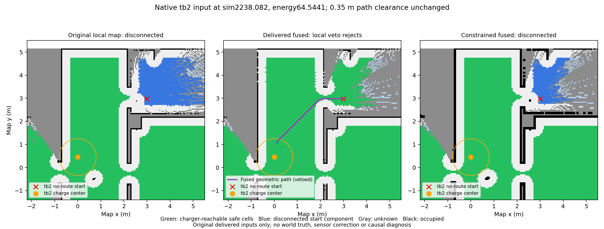

# P2C.1 v41 首强制原任务 FAIL

冻结723a844e54e6f28501d59fc4ed2785f5f2d65592，2026-10-09T12:07:45.321295到12:14:06.322338 UTC。原生PARTIAL_COMPLETE279.1秒，success=false，tb2在正电量下因no_known_route失效；目标247.0秒发现、257.0秒RALLY。两机各charge1，最低16.366306239008143，零接触/耗尽/任务期基础设施失败/任务重试。owner721454/observer721474自然exit0/0并已关闭。12独立审计通过，不替代首强制完整任务门禁。余3开发/17正式/主门2物理/917未调用；另行两格安全表征见独立报告，不能回填本失败。

原始completion_time_sec=279.1和原生5.3秒保持证明均保留；保持只覆盖健康tb1，不是两机全任务完成。完整任务指标按失败惩罚300秒，不能将原始partial字段改为空或计为成功。

失路时2238.082秒，tb2位置(2.9926104632,2.9793562650)，能量64.54412442084852。准确本地/融合输入当前单元均已知自由且满足净空。原本地图完整接触路径不存在；融合几何路径3.725689879米违反本地已知障碍veto；保守融合搜索也没有完整路径。原预算/停止/30秒后明确失败正确执行，但暴露出任务过程中地图返航连通性丢失。不能将其误判为当前位置占用、低电量、无线延迟或已证明的SLAM/传感器因果问题。不能为通过而清除已知障碍、用欧氏距离冒充路径或放宽源TTL。

原始安全行SHA/行号、三份准确原地图、先前AP指令单独绑定和图示见JSON与gzip附件。

P3C.5用户已验收。P2C.1完整任务集成未通过；原300秒/.35米/.05米每秒/.1弧度每秒/5秒、源TTL不变，无P4/ns-3/Wi-Fi/RL，917仍未暴露。
