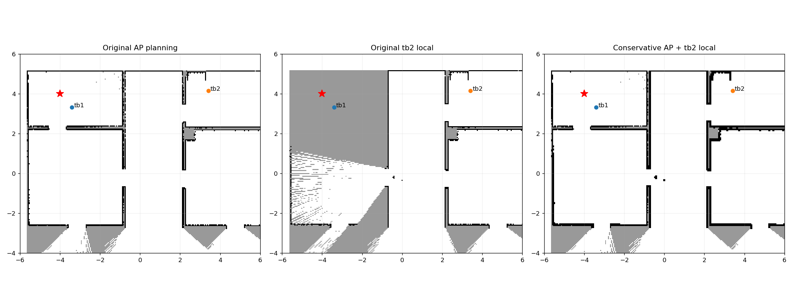
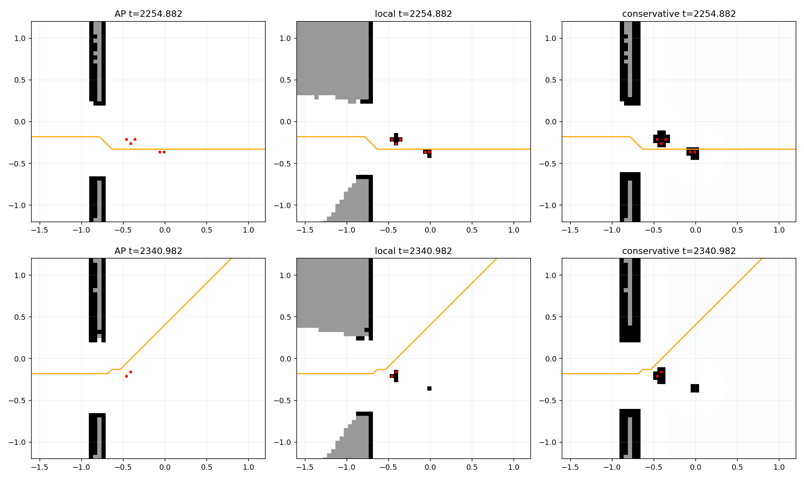

# P2C.1 融合与本地图失路观测组件 PASS

[v65首原任务FAIL](20261010_p2c_v65_failed_development.md)保持：27f1992原生FAILED207.1秒、检测98.6秒、两机各charge1、最低15.425216977、零接触耗尽FAILED机器人；完整strict FAIL和18分项PASS均保留。余3开发/17正式/2物理与917未调用。

原八完整分配表明第三次起融合图128/131集合候选可达，保守加入原tb2本地图后0可达。独立检查确认失路判定不含同伴身体mask，撤回“observer挡路”的早期假设。原本地图在中央门口几组正占用，融合图同处自由；仅凭该证据不能断定物理来源，不能擦格、改阈值或使融合捷径获得派发权限。原连接前沿直线距离排名使tb2四次逐渐向右上移动，六实际补查成功后仍失路并耗尽原上限。没有跨版本任务反事实或唯一原因结论。

新rally_connection_reinspection仅在原完整搜索证明非observer ACTIVE机器人缺完整集合进路时，比较原融合已知空间与保守本地组合组件。若融合已知路通、保守图不通，按身体mask后的融合图到既有集合候选的geodesic距离排序当前保守组件中所有known-free/.45米端点，保留.35米完整进路/.6米身体及原.6米有界known-free起步逃离，以原.4米改进/.35米实际移动门槛保留实际观测位。旧全部前沿在其后保持原稳定顺序。融合场只作偏好，无未知运动、障碍擦除、占用值放宽或已知“无障碍”结论。

跨回调仅保留位置，下一callback原send_survey_goal以当前原图、身体、预约、完整去返能源和2/5/60秒源重新核验；私有记录包含原本地图和精确几何witness。独立读者由原路径场重建全部候选的最小排名，并绑定原failed assignment、源戳和CDR。缺声明/本地图、删障碍、假源龄、伪端点/排名/格点拒绝。原六/九补查尝试、重试/300秒任务/5秒原生保持与全部物理刺激保持。

六原条件快照各新增门口右侧(-0.137,0.269)米端点，仍未把128/131原集合候选变为可达；旧普通规划器给出5米内前缀。全部12原local/fused地图与原native/CDR逐格绑定。23新反例含两原框架、四种正占用1/49/50/100保护、缺图/融合断路/unknown和occupied起点/无候选/已连通拒绝、当前身体遮挡及8伪造独立拒绝。97定向24.26秒、1989完整功能249.13秒PASS；四包原symlink 5.92秒、190保护6历史授权54协议/两声明/AST范围PASS。

真实DDS发布地图/TF/odom/battery，真实ActionServer/Future、原串行状态callback：旧source10→clock13几何过期且零goal，新实际交付13后旧前沿(8.05,9.25)13次trial/1goal；新观测位(5.85,5.85)1次trial/1goal；新.1低能量25trial/零goal/零尝试消费。各完整geometry/priority/outbound原实际CDR独立绑定，三案owned关闭。为合成endpoint、零physical Nav2目标、无任务或地图更新收益声明。首夹具失败把堵门同伴后的合法None误要求替代位，修正为不能授权原位；首DDS夹具只有gateway地图主题，补实际发布/订阅原生地图主题后原binder通过，两个失败日志保留。

仅1中央几何生成方法修改+1新纯方法；82中央/102旧纯方法和globals/原全部派发/能源/源龄方法AST保持，七native/SLAM/launch字节保持。19其他gate方法及原地图CDR binder保持；两manifest仅parent/time/新偏好声明，cases/schedules/stimuli逐字保持。初scope helper用了不存在ground_truth_metrics路径，改为既有八保护路径列表去control后成功，未影响生产或任务。新v66须同clean pushed4开发→17正式+2物理，先15非留出及两物理通过才917；完整P2C.1尚未完成，无P4/ns-3/Wi-Fi/RL。

[JSON](20261010_p2c_reinspection_components.json)与provenance保存完整字面/夹具/原诊断/失败/测试/DDS/声明/所有临时helper和SHA。
