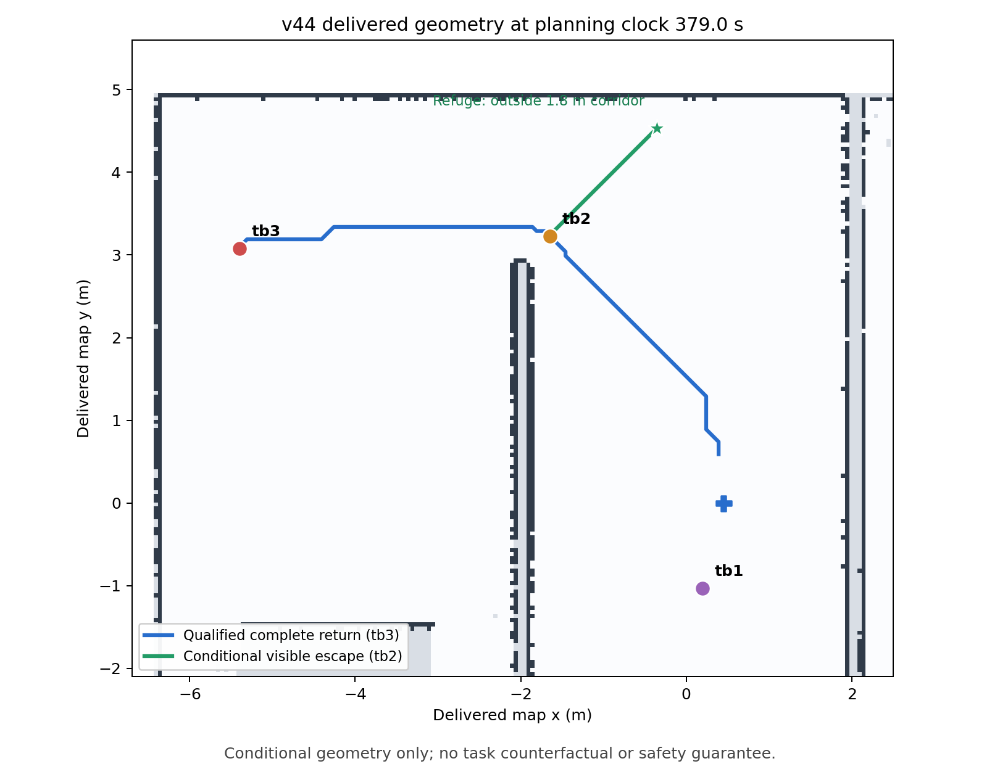

# P2C.1 探索返航清道组件 PASS，完整集成仍待验证

原 v44 四格在 `39e1840930c692612d0cf0584050ae961dce4fff` 上为三 COMPLETE / 走廊超时并 10 次接触，完整 FAIL 原件保持。新组件不回填旧任务，也不跨版本合并成功率。

探索及 FOUND_UNCONFIRMED 的原充电入口现在核验完整已知返航通道。通道被同伴机体占据时，优先为最靠近返航者的空闲 ACTIVE 同伴寻找原地图内可见、完整机体可行的避让点；保留原 1.8 m 返航预约净空。计算只保存几何意图，下一回调重新读取当前源戳、完整本地/融合返路、身体位置、端点与当前去返能源预算，源过期、未来戳、未知/占用路线或资金不足均不派发。采用既有普通 NavigateToPose 流，成功不增加探索前沿计数；重复同一受益者返航状态不取消其已核准逃离。原 Nav2、本地电池返航、SLAM 机体内回波过滤、300 秒任务、5 秒保持、2/5/60 秒 TTL 与能量安全门槛保持。

独立读者从私有无损交付图与各源头戳重建完整保护路线、机体逃离和完整预算，不调用新增中央方法。旁录不成为新规划输入或新应用流，正式门禁绑定读者 SHA。两个 manifest 的原任务/物理刺激定义全部保持。

最终全功能 1630 PASS / 167.03 s，最后定向 131 PASS / 26.83 s，四包构建 PASS / 5.51 s，190 保护 / 6 声明修改 / 54 静态协议格及两 validate-only 声明 PASS。中央 11 方法修改、5 新方法，另 64 方法 AST 保持；native battery/SLAM/采样/物理准备保持。

实际隔离 DDS / Humble Future 对照 PASS：旧冻结在源 10.0 秒立即请求充电；新方案的计算期间 clock 10→13 秒，旧源保持 10、仅留几何意图，零请求；下回调源 13 重新核验后发送一个合成 action 逃离，真实 Future 结果与交付清空位姿 14 到达后才发布原充电请求。是合成地图/位姿与 action endpoint，零 Gazebo/真实 Nav2 任务，不是物理安全或任务收益证明。

v44 原交付状态 379.0 秒可找到 tb2 可见避让点约 (-0.358, 4.530)，新预算与独立读者通过。只是条件组件，原 tb3 第二返航未闭合和 10 接触保持。

所有初始定向/全功能夹具失败、改正及中间 DDS 结果保留在同名 provenance.json.gz。初始能源 mock 超过真实容量边界、原状态最近阻挡体顺序、手工旁录缺本地 map epoch、过期夹具未同步 TF/map 源戳等均保留；最终不放宽生产保护或丢弃失败原任务。

下一步为新 clean pushed 冻结完整四开发，再同源码 17 正式与两物理门禁；全部固定/安全门禁通过后才能首用 917。当前未调用，P2C.1 仍未完成。P3C.5 已验收，无 P4/ns-3/Wi-Fi/RL，actual airtime/J 和容量未测，不作硬件一般安全保证。
