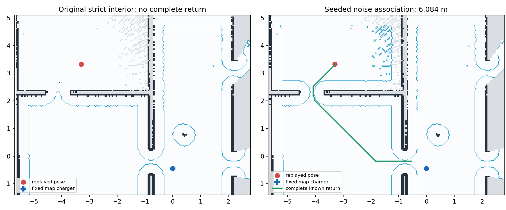

# P2C.1 机体边界噪声关联组件 PASS，完整任务尚未完成

v45 首原强制在 `531b2abde913f162514570bf99955a7ba0b50e85` 上 FAILED211.5 秒、tb1 正电量失路。原始失败保持，剩余三开发、17 正式、同源两物理及 917 未调用。

原出口孤立占用点与近机体边界扫描相邻。前两种方案（四束邻域两机体内支持、整连续段两机体内支持）虽组件测试通过，原生重放均无完整返路，故拒绝并保留。最终仍采用原 SDF/URDF 共同机体矩形；仅在连续原扫描回波段至少三束、至少一束严格在原物理机体内，且各束沿原矩形表面的测距差不超过 0.0375 m 时，将这一段关联为机体边界噪声。0.0375 来自未修改的 Gaussian sigma0.01 的三倍加原 range resolution0.015 的一半；不是机体几何膨胀。无机体内支持、短段、断开的远束和带外观测保持。整周边界按真实角度相邻合并，部分扫描两端不合并。

这是按原模型噪声作的测量分类，会拒绝有机体内支持的段中部分不确定外边界测量，不宣称任意真实传感器/障碍的一般安全。所有未来机器人及基线使用相同预处理。只复制 SLAM 内部扫描、将拒绝束置 NaN；原 Karto 忽略 NaN，不作自由射线。原 scan 发布、Nav2、占用规则、匹配参数、模型物理、控制、电池、本地完整返路、能源、30 秒失路等待、300 秒任务、5 秒保持和 TTL 保持，没有直接擦除占用格或新增 AP 流。

实际原生旧二进制/新 C++ 各收齐相同 1280 份原 CDR，240 条原生过滤记录/1362 束与独立读者完全一致。原严格内点版本最终完整返路 None，最终方案按原 0.35 m 完整净空/0.8 m 充电接触区可返 6.084026 m；两原生子进程自然关闭0，零 Gazebo/Nav2任务。重放 clock 来自原源戳，收件调度与历史 Karto 图不是原任务；这是条件组件证据，不是原任务反事实、任务收益或硬时限保证。诊断助手现直接使用本地电池固定 map 充电坐标，修正此前错误的 odom 重投影；前两 FAIL 原件不重标。

最终44定向/9.90秒、1648全功能/162.03秒，原生SLAM构建70秒及四包5.38秒 PASS；190保护/6已声明修改/54静态协议格、普通及物理validate-only PASS。控制/本地电池/动作串行/common SLAM/Karto保持；原两manifest全部cases与门禁集合/时限/刺激保持。完整源码、原CDR/SHA、原生地图、配置、两失败版本/日志、最终校验输出由同名provenance.json.gz保存或绑定；最初错误目录的no-tests exit4与后续正确全套通过均保留。

新 v46 必须在 clean pushed 冻结后做首强制及完整四开发，然后同提交17正式/两物理；固定与安全全通过后才首用917。当前P2C.1未完成，P3C.5已验收；无P4/ns-3/Wi-Fi/RL，actual airtime/J与容量未测。
