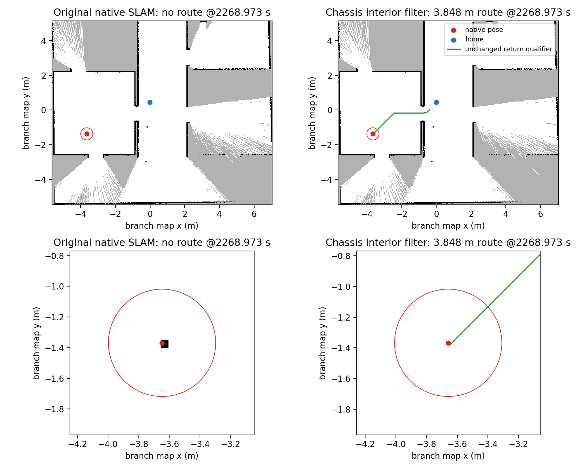

# P2C.1 原生机体内回波过滤组件

组件PASS，完整任务尚待新冻结验证。v43首强制原格63c2e17为RALLY超时300.0秒/tb2正电量失路FAILED，全部原证据和13个子门PASS/总安全门FAIL保持。未调用余三开发、17正式、两物理和917。

原CDR定位2235.173秒转向扫描的近距离回波，严格落在既有SDF/URDF共同机体XY内部的10点与随后当前位置占用块相邻；同期另一机器人远离该点。当前扫描最近1.1米与Nav2当前点空闲只作诊断，未用于任意地图单元清除。通用shouldProcessScan不参与实际多机器人路径，Karto已有转角判断，该候选入口假设已撤回，没有修改。

新多机器人SLAM在建图/匹配前复制本帧，仅将有限、原range_min<range<range_max且激光外参投影严格位于共同机体矩形内的点置NaN。共同矩形来自原SDF0.265m与URDF0.266m的同中心(-0.064,0)机体箱交集：xmin=-0.1965/xmax0.0685/y±0.1325m，零外扩；边界外读数保留。默认空配置禁用，边界只读、非法配置拒绝；原话题/CDR与头戳、Nav2、所有原匹配参数和能源/完整返路函数保持。反向安装激光不启用此平面过滤。此前源码保护边界明确增加原生cpp/一个新纯头文件/内在几何配置，额外保护21个原头文件；今后各基线同冻结使用。没有新增AP观测/应用无线流或同伴屏蔽。

保存旧二进制与共享库，旧/新原生节点在独立DDS域同时收到各1353帧逐字节核验的原CDR；使用原odom相关TF、静态外参和各分支自己产生的map→odom。150条新C++过滤旁证与独立原CDR逐帧计数一致，共662个点。两边原参数完全相同，唯一新增物理机体过滤；source-header回放clock/交付调度为条件重放，不是原任务控制器反事实。原图当前点100、完整返路None；新图当前点0、原完整接触路径3.84807474m、终点在原0.8m接触区。两原生子进程自然退出0，零Nav2目标。这不证明整个任务已完成或任意动态地图安全。初始Python输入处理对照与随后两次原生处理对照都保留，最终原生对照核验原CDR接收数与全部路径顶点。

每分支采用自己的最终TF/地图坐标与原始odometry；各自源时间2268.973秒。上行完整地图、下行局部放大；黑色占用、灰色未知、红点位姿/原0.35m路径净空圈、绿色原返路函数路径。地图配准因过滤产生约厘米级差异，未把两分支TF强行共用。

92定向检查/1597全功能回归PASS；五包含SLAM构建55.4秒PASS；190受保护/6声明修改/54协议格PASS；普通与物理两manifest validate-only通过，无任务调用。原control.py/native battery/common SLAM/Karto后端相对63c2e17逐字节相同；CPP边界/外部障碍/原扫描、TF/源/计数/配置篡改反例涵盖，完整旁证和SHA见同名JSON/provenance.json.gz。

未来同clean pushed源先四开发，再17正式+两物理；所有原300秒、原生5秒保持、源龄和完整能源/几何保护仍须严格通过。917保持未暴露，原失路/耗尽反例必须继续正确失败。P3C.5已验收，P2C.1尚未完成，无P4/ns-3/Wi-Fi/RL，actual airtime/J未测。
